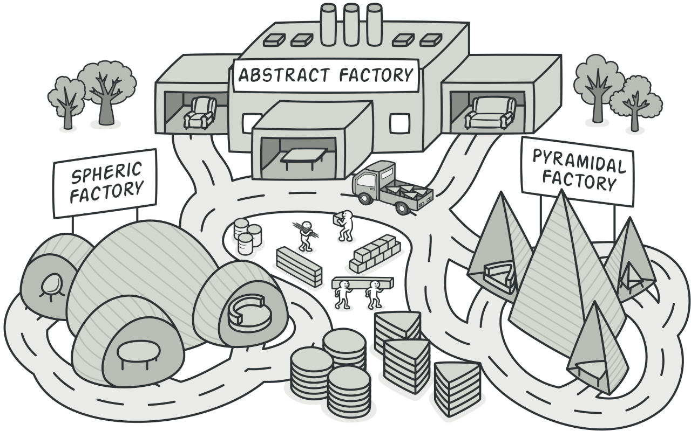

# References
- [https://refactoring.guru/design-patterns/abstract-factory](https://refactoring.guru/design-patterns/abstract-factory)

# What is the Abstract Factory?
- It is a creational design pattern.
- It is a pattern that allows you to create a family of related objects without specifying their concrete classes.

**Original English**

> Abstract Factory is a creational design pattern that 1) **lets you produce** 2) **families** of related objects 3) **without specifying** their concrete classes.

1) **let you produce**: That is, the client depends on the factory to create products.

2) **families**: The products are closely related (families).

3) **without specifying**: It depends on abstract classes.

Why was the Factory made abstract? Let's look at a diagram and then explain further.

# Situation

### Program Requirements
- We want to create a furniture shop simulator.
- The program's code is composed of classes representing the following:
    1. A set of related products (e.g., Chair + Sofa + CoffeeTable)
    2. Each product has a different style (e.g., Art Deco Chair, Victorian Chair, Modern Chair)
- We need a way to create individual furniture objects. At this time, we must create furniture with the same style. Otherwise, the simulator's customer will be upset (e.g., if you have an Art Deco Chair and a Victorian Sofa, the customer gets angry).

### OOD Perspective Requirements
- When adding a new set of furniture styles (variants), the program should not need to be modified.
    - A new set of furniture means a new family of products, like Entic Chair, Entic Sofa, Entic Coffee Table.
- Furniture suppliers frequently change their catalogs.
- The core code should not change every time the catalog changes.

# Solution
Let's think about the problem from the perspective of the OOD 5 principles.

### OOD 5 Principles
#### DIP
#### 1. Abstraction
The client will consume products. If the client depends on concrete products like modern chair, modern sofa, etc., it becomes problematic.

Therefore, the client should depend on abstract classes that represent each product.

#### 2. High-level Policy
The key point here is that the client uses furniture. Even if the style of the furniture changes, the logic for using the furniture does not change. This is a high-level policy. Therefore, the client should also depend on the abstract class representing furniture to comply with OCP.

#### LSP
When abstracting, the abstract class must be replaceable by its subclasses. Therefore, when abstracting furniture, you should group classes with the same behavior and abstract them together.

So, how does the Abstract Factory Pattern implement these principles?

### Abstract Factory Pattern
1. Art Deco, Victorian, Modern Chair -> Abstract as an interface called Chair. In other words, abstract the style of each product as a product.

2. Group the methods that create Chair, CoffeeTable, and Sofa into one interface. This becomes the Abstract Factory.
3. If you want to create Victorian furniture, implement the AbstractFactory to create Victorian products. In other words, a new Factory is created for each style.

# Structure

- **Abstract Products**
    - The part that declares the interfaces of related products.
    - e.g., createProductA(), createProductB()
- **Concrete Products**
    - A set of distinct styles created by implementing the abstract product.
- **Abstract Factory**
    - An abstract class that declares the interface for creating abstract products. At this time, the products should be declared as related products as explained above.
- **Concrete Factories**
    - A class that implements the creation methods of the abstract factory. Each concrete factory is responsible for a unique style.
    - !! No matter how much a concrete factory creates a specific product, the return type must always follow the abstract type (e.g., return Chair, not ModernChair).

# Another Example

Suppose an application runs and configures the GUI according to whether the operating system is Mac or Windows.

Therefore, in the client, the Application determines whether the OS is Mac or Windows, and injects the MacFactory if it is Mac. Thus, Mac users can use the Mac-specific UI.

# Pros and Cons
### Pros
1. Reduces the coupling between concrete products and client code.
2. Follows SRP, as the logic for creating products is gathered in one class.
3. Follows OCP.

### Cons
1. If many styles of furniture are created, the number of interfaces to explain increases, making it more complex.

# Relationship with Other Patterns
1. Many designs start with the Factory Method and evolve into the Abstract Factory as things get more complex.
2. The Abstract Factory can be seen as a set of Factory Methods.
3. In my opinion, a class with a Factory Method includes business logic, but as the number of products to be created increases, the Abstract Factory only takes on the responsibility of creation.
