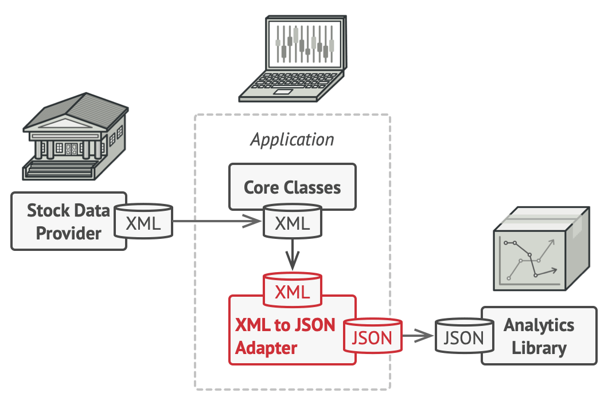

# Source

- [https://refactoring.guru/design-patterns/adapter](https://refactoring.guru/design-patterns/adapter)

# What is the Adapter pattern?

- Structural pattern
- A design pattern that allows two incompatible interfaces to collaborate.

# Situation

### Goal

We want to create a stock market monitoring application.

### Method

1. Receive stock data in `XML` format.
2. Analyze it using an Analytics Library and display graphs.

### Problem

However, there is a **problem**. The Analytics Library accepts data in `JSON` format for analysis. In other words, the format of the stock data provider and the format of the program that analyzes the data do not match.

### What if you try to solve it by changing the third-party library code?

#### Problems

##### 1. The dependencies of the third-party library might break.

##### 2. Access to the third-party library code might not even be possible.

# Solution

### Using the Adapter Pattern!

1. The adapter handles the `XML` -> `JSON` conversion process.
   - Because of this, the client simply needs to pass the `XML` data to the Adapter.
   - Also, complex conversion code can be hidden within the Adapter.
2. Then, the converted `JSON` is passed to the Analytics Library.
   - By simply calling the Analytics Library from the Adapter, the analytics library cannot detect the adapter's presence. In other words, it does not depend on the Adapter.
3. And the result returned by the Analytics Library is passed to the Client.

# Structure

### 1. Object Adapter

#### 1. Client Interface

1. The Client Interface is the interface for the client to use the Service.
2. Since the client depends on the interface, it follows the OCP. Therefore, even if you replace it with a new version of the Adapter, you don't need to change the client code.

#### 2. Adapter

1. The Adapter is a class where you can write code between the client and the service.
2. It implements the client interface and wraps the service object.
   - There are two ways to initialize the service:
     1. Injected through the constructor (eager loading).
     2. When a method is called (lazy loading).
3. The adapter receives the client's request through the adapter interface, converts it to a format suitable for the service, and then sends the data to the wrapped service.

#### 3. Service

1. Refers to a Service that the client wants to use, but its format is incompatible.

### 2. Class Adapter

1. Can only be used in languages that support multiple inheritance.
2. The Existing Class can be seen as the class that the Client currently uses for service application.
3. Since the Adapter inherits from the Service, there is no need to wrap the Service, and if you override the method being used by the Client, the client will be able to use the Adapter's method.

> The difference between the two probably stems from... Object Adapter uses the service through an **object**, while Class Adapter inherits the service **class** to use it. 