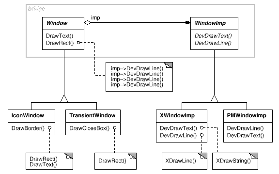
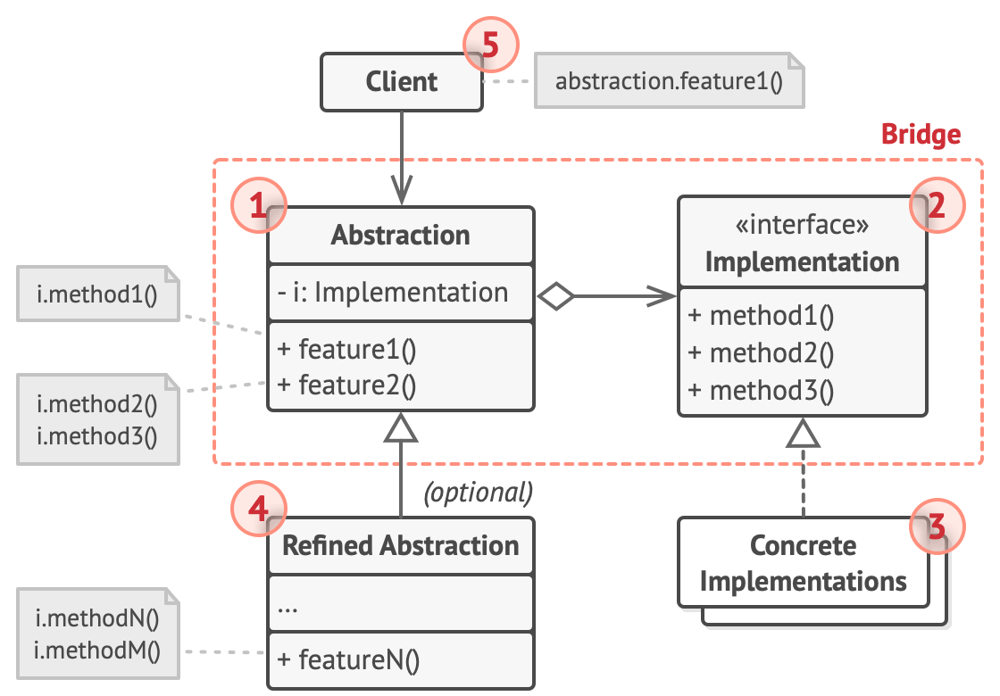

# References

- [https://refactoring.guru/design-patterns/bridge](https://refactoring.guru/design-patterns/bridge)
- [https://en.wikipedia.org/wiki/Bridge_pattern](https://en.wikipedia.org/wiki/Bridge_pattern)
- Design Patterns: Elements of Reusable Object-Oriented Software (link) [https://archive.org/details/designpatternsel00gamm/page/151](https://archive.org/details/designpatternsel00gamm/page/151)

# What is the Bridge Pattern?

- Structural design pattern

### Guru Definition

A pattern that separates a large class or a set of highly related classes into two hierarchies.

### GoF-DesignPattern Definition

A pattern that decouples an **abstraction** from its **implementation** so that the two can vary independently.

### Abstraction and Implementation

- Abstraction and implementation are **exactly as Robert Martin described**.
- In the explanation of DIP, Keyboard and Printer correspond to implementation, and Copy can be seen as corresponding to abstraction.
- That is, Copy is a high-level policy corresponding to the inherent abstract part of the application.
- Recall that the low-level policy that concretely performs the abstract content of copy was keyboard and printer.
- The Bridge Pattern goes further, making abstraction an abstract class to allow for the expansion of high-level policies.

### Analogy - Subtitle (Humans think abstractly)

1. Pick up a **spoon** and eat **rice**.
2. Spoon -> It could be a spoon from a restaurant or a spoon from home. Rice could also be rice cooked at a specific time in a restaurant, or leftover rice at home.

To satisfy hunger, one performs the act (**abstraction**) of picking up a spoon and eating rice.

This act is achieved by picking up a spoon at home (**concrete**) and eating leftover rice at home (**concrete**).

At this time, no matter what kind of spoon or rice appears, the meaning of 1. does not change. This is because spoon and rice represent various spoons. In other words, it can be seen as polymorphic.

# Situation

1. Let's consider a program that responds to user requests by calling an API through a GUI.
2. At this time, the API has Operation code for various OS.
   ex:) mac OS, window OS, Linux OS (If you click the delete button in the GUI, each OS will perform different logic.)
3. Let's also consider a few different GUIs. At this time, implement admin, regular customer, etc., by inheriting the GUI abstraction class.
   ex:) admin, regular customer....

### Problem

I want to create code where the API works for the GUI.

### What if we create subclasses for everything?

By inheriting GUI, you can create many classes for each, such as admin GUI for Windows, admin GUI for Linux, admin GUI for macOS, etc.

If you inherit everything like this, a problem arises where you have to create **numerous** subclasses, equal to the number of GUI types * number of operating systems.

# Solution

### Using the Bridge Pattern!

1. Regardless of which API (Implementation) comes, the GUI does not change.
2. Therefore, we can say that GUI is a high-level-policy, and API is a low-level-policy.
3. Therefore, have the GUI possess a class (interface) that abstracts the Low-level-policy.
4. And make that GUI depend on that interface.

This way, even if you develop the GUI separately, since it depends on the abstract class, the API logic will not need to be changed, and even if you add another OS, the GUI will not need to be changed.

# Structure

### 1. Abstraction

1. Provides high-level-policy logic.
2. Depends on low-level-policy.

### 2. Implementation

1. This is the part corresponding to low-level-policy logic.
2. Abstraction can only communicate with concrete implementation through methods written in implementation.

### 3. Concrete Implementations

1. Contains platform-specific code.

### 4. Refined Abstraction

1. Provides various types of control logic.

### 5. Client

1. Although the client only works with abstraction, it is the client's responsibility to connect which implementation objects.

# Relationship with Other Patterns

1. While the Bridge pattern helps two classes of different natures to be developed independently, the Adapter pattern can be applied when the interfaces of existing code do not match each other.

# Author's final words on the Bridge Pattern

> Here, Window refers to the Window GUI, and WindowImp refers to the interface of the implementation of that function. In other words, it is the implementation.

We refer to the relationship between Window and WindowImp as a **bridge**, because it bridges the abstraction and its implementation, **letting them vary independently.** 