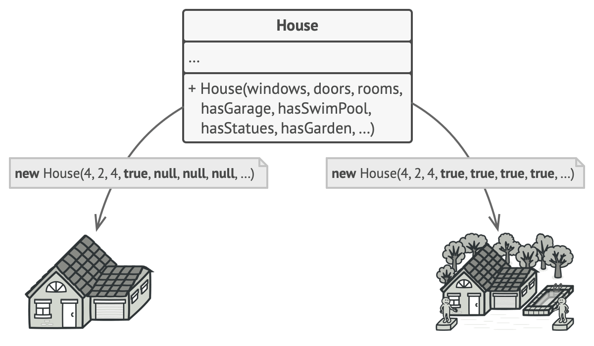

# References
- [https://refactoring.guru/design-patterns/builder](https://refactoring.guru/design-patterns/builder) (Builder pattern explanation)
- [https://projectlombok.org/features/Builder](https://projectlombok.org/features/Builder) (Lombok)

# What is Builder?
- Creational design pattern
- A design pattern that allows you to construct complex objects step-by-step.
- Allows you to create different types of objects with the same construction code.

# Situation
- You need to create a **complex object** with many fields and nested objects.

## Not Recommended Method 1 - Implementation via Class Inheritance

### Method Description
1. **Create a base class**
   - Suppose you create a base class called House. This class has a roof, windows, and exterior walls. You make it with specific field values. In other words, you create classes like CabinHouse and BrickHouse. For example, the exterior wall of CabinHouse is wood, and for BrickHouse, it is brick.
2. **For extension - create a subclass**
   - If you want to make a cabin house with a storage room, you inherit from CabinHouse and add a storage room.

### Problems
1. You end up with countless subclasses
   - Because you have to create a new subclass for every new parameter.
2. The hierarchy can become deep
   - Inheritance forms a hierarchical structure. If you want to extend not with an annex but with a style (e.g., modern), you have to make it one level deeper.

## Not Recommended Method 2 - Giant Constructor

### Method Description
- Write a constructor that takes all possible parameters.

### Problems
1. You have to consider unnecessary parameters and put them as arguments
   - As shown on the left of the figure above, even when creating a regular house with only a storage room, you have to consider other options and put null for them.
2. It's hard to figure out the meaning of each argument
   - When there are many parameters, it's hard to know what each argument means.

# Solution - Builder Pattern
The Builder pattern moves the object creation code outside the class to be created. It delegates the creation responsibility to individual objects called _builders_. These builders:
1. Allow you to specify the fields to be created one by one.
2. Allow you to specify only the fields that need to be created.

[Figure Description] _The Builder pattern lets you construct complex objects step by step. The Builder doesn't allow other objects to access the product while it's being built._ (I'll explain why other objects can't access the object while the builder is building it after showing how to implement this pattern.)

3. You can also create different objects with the same construction steps.

This figure shows building a log house, a brick house, and a jewel house. They are all different, but since they share the same construction steps (building walls, putting up the roof, etc.), you can use a builder with the same construction steps to create different styles of houses.

### Director
- A class that helps the builder construct objects by following a specific procedure.
- If there are objects that are frequently created, you can use the director to create them via the builder (reusability).
- Therefore, creating this class in the builder pattern is optional.
- Additionally, it can hide from the client how the object is created.

# Structure

#### Builder Interface
- This interface specifies the step-by-step methods for building each field of the builder.
- Write a method called reset() for object initialization.

#### Concrete Builders
- Create different objects. In other words, if the steps for creating an object are the same, you can implement the Builder.
- Therefore, the created objects may have different types.

#### Products
- The objects created by the concrete builder.

#### Director
- Implements frequently used builders.

# Another Example
Note two things here:

1. Car Builder and CarManual Builder have different interfaces.
   - In the previous house example, CabinHouse, BrickHouse, and JewelHouse could be abstracted as a house interface, but Car and Manual cannot. They are different. Therefore, getResult() is implemented. The type may differ. So, the value returned from the Director cannot be Car or Manual. If you return them, you depend on concrete classes (DIP violation). Therefore, the return value is the builder.
   - (You might think that since the behavior pattern is the same, it follows LSP, but the Builder's behavior pattern is the same for setting fields, not for Car or Manual.)
2. The builder creates the object internally via reset(), and when done, returns the object via getResult().
   - Now I can explain the figure above about why other objects can't access the object while the builder is building it. The builder creates the object internally (field values), and access to this object is declared private, so only the builder can access and modify the object. That's why, as the figure says, other objects can't access it while it's being built.

# When to Use
- When the constructor has many parameters

# Pros and Cons
## Pros
1. You can create fields one by one
2. You can reuse the same construction code
3. Separates complex object creation logic from business logic

## Cons
- The builder pattern increases overall code complexity because you have to create new classes.

# Relationship with Other Patterns
1. If the Factory Method becomes too complex, you can switch to the Builder pattern.
   - Because the object creation pattern becomes more complex.
2. The Builder focuses on creating a complex object step by step, while the Abstract Factory focuses on creating related objects. Therefore, the Abstract Factory returns the product at once, while the Builder creates the product step by step before returning it.
