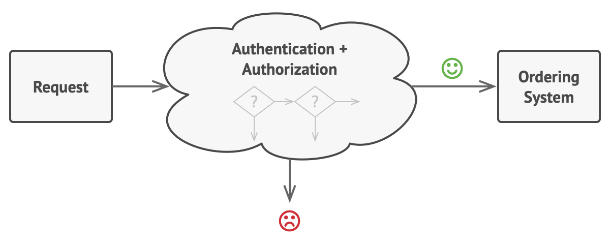
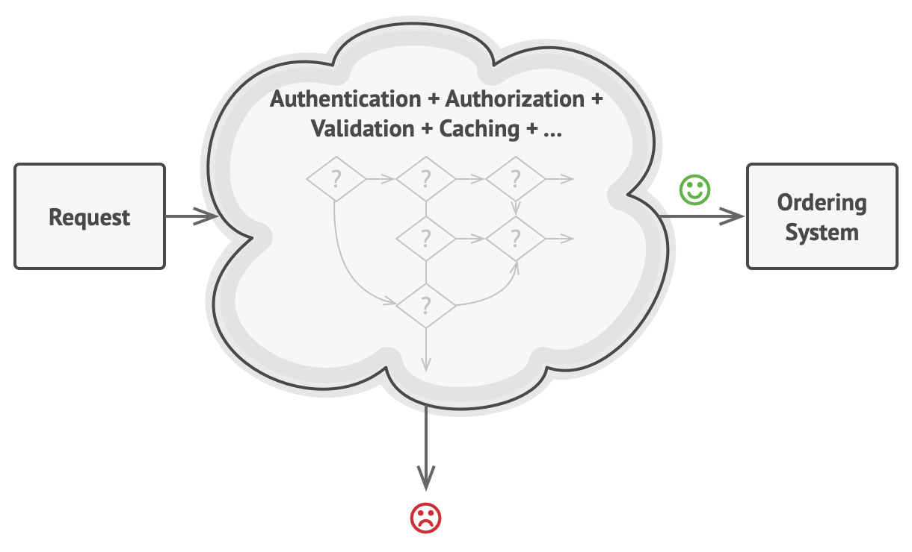
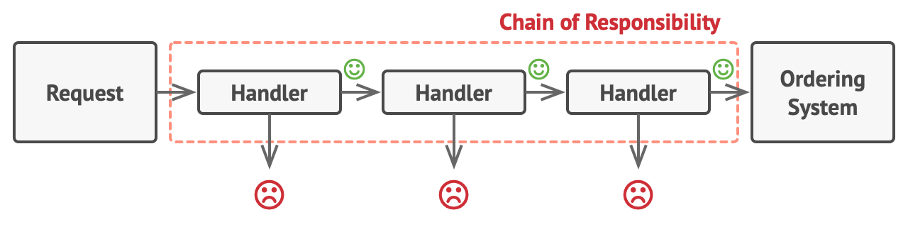
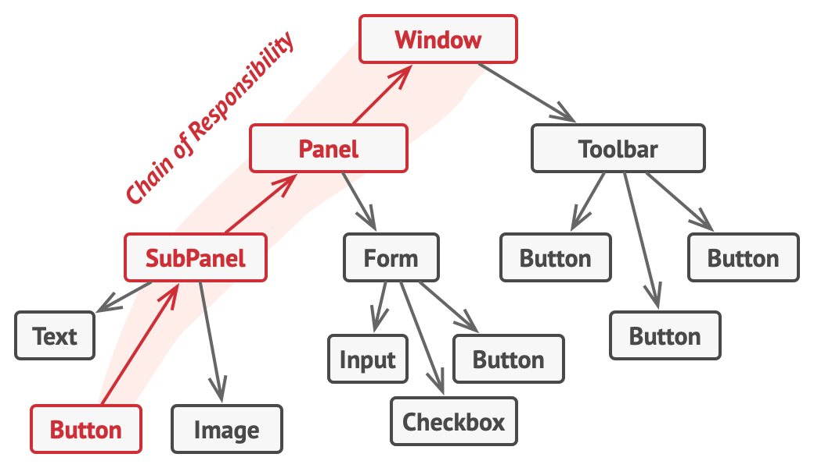

# Chain Of Responsibility Pattern

**Reference**  
[https://refactoring.guru/design-patterns/chain-of-responsibility](https://refactoring.guru/design-patterns/chain-of-responsibility)

## What is Chain of Responsibility?
- Behavioral object pattern
  - A pattern about how groups communicate.
- A pattern that passes requests along a chain of handlers.
  - Each handler in the chain decides whether to process the request or pass it to the next handler.

## Situation
- Online Ordering System

### Requirements
- Only authorized users can create orders (restrict system access).
- Only admin users can view all information about all orders.

### Approach
- These checks must be performed sequentially:
  1. Check credentials (authentication)
     - If credentials are wrong or authentication fails, the process stops.
  2. Grant appropriate permissions (authorization)

### Problem - Adding More Requirements
- Over time, new requirements are added:
  - Add validation to avoid sending raw order data for security reasons.
  - Check for brute force password cracking by monitoring repeated failed attempts from the same IP.
  - Add caching for performance.

- If all this logic is implemented in a single object, the code grows, becomes harder to maintain, and is not reusable.

## Solution - Create a Chain of Handlers!
### Handler
- The chain of handlers passes specific behaviors to handler objects.
- Each check can be a class with a single method.
- Request data is passed as arguments to these methods.

### Applying as a Chain
- Handlers are linked in a chain, each with a reference to the next handler.
- Each handler can process the request or pass it to the next handler.
- The request traverses the chain until all handlers have processed it or one stops the process.

#### Point
- A handler can decide to stop processing at any point.

### Application
- In the ordering system, validation, authentication, etc. can each be a handler with a single method.
- If a handler's check passes, the request is passed to the next handler.

- Thus, a series of handlers forms a chain of responsibility.

### Another Approach - Only One Handler Processes the Request
- In some cases, only one handler in the chain processes the request (or none).
- If a handler can process the request, it does so and stops; otherwise, it passes the request to the next handler.
- This is common in GUI systems.

### Note
- All handlers must implement the same interface.
- If handlers depend on concrete handlers, you lose flexibility in ordering and reuse.

## Structure

### 1. Handler
- Interface for all concrete handlers.
- Declares a single method for processing requests.
- May also have a method for setting the next handler in the chain.

### 2. BaseHandler
- (Optional) Contains code common to all handlers.

### 3. ConcreteHandlers
- Contain the logic for processing requests.
- Each handler must decide whether to process the request or pass it on.
- Usually, handlers are self-contained and immutable.

### 4. Client
- Sets up the chain, either once or dynamically.
- Requests do not have to start at the first handler; they can start at any handler in the chain. 