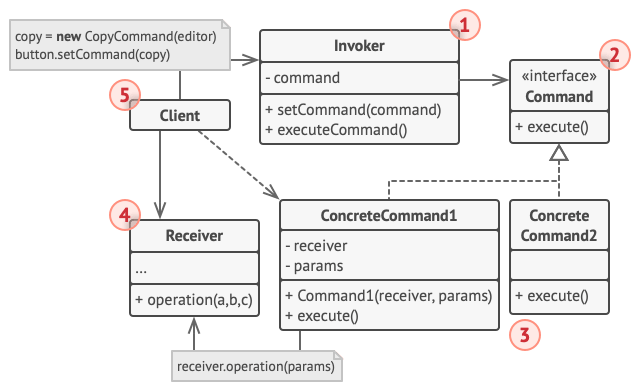

# Command Pattern

**References**  
[https://refactoring.guru/design-patterns/command](https://refactoring.guru/design-patterns/command)  
[http://aeternum.egloos.com/v/2948571](http://aeternum.egloos.com/v/2948571)

## Definition
- Behavioral design pattern
  - A pattern that encapsulates behavior in an object and delegates requests to the encapsulated object.
- A design pattern that turns a request into a stand-alone object containing all information about the request.
  - This allows you to parameterize methods with different requests, delay or queue request execution, and support undoable operations.

## Situation - Building a Text Editor App
- Suppose you are building a text editor app like Hangul or Word.


### Problem
- How should you build a toolbar with various buttons?

### Bad Approach - Creating Subclasses

#### Method
- Create a subclass of Button for each button, with the code to execute for that button.
#### Problems
1. Many subclasses are created.
   - If the Button class changes, its subclasses may break.
2. Duplication can occur.
   - For example, SaveButton, SaveMenuItem, and SaveShortcut all perform the same save operation but are implemented as different classes.


## Solution - Layering, Delegating
### Cause of the Problem
- This happens because the roles of the GUI and business logic are not separated. Applying SRP (Single Responsibility Principle) solves this, usually by layering.

### Method
#### Layering

- The GUI renders images, receives input, sends requests with parameters to the business logic, and displays the result.
- The business logic performs the requested operation.

#### Command Pattern
- The Command Pattern goes further by preventing the GUI from calling business logic directly.

##### Implementation Steps
1. Extract detailed requests into separate command classes, each with a method to trigger the request (usually with no parameters).
   - The details of the request (which object, which method, which arguments) are encapsulated in the command object.
   - Command objects act as a link between various GUI and business logic objects.
   - The GUI only needs to call the execute method of the appropriate command, without knowing about the business logic object.


2. Implement all commands with the same interface.
   - Benefits:
     1. The GUI does not depend on specific commands.
     2. The GUI's behavior can be changed at runtime.
     3. Commands can be stored in containers.

##### Question - What about parameters?
- Command methods do not take parameters, but business logic often needs them. How is this handled?
- Parameters are considered part of the detailed request. You implement a command class for each combination of business logic and parameters.
- Thus, the command pattern structure in this example is as follows:


1. No need to create many subclasses. The Button class only needs a reference to a command object.
2. All buttons for the save operation can use the same save command without duplication.

Additional benefits:
1. Since Command and business logic are composed, you can add logging or delay operations.
2. Requests are turned into command objects, making it easy to undo or redo operations.

## Structure


### 1. Invoker (or Sender)
- Responsible for initiating requests (triggering).
- Must have a reference to a command object.
- Sends requests to the command, not directly to the receiver.
- Does not create command objects; the client does.

### 2. Command (interface)
- Declares a single method.

### 3. Concrete Commands
- Implement various requests.
- Instead of performing the request directly, they delegate to the business logic (receiver).

### 4. Receiver
- The part that actually performs the request (contains the business logic).

### 5. Client
- Creates and sets up command objects.
- The client must provide all parameters needed to create the receiver instance in the command constructor.

## Code Example
### 1. Command
```java
public abstract class Command {
    public Editor editor;
    private String backup;

    Command(Editor editor) {
        this.editor = editor;
    }

    void backup() {
        backup = editor.textField.getText();
    }

    public void undo() {
        editor.textField.setText(backup);
    }

    public abstract boolean execute();
}
```
### 2. Copy Command
```java
public class CopyCommand extends Command {

    public CopyCommand(Editor editor) {
        super(editor);
    }

    @Override
    public boolean execute() {
        editor.clipboard = editor.textField.getSelectedText();
        return false;
    }
}
```
### 3. Paste Command
```java
public class PasteCommand extends Command {

    public PasteCommand(Editor editor) {
        super(editor);
    }

    @Override
    public boolean execute() {
        if (editor.clipboard == null || editor.clipboard.isEmpty()) return false;

        backup();
        editor.textField.insert(editor.clipboard, editor.textField.getCaretPosition());
        return true;
    }
}
```
### 4. Cut Command
```java
public class CutCommand extends Command {

    public CutCommand(Editor editor) {
        super(editor);
    }

    @Override
    public boolean execute() {
        if (editor.textField.getSelectedText().isEmpty()) return false;

        backup();
        String source = editor.textField.getText();
        editor.clipboard = editor.textField.getSelectedText();
        editor.textField.setText(cutString(source));
        return true;
    }

    private String cutString(String source) {
        String start = source.substring(0, editor.textField.getSelectionStart());
        String end = source.substring(editor.textField.getSelectionEnd());
        return start + end;
    }
}
```
### 5. Command History
```java
public class CommandHistory {
    private Stack<Command> history = new Stack<>();

    public void push(Command c) {
        history.push(c);
    }

    public Command pop() {
        return history.pop();
    }

    public boolean isEmpty() { return history.isEmpty(); }
}
```
### 6. Editor
```java
public class Editor {
    public JTextArea textField;
    public String clipboard;
    private CommandHistory history = new CommandHistory();

    public void init() {
        JFrame frame = new JFrame("Text editor (type & use buttons, Luke!)");
        JPanel content = new JPanel();
        frame.setContentPane(content);
        frame.setDefaultCloseOperation(WindowConstants.EXIT_ON_CLOSE);
        content.setLayout(new BoxLayout(content, BoxLayout.Y_AXIS));
        textField = new JTextArea();
        textField.setLineWrap(true);
        content.add(textField);
        JPanel buttons = new JPanel(new FlowLayout(FlowLayout.CENTER));
        JButton ctrlC = new JButton("Ctrl+C");
        JButton ctrlX = new JButton("Ctrl+X");
        JButton ctrlV = new JButton("Ctrl+V");
        JButton ctrlZ = new JButton("Ctrl+Z");
        Editor editor = this;
        ctrlC.addActionListener(new ActionListener() {
            @Override
            public void actionPerformed(ActionEvent e) {
                executeCommand(new CopyCommand(editor));
            }
        });
        ctrlX.addActionListener(new ActionListener() {
            @Override
            public void actionPerformed(ActionEvent e) {
                executeCommand(new CutCommand(editor));
            }
        });
        ctrlV.addActionListener(new ActionListener() {
            @Override
            public void actionPerformed(ActionEvent e) {
                executeCommand(new PasteCommand(editor));
            }
        });
        ctrlZ.addActionListener(new ActionListener() {
            @Override
            public void actionPerformed(ActionEvent e) {
                undo();
            }
        });
        buttons.add(ctrlC);
        // ... (rest omitted for brevity)
    }
    // ... (rest omitted for brevity)
}
``` 