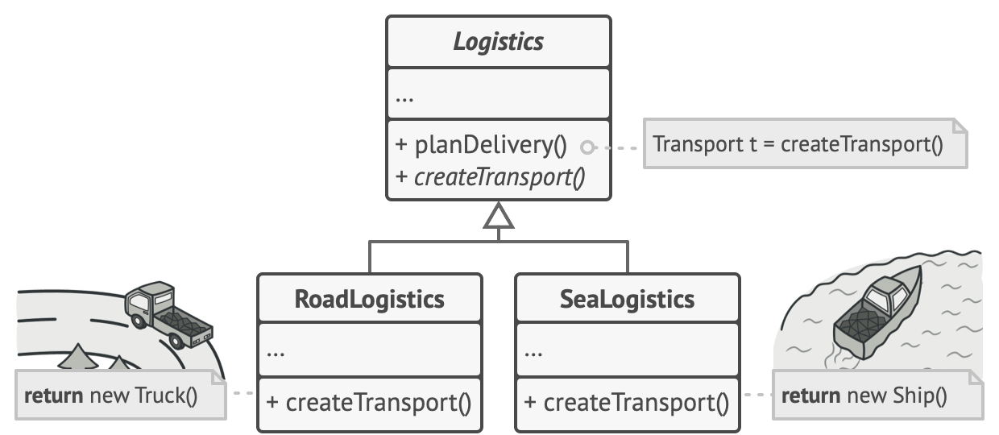

# References
- [https://refactoring.guru/design-patterns/factory-method](https://refactoring.guru/design-patterns/factory-method)

# What is the Factory Method?
- Creational design pattern
- Provides an interface for creating objects in a superclass, but allows subclasses to alter the type of objects that will be created.

# Situation

- There is an existing logistics app that uses trucks.
- As the business grows, you want to add ships to support maritime logistics services.
- However, Truck is tightly **coupled** to the entire system, making it difficult to add Ship.

# Solution
The main point of the problem is:

1. The system depends on the concrete class Truck.
    - It depends on Truck by **creating** and **using** it.

So, the solution is:

*1. Replace direct calls to create a truck (new Truck) in the client with a factory method.*

**2. Abstract Truck and Ship to implement a Transport interface.**

Whether to create a truck or a ship is implemented by overriding the factory method.

> **[Terminology]** A method that creates objects is called a **factory method**, and the objects created by this method are called **products** (truck, ship).

# Structure

### Product
- Declared as an interface.

### Concrete Products
- Implement the product interface differently for each product.

### Creator
- Creates the factory method.
- It is important to specify the **return type** of the factory method. In other words, it is important to specify the abstract type of the products.
- Despite its name, this class is not only responsible for creating objects, but also contains business logic related to products. The factory method helps separate creation logic from business logic.

### Concrete Creators
- Override the factory method to return different types of products.
- **It does not necessarily return a new instance.** It can return an already created instance.

# Another Example

- `render()`: Business logic that renders a dialog using a **Button**.
- `createButton()`: Factory method that creates an instance of a class implementing the Button interface.

If you implement WindowsDialog, the factory method creates a WindowsButton. If you implement WebDialog, the factory method creates an HTMLButton. This allows you to add new types without modifying existing code.

# When to Use
1. When client code should work without knowing the exact type of products.
2. When you want to provide a way for users to extend internal components of a library or framework.
    - e.g., If a framework provides UIButton, and a user wants to use RoundButton, they can implement the Button interface as RoundButton and override the factory method to return RoundButton.
3. When you want to reuse existing instances.
    - You can apply this logic in the factory method creation.

# Pros and Cons
### Pros
1. Follows SRP by moving creation code to another part of the program.
2. Follows OCP because you don't need to modify existing code when creating new types of products.

### Cons
1. Becomes more complex because you have to create a subclass for every new object type. 