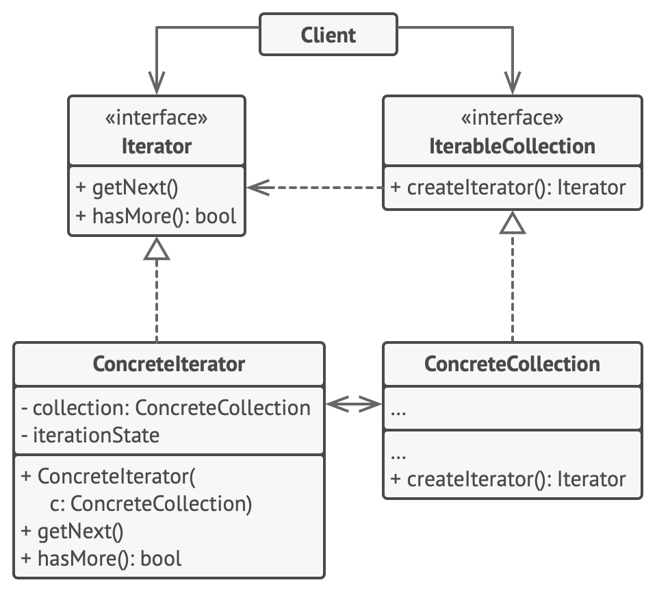

# Iterator Pattern

**Reference**  
[https://refactoring.guru/design-patterns/iterator](https://refactoring.guru/design-patterns/iterator)

## Definition
- Behavioral design pattern
  - A pattern that encapsulates the behavior of an object and delegates requests to the object.
- A design pattern that allows you to traverse elements of a collection without knowing its underlying structure.

## Situation - Traversing Various Types of Collections

- You need to traverse various types of collections.

### Bad Approach - Implementing Traversal Algorithms in the Collection
#### Problems
1. If the data structure is complex, traversal can be difficult and there can be many types.  
   - For example, in a tree, you can traverse using DFS, BFS, or even randomly. If you implement all traversal algorithms in the collection, it becomes messy. The main function of a collection is efficient storage, after all.
2. The client code becomes dependent on specific collections.  
   - Even though the client doesn't care how the data is stored, it ends up depending on the collection because each collection provides different ways to access its elements.

### Solution - Separate the Traversal Algorithm!
- The core of the iterator pattern is to separate the traversal algorithm from the collection into an object called an iterator.

#### Implementation and Benefits
1. Separate the traversal part into a class called iterator.
   - You can encapsulate the details of traversal (e.g., current position, how many elements are left).
   - The responsibility for traversal is given to the iterator.
2. Implement main methods to fetch elements.
   - This allows you to traverse all elements.
3. Ensure all iterators implement the same interface.
   - This allows client code to use collections and traversal algorithms interchangeably.

## Structure

### 1. Iterator
- Implements the algorithm needed to traverse a collection.
  1. Fetch the next element
  2. Get the current position
  3. Restart the iteration, etc.

### 2. Concrete Iterators
- Implements specific algorithms for traversal.
- The iterator tracks its own progress, so multiple iterators can traverse the same collection independently.

### 3. Collection
- Declares one or more methods to obtain an iterator.

### 4. ConcreteCollection
- Returns a new iterator instance each time the client requests one.

### 5. Client
- Uses the collection and iterator through their interfaces.
- The client does not create the iterator; the collection does.  
  - In special cases, the client may create its own iterator, e.g., if it wants a custom iterator.

## Question
Even though the collection interface claims to be type-agnostic, if the collection is a tree or a list, the traversal may differ, violating LSP (Liskov Substitution Principle).

For example, a tree may return iterators named dfs, bfs, etc., but a list does not have such iterators. Thus, it can be seen as a violation of LSP.

Therefore, instead of grouping all collections together, it may be better to create interfaces for collections where LSP applies, such as grouping trees and lists separately. 