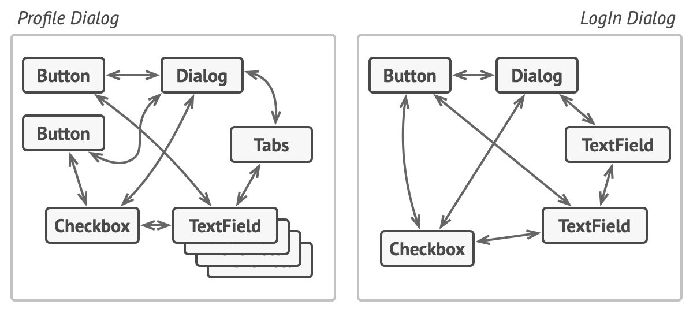
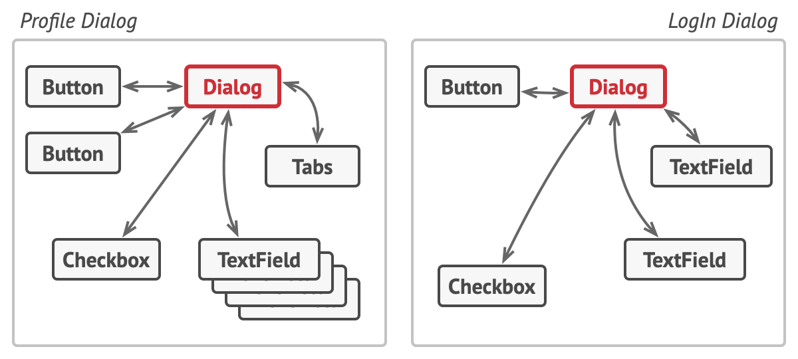

# Mediator Pattern

**Reference**  
[https://refactoring.guru/design-patterns/mediator](https://refactoring.guru/design-patterns/mediator)

## Definition
- Behavioral design pattern
  - A pattern about how objects communicate within a group.
- A design pattern that restricts direct communication between objects and forces them to communicate through a mediator object.

## Situation - Communication Between Components in a Dialog
- Imagine a dialog for creating and editing a customer's profile.
- This dialog contains various form controls, e.g., text fields, checkboxes, buttons.

### Key Point
How should components communicate within a form?
- Example interactions:
  1. When the [submit button] is pressed, it checks the [text field] for validity.
  2. When the [checkbox] labeled "I have a dog" is checked, a hidden [text field] for the dog's name appears.

## Bad Approach - Direct Communication Between Form Controls

- For example, if the [checkbox button] directly manipulates the [text field], the [checkbox button] becomes dependent on the [text field].
- This leads to the following problem:

### Problem - Not Reusable
- You may want to reuse the checkbox in another form, but it's tightly coupled to the dog name text field, making reuse difficult.

## Solution - Use a Mediator!
- To reduce direct communication, introduce a mediator. All communication goes through the mediator. In this example, the dialog that knows all components can act as the mediator.

### Component (button, checkbox...)
- The [checkbox button] notifies the mediator when it is checked (using a notify method).
- The [text field] is operated by the mediator.

### Mediator (dialog)
- The mediator receives notifications (e.g., the checkbox button was clicked) and, using references to the dialog's text fields, delegates or performs actions.

### Benefits
1. Objects only need to notify!
   - The checkbox button used to show the text field itself, but now it just notifies the mediator.
2. Can be used in various dialogs!
   - By declaring an abstract interface for the dialog, it can be used in many contexts.
3. Can encapsulate relationships!
   - Complex relationships between objects can be hidden via the mediator.

=> Components depend only on the dialog, not on each other, making reuse easier in different contexts.

## Structure

### 1. Component
- Contains its own business logic.
- Has a mediator interface field to notify the mediator.
  - This allows reuse in various mediators.

### 2. Mediator
- Declares methods for communication between components.
  - Usually implemented as a single notification method.
  - Components pass themselves and context arguments to the method (e.g., `m.notify(this, "click")`).
  - This removes dependencies between sender and receiver components.

### 3. Concrete Mediator
- Encapsulates relationships between components.
- Usually holds references to all components and manages them, sometimes even its own lifecycle.

#### Key Points
- Components must not know about each other. When an event occurs, they only notify the mediator.
- The mediator identifies the sender and determines which component to trigger.
- From the component's perspective, the mediator is like a black box: the sender doesn't know who will receive the request, and the receiver doesn't know who sent it. 