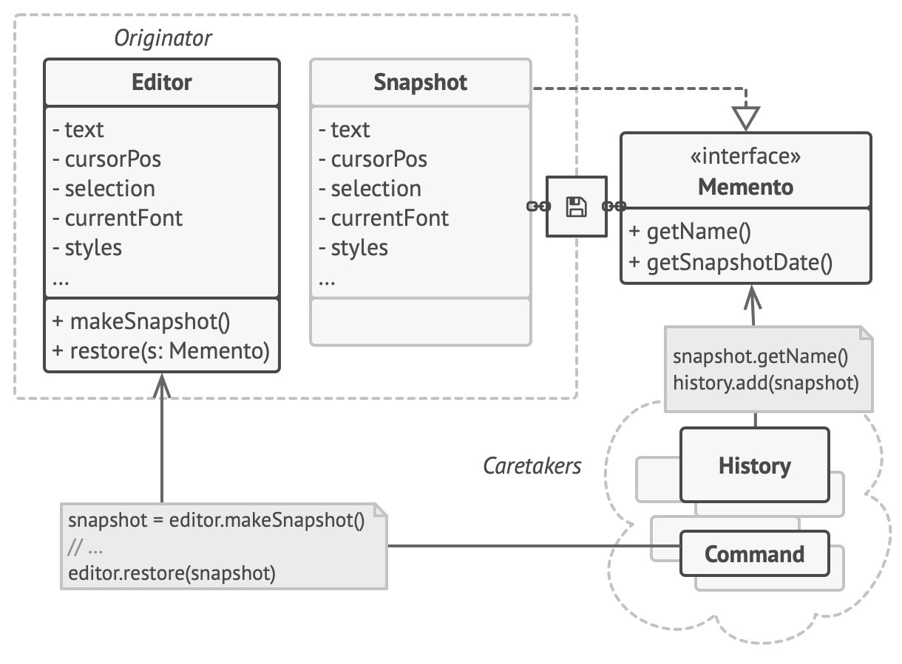
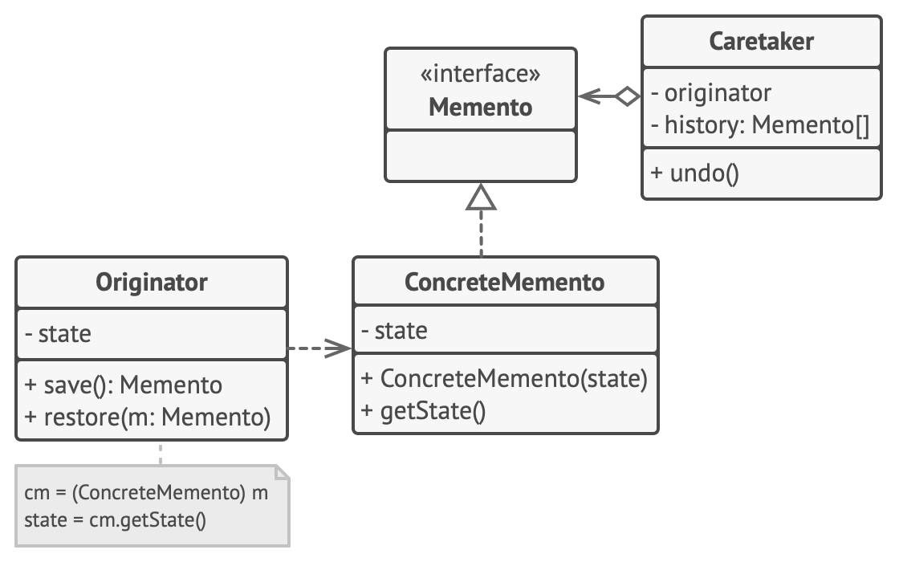
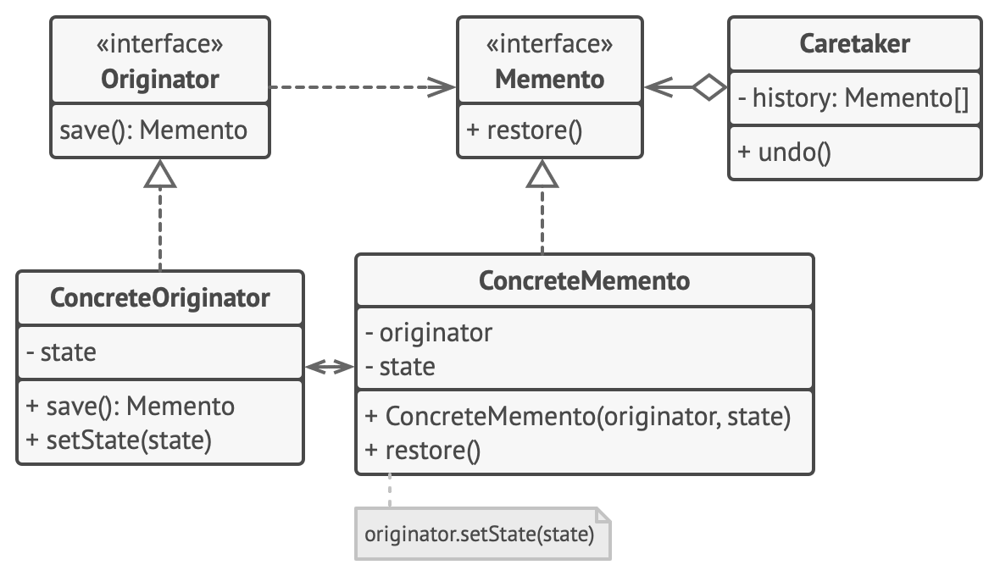

# Memento Pattern

**Reference**  
[https://refactoring.guru/design-patterns/memento](https://refactoring.guru/design-patterns/memento)

memento: a souvenir to remember a person or place

## Definition
- Behavioral design pattern
  - A pattern that encapsulates the behavior of an object and delegates requests to the object.
- A design pattern that encapsulates implementation details while allowing you to save or restore the previous state of an object.
- Also called the Snapshot Pattern.

## Situation - Implementing Undo Feature in an Editor Program
- Imagine an editor program.
- This program allows not only text editing but also text decoration and image insertion.

### Problem
- How can we implement the undo feature?

### To implement the undo feature...
1. Before performing an operation, save the state of all objects and put them in storage.
2. Later, when the user decides to revert, retrieve the state of the objects from storage.
3. Set the app's current state based on that state.

How should we read the object's state at this time?

### Bad Approaches
#### Method 1: Access editor state from another object
- Problem: You may not be able to access the value. Usually, classes declare their state values as private.

#### Method 2: Declare as public
- Problem: If you later change the class's fields, classes that depend on those fields may break.

#### Method 3: Store in a list of value-type containers
- Even if you make the field private, if the container is public, you end up allowing access anyway.

How can you copy the state while encapsulating it from other objects?

## Solution
### The object to be copied (originator) should copy its own state!
The Memento pattern has two key points:
1. Like the Prototype pattern, the object to be copied is responsible for saving its own data. This allows copying even if the values are private.
2. The value to be copied is stored in an object called a memento. Instead of creating its own object for storage, the originator saves its values in a memento object, which is also declared private to prevent access.

Here, we'll use the terms originator and caretaker. The originator is the object to be copied, and the caretaker is the object that uses the copied snapshot.

### Method
#### 1. Declare a memento to store the originator's values
- Declare a memento class inside the originator object's class. This allows the memento to store the state values even if the originator's state is private.

#### 2. Make memento's values private so other objects can't access them
- Both the originator and the memento snapshot should prevent access from other objects.

#### 3. When a snapshot is needed, the originator saves its values and outputs a memento
- When the caretaker needs a snapshot, it asks the originator to provide one.

#### 4. To restore, give the snapshot to the originator
- Since only the originator can read the memento, the caretaker hands the snapshot to the originator and asks it to restore.

#### 5. Store metadata
- Additionally, declare fields in the memento to record the name and snapshot time for each memento. Other objects can use this information to identify snapshots. The memento interface thus includes methods like getName and getSnapshotDate to view metadata.

## Structure
There are three possible structures, but the core is the same: how to encapsulate the data.

### 1. Implementation based on nested classes

- The memento class is a nested class of the originator. The originator can access the memento declared as a private field, but the caretaker cannot.
#### 1. Originator
  - Can leave a snapshot of its state and restore using the snapshot information.
#### 2. Memento
  - Value object for the originator's state snapshot
  - Usually created via constructor and made immutable.
#### 3. Caretaker
  - Knows information about the originator's state snapshot (when and why it was captured, and when to restore).
  - Usually stores mementos in a stack to track the originator's history.
  - When restoration is needed, pops a memento from the stack and gives it to the originator to restore.

### 2. Implementation based on intermediate interface

- Used when there is no nested interface (e.g., PHP).
- The caretaker is only given methods limited to the Memento interface.
- The originator uses ConcreteMemento to get state information via a getState() method.

### 3. Implementation with even stricter encapsulation

- This structure blocks any possibility of changing the originator's state through the memento.
1. This structure allows various types of originators and mementos, but only matching pairs work together.
2. The caretaker works through the Memento interface, so it is limited in changing state. Also, since restore is moved to the Memento, the caretaker becomes independent from the originator. 