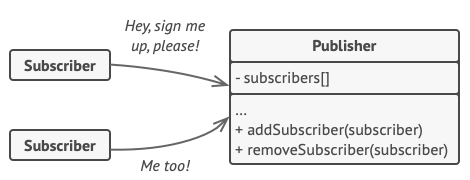

# Observer Pattern

**References**  
[https://refactoring.guru/design-patterns/observer](https://refactoring.guru/design-patterns/observer)  
[https://ko.wikipedia.org/wiki/%EC%98%B5%EC%84%9C%EB%B2%84_%ED%8C%A8%ED%84%B4](https://ko.wikipedia.org/wiki/%EC%98%B5%EC%84%9C%EB%B2%84_%ED%8C%A8%ED%84%B4)

## Intent

### Classification
- Behavioral design pattern
  - A pattern about how objects communicate within a group.

### Definition
- (guru) A pattern that defines a subscription mechanism to notify multiple objects about events that happen to the object they are observing.
- (wiki) A design pattern in which observers, who are interested in changes to an object's state, register themselves with the object, and the object notifies each observer directly via methods whenever its state changes.


## Problem

### Situation - Notifying Events
- There are two types of objects: `Customer` and `Store`.
- Customers are interested in the latest iPhone model that will soon be sold at the Store.

### Problem
- How can customers buy the product as soon as the latest iPhone is available in the store?


### Bad Approaches
#### [Method 1] Customer visits every day
- Customers visit the store every day to check if the latest iPhone has been released.

##### Drawbacks
1. Customers may visit the store even if the product hasn't been released, resulting in unnecessary effort.

#### [Method 2] Store notifies all customers
- The store sends emails to all customers whenever a new product is released.
- This avoids unnecessary visits by customers.

##### Drawbacks
1. Customers who are not interested in the new product still receive notifications, which can be annoying.
2. The store wastes resources.

From a programming perspective, the problems can be summarized as:
1. Customers should not waste resources checking for new products.
2. The store should not waste resources notifying uninterested customers.

How can we solve these conflicting problems?

## Solution

### Method
- The store should only send emails to customers who are interested in the new iPhone release!

To explain this, let's introduce some terminology.

### Terminology
#### 1. Publisher
- An object with an interesting state, also called a _subject_. In the observer pattern, this object notifies other objects of its state, so it's called a publisher.

#### 2. Subscribers
- Objects that want to track (observe) changes in the publisher's state are called subscribers.

### Applying the Observer Pattern
1. Add a subscription mechanism to the publisher class so that subscribers can subscribe to and unsubscribe from events (e.g., addSubscriber, removeSubscriber...).



2. The publisher calls a special notification method on subscribers to deliver important events.
3. To avoid coupling the publisher to concrete subscribers, all subscribers implement the same interface. This interface declares a notification method that receives context data about the event.


4. If you want to register subscribers with multiple publishers, declare the publisher as an interface to avoid depending on specific publishers.

### Applying to the [Customer - Store] Problem
- Only customers interested in the iPhone release are registered at the store.
- When the iPhone is released, the store notifies only the subscribed customers.

## Structure


### 1. Publisher
- Issues events of interest to other objects.
- These events occur when:
  - The publisher's state changes, or
  - Certain behaviors are executed.
- The publisher has infrastructure for subscriptions (defined mechanism):
  1. A container to store subscribers
  2. A method to add subscribers
  3. A method to remove subscribers
- When an event occurs, the publisher goes over the subscribers and calls their notification methods.

### 2. Subscriber (interface)
- Declares a notification interface.
- Usually has a single update method.
- This method receives contextual parameters so the publisher can pass event details.

### 3. Concrete Subscriber
- Performs specific actions in response to notifications from the publisher.

### 4. Client
- Creates publishers and subscribers and registers subscribers with publishers.

## Example
### Structure


This example separates the publisher's subscription infrastructure into an EventManager, resulting in a much better structure. Therefore, instead of writing a new example, I'll introduce this one directly.

#### 1. Publisher - Basic publisher
```java
package refactoring_guru.observer.example.publisher;

import refactoring_guru.observer.example.listeners.EventListener;

import java.io.File;
import java.util.ArrayList;
import java.util.HashMap;
import java.util.List;
import java.util.Map;

public class EventManager {
    Map<String, List<EventListener>> listeners = new HashMap<>();

    public EventManager(String... operations) {
        for (String operation : operations) {
            this.listeners.put(operation, new ArrayList<>());
        }
    }

    public void subscribe(String eventType, EventListener listener) {
        List<EventListener> users = listeners.get(eventType);
        users.add(listener);
    }

    public void unsubscribe(String eventType, EventListener listener) {
        List<EventListener> users = listeners.get(eventType);
        users.remove(listener);
    }

    public void notify(String eventType, File file) {
        List<EventListener> users = listeners.get(eventType);
        for (EventListener listener : users) {
            listener.update(eventType, file);
        }
    }
}
```

#### 2. Editor - Concrete publisher, tracked by other objects
```java
package refactoring_guru.observer.example.editor;

import refactoring_guru.observer.example.publisher.EventManager;

import java.io.File;

public class Editor {
    public EventManager events;
    private File file;

    public Editor() {
        this.events = new EventManager("open", "save");
    }

    public void openFile(String filePath) {
        this.file = new File(filePath);
        events.notify("open", file);
    }

    public void saveFile() throws Exception {
        if (this.file != null) {
            events.notify("save", file);
        } else {
            throw new Exception("Please open a file first.");
        }
    }
}
```

#### 3. Listeners
```java
package refactoring_guru.observer.example.listeners;

import java.io.File;

public interface EventListener {
    void update(String eventType, File file);
}
```

#### 4. EmailNotificationListener
```java
package refactoring_guru.observer.example.listeners;

import java.io.File;

public class EmailNotificationListener implements EventListener {
    private String email;

    public EmailNotificationListener(String email) {
        this.email = email;
    }

    @Override
    public void update(String eventType, File file) {
        System.out.println("Email to " + email + ": Someone has performed " + eventType + " operation with the following file: " + file.getName());
    }
}
```

#### 5. LogOpenListener
```java
package refactoring_guru.observer.example.listeners;

import java.io.File;

public class LogOpenListener implements EventListener {
    private File log;

    public LogOpenListener(String fileName) {
        this.log = new File(fileName);
    }

    @Override
    public void update(String eventType, File file) {
        System.out.println("Save to log " + log + ": Someone has performed " + eventType + " operation with the following file: " + file.getName());
    }
}
```

#### 6. Demo
```java
package refactoring_guru.observer.example;

import refactoring_guru.observer.example.editor.Editor;
import refactoring_guru.observer.example.listeners.EmailNotificationListener;
import refactoring_guru.observer.example.listeners.LogOpenListener;

public class Demo {
    public static void main(String[] args) {
        Editor editor = new Editor();
        editor.events.subscribe("open", new LogOpenListener("/path/to/log/file.txt"));
        editor.events.subscribe("save", new EmailNotificationListener("admin@example.com"));

        try {
            editor.openFile("test.txt");
            editor.saveFile();
        } catch (Exception e) {
            e.printStackTrace();
        }
    }
}
``` 