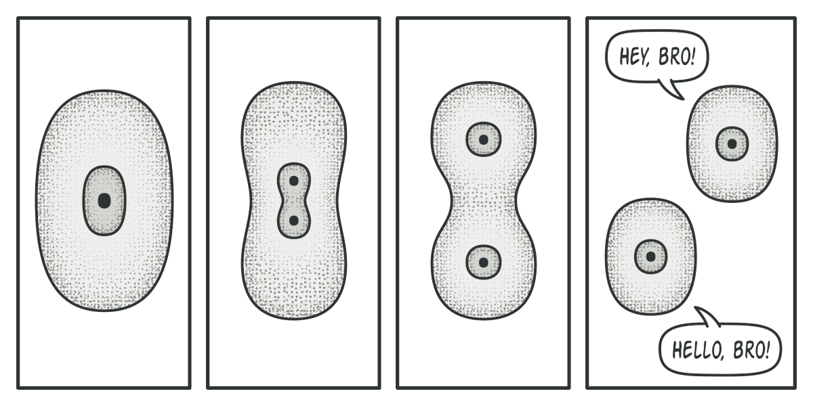

## What is the Prototype Pattern?

The Prototype Pattern is a **creational design pattern**.  
It enables the creation of new objects by copying an existing object, rather than creating them from scratch via their class constructors. This helps decouple code from specific classes.

## Prototype: Common vs Software Usage

When I first encountered the Prototype Pattern, I was confused. The word "prototype" in daily use has a slightly different meaning, so let’s clarify that first.

**Everyday Use:**  
A prototype usually refers to a preliminary version of a product made to test core features before mass production.  
In game development, it can also mean a simplified version of the game created to test gameplay and feasibility.

**In the Prototype Pattern:**  
A prototype is an object that supports cloning itself.  
Rather than a draft or concept model, think of it like an amoeba that can self-replicate.  
Despite the differences, both meanings derive from the idea of an "original form".


## The Problem

Say we want to duplicate an object.

**Typical Approach:**
- Use the object's class to create a new instance
- Copy all fields from the original object into the new one

**Problems:**
- If fields are private, we might not be able to access them.
- The code ends up depending on the concrete class.
- If we only have an interface reference, we can't create a new instance.

## The Solution

Delegate the cloning responsibility to the object itself!  
This eliminates the need to access fields externally or know the concrete class.

1. Define an interface for cloning (e.g., `clone()`).
2. Each class implements this method and manages its own duplication.
3. Now we can duplicate via the interface without depending on the class.

## Structure

### 1. Basic Implementation


#### Prototype Interface

```java
public interface Prototype {
    public Prototype clone();
}
```

#### ConcretePrototype

```java
public class Circle implements Prototype {
    private int x;
    private int y;

    public Circle(Circle prototype) {
        this.x = prototype.x;
        this.y = prototype.y;
    }

    public Circle(int x, int y) {
        this.x = x;
        this.y = y;
    }

    @Override
    public Prototype clone() {
        return new Circle(this);
    }
}
```

#### RedCircle Example (Subclassing)

```java
public class RedCircle extends Circle {
    private String color;

    public RedCircle(RedCircle prototype) {
        super(prototype);
        this.color = prototype.color;
    }

    public RedCircle(Circle circle, String color) {
        super(circle);
        this.color = color;
    }

    public RedCircle(int x, int y, String color) {
        super(x, y);
        this.color = color;
    }

    public Prototype clone() {
        return new RedCircle(this);
    }
}
```

#### Client

```java
public class Client {
    Prototype circle = new Circle(3, 5);
    Prototype redCircle1 = new RedCircle(3, 5, "red");
    Prototype redCircle2 = new RedCircle((Circle) circle, "red");
    Prototype newCircle = circle.clone();
    Prototype newRedCircle = redCircle1.clone();
}
```

### 2. Prototype Registry

You can manage prototypes using a registry or collector.  
This hides the creation logic from clients—they simply fetch from the registry.

In this context, clients may either:
1. Initialize and register objects to the registry.
2. Fetch existing prototypes from the registry.


## Limitations in Java

You often need to cast objects after cloning to access subclass-specific methods.

```java
abstract class Shape {
    private int x;
    private int y;

    public Shape(int x, int y) {
        this.x = x;
        this.y = y;
    }

    public Shape(Shape shape) {
        this.x = shape.x;
        this.y = shape.y;
    }

    public abstract Shape clone();
}

public class Circle extends Shape {
    private int radius;

    public Circle(int x, int y, int radius) {
        super(x, y);
        this.radius = radius;
    }

    public Circle(Circle circle) {
        super(circle);
        this.radius = circle.radius;
    }

    public int getRadius() {
        return radius;
    }

    @Override
    public Shape clone() {
        return new Circle(this);
    }
}

public class Client {
    public static void main(String[] args) {
        Circle circle = new Circle(3, 5, 110);

        Shape circle1 = circle.clone();
        // circle1.getRadius(); // Error

        Circle circle2 = (Circle) circle.clone();
        circle2.getRadius();
    }
}
```

As shown above, casting is required to access subclass-specific methods.  
This defeats the purpose of polymorphism and makes the pattern less elegant in Java.  
Hence, this pattern may be more suitable in dynamically typed languages like Python or JavaScript.

## Related Patterns

- Can be used as an alternative to complex Factory Methods.
- Abstract Factory can internally use Prototype to generate objects.