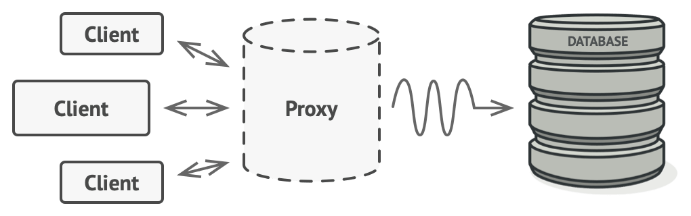

# References

- [https://refactoring.guru/design-patterns/proxy](https://refactoring.guru/design-patterns/proxy)
- [https://en.wikipedia.org/wiki/Proxy_pattern](https://en.wikipedia.org/wiki/Proxy_pattern)
- proxy: agent, substitute

# What is the Proxy Pattern?

- Structural design pattern
- By placing an agent in front of the real service, the **client's access to the real service** can be **controlled by the agent**.

# Situation - When do you need to control access to the real service?


- There is an object that can consume a lot of resources by connecting to the DB.
- This object is executed occasionally.

To address this, you might consider lazy initialization.

In other words, you want to control access to the DB by creating the object only when needed.

### Bad Approaches

1. Modify all client codes that use the object to use lazy initialization
   - This causes code duplication since each client must be modified.
2. Modify the object itself for lazy initialization
   - If the object is from a 3rd-party library, you cannot modify it.

# Solution - Use an Agent!



1. As shown above, place a proxy class with the same interface as the database in front.
2. Make the client request the proxy instead of the database.
3. When the client makes a request, the proxy initializes the object and performs the logic on the real service.

# Structure


### 1. ServiceInterface
Create an interface for the Service so that both Proxy and Service have the same interface.

### 2. Service
The service contains the actual business logic.

### 3. Proxy
The proxy holds a reference field to the service. This is to delegate and control the work.

### 4. Client
The client uses the Proxy as if it were the real service.

# Use Cases

1. Lazy initialization
2. Security
   - The proxy checks user permissions when accessing the real service and decides whether to allow or deny access.
3. Logging
4. Caching

# Example - YouTube Caching Library


### 1. ThirdParty YouTubeLib

```java
public interface ThirdPartyYouTubeLib {
    HashMap<String, Video> popularVideos();
    Video getVideo(String videoId);
}
```

### 2. ThirdPartyYouTubeClass

```java
public class ThirdPartyYouTubeClass implements ThirdPartyYouTubeLib {
    @Override
    public HashMap<String, Video> popularVideos() {
        connectToServer("http://www.youtube.com");
        return getRandomVideos();
    }

    @Override
    public Video getVideo(String videoId) {
        connectToServer("http://www.youtube.com/" + videoId);
        return getSomeVideo(videoId);
    }

    // -----------------------------------------------------------------------
    // Fake methods to simulate network activity. They as slow as a real life.

    private int random(int min, int max) {
        return min + (int) (Math.random() * ((max - min) + 1));
    }

    private void experienceNetworkLatency() {
        int randomLatency = random(5, 10);
        for (int i = 0; i < randomLatency; i++) {
            try {
                Thread.sleep(100);
            } catch (InterruptedException ex) {
                ex.printStackTrace();
            }
        }
    }

    private void connectToServer(String server) {
        System.out.print("Connecting to " + server + "... ");
        experienceNetworkLatency();
        System.out.print("Connected!" + "\n");
    }

    private HashMap<String, Video> getRandomVideos() {
        System.out.print("Downloading populars... ");
        experienceNetworkLatency();
        HashMap<String, Video> hmap = new HashMap<String, Video>();
        hmap.put("catzzzzzzzzz", new Video("sadgahasgdas", "Catzzzz.avi"));
        hmap.put("mkafksangasj", new Video("mkafksangasj", "Dog play with ball.mp4"));
        hmap.put("dancesvideoo", new Video("asdfas3ffasd", "Dancing video.mpq"));
        hmap.put("dlsdk5jfslaf", new Video("dlsdk5jfslaf", "Barcelona vs RealM.mov"));
        hmap.put("3sdfgsd1j333", new Video("3sdfgsd1j333", "Programing lesson#1.avi"));
        System.out.print("Done!" + "\n");
        return hmap;
    }

    private Video getSomeVideo(String videoId) {
        System.out.print("Downloading video... ");
        experienceNetworkLatency();
        Video video = new Video(videoId, "Some video title");
        System.out.print("Done!" + "\n");
        return video;
    }
}
```

### 3. Video

```java
public class Video {
    public String id;
    public String title;
    public String data;

    Video(String id, String title) {
        this.id = id;
        this.title = title;
        this.data = "Random video.";
    }
}
```

### 4. Caching Proxy

```java
public class YouTubeCacheProxy implements ThirdPartyYouTubeLib {
    private ThirdPartyYouTubeLib youtubeService;
    private HashMap<String, Video> cachePopular = new HashMap<String, Video>();
    private HashMap<String, Video> cacheAll = new HashMap<String, Video>();

    public YouTubeCacheProxy() {
        this.youtubeService = new ThirdPartyYouTubeClass();
    }

    @Override
    public HashMap<String, Video> popularVideos() {
        if (cachePopular.isEmpty()) {
            cachePopular = youtubeService.popularVideos();
        } else {
            System.out.println("Retrieved list from cache.");
        }
        return cachePopular;
    }

    @Override
    public Video getVideo(String videoId) {
        Video video = cacheAll.get(videoId);
        if (video == null) {
            video = youtubeService.getVideo(videoId);
            cacheAll.put(videoId, video);
        } else {
            System.out.println("Retrieved video '" + videoId + "' from cache.");
        }
        return video;
    }

    public void reset() {
        cachePopular.clear();
        cacheAll.clear();
    }
}
```

### 4. YouTubeDownloader

```java
public class YouTubeDownloader {
    private ThirdPartyYouTubeLib api;

    public YouTubeDownloader(ThirdPartyYouTubeLib api) {
        this.api = api;
    }

    public void renderVideoPage(String videoId) {
        Video video = api.getVideo(videoId);
        System.out.println("\n-------------------------------");
        System.out.println("Video page (imagine fancy HTML)");
        System.out.println("ID: " + video.id);
        System.out.println("Title: " + video.title);
        System.out.println("Video: " + video.data);
        System.out.println("-------------------------------\n");
    }

    public void renderPopularVideos() {
        HashMap<String, Video> list = api.popularVideos();
        System.out.println("\n-------------------------------");
        System.out.println("Most popular videos on YouTube (imagine fancy HTML)");
        for (Video video : list.values()) {
            System.out.println("ID: " + video.id + " / Title: " + video.title);
        }
        System.out.println("-------------------------------\n");
    }
}
```

### 5. Demo

```java
public class Demo {
    public static void main(String[] args) {
        YouTubeDownloader naiveDownloader = new YouTubeDownloader(new ThirdPartyYouTubeClass());
        YouTubeDownloader smartDownloader = new YouTubeDownloader(new YouTubeCacheProxy());

        long naive = test(naiveDownloader);
        long smart = test(smartDownloader);
        System.out.print("Time saved by caching proxy: " + (naive - smart) + "ms");
    }

    private static long test(YouTubeDownloader downloader) {
        long startTime = System.currentTimeMillis();

        // User behavior in our app:
        downloader.renderPopularVideos();
        downloader.renderVideoPage("catzzzzzzzzz");
        downloader.renderPopularVideos();
        downloader.renderVideoPage("dancesvideoo");
        // Users might visit the same page quite often.
        downloader.renderVideoPage("catzzzzzzzzz");
        downloader.renderVideoPage("someothervid");

        long estimatedTime = System.currentTimeMillis() - startTime;
        System.out.print("Time elapsed: " + estimatedTime + "ms\n");
        return estimatedTime;
    }
}
```

# Conclusion

The proxy could interface to anything: a network connection, a large object in memory, a file, or some other resource that is expensive or impossible to duplicate.

In short, a proxy is a wrapper or agent object that is being called by the client to access the real serving object behind the scenes.

---

When introducing more than 10 design patterns, a noticeable object relationship emerges: aggregation and composition. Ultimately, there are two main reasons to use this pattern:

1. You can delegate work.
2. Instead of executing the service directly, you execute the real work through the object, so you can add logic to that object. 