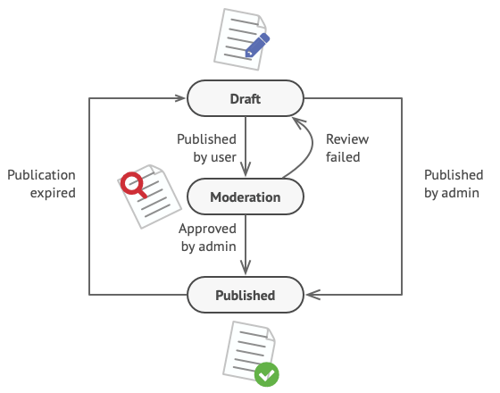
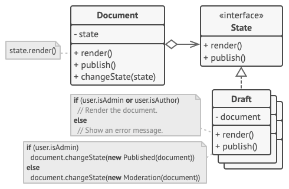

# State Pattern

> Three-line summary  
> 1. A behavioral design pattern  
> 2. A pattern that encapsulates the behavior of an object and delegates requests to the object  
> 3. A pattern that changes the behavior as the object's state changes

**References**  
[https://refactoring.guru/design-patterns/state](https://refactoring.guru/design-patterns/state)  
[https://en.wikipedia.org/wiki/State_pattern](https://en.wikipedia.org/wiki/State_pattern)

## Intent

### Classification
- Behavioral design pattern
  - A pattern that encapsulates the behavior of an object and delegates requests to the object.

### Definition
- A design pattern that changes the behavior as the object's state changes.
  - Because of this, it may appear as if the object's class has changed.

## Problem

### Situation - Finite State Machine
The State Pattern is closely related to the concept of a finite state machine.

So, let's first explain the finite state machine.


- At any given moment, a program has a specific state.
- The number of states is finite.
- The program behaves differently in each state.
- The program can immediately change from one state to another.
- Depending on the current state, the possible states to transition to may be limited, or there may be none. These switching rules are called transitions.
- Transitions are also finite and predefined.

This approach can be applied to objects. Let's introduce a document program that applies this approach.

#### Document class states
1. Draft
2. Moderation
3. Published

#### Document class method: publish
The publish method behaves differently depending on the state.

1. Draft  
   Changes the document's state to moderation.
2. Moderation  
   Only if the current user is an admin, changes the document to public.
3. Published  
   Does nothing.



### Bad approach
1. Represents the state as a set of values in the object's field.
2. Uses conditional statements to behave differently depending on the current state.

```java
class Document is
    field state: string
    // ...
    method publish() is
        switch (state)
            "draft":
                state = "moderation"
                break
            "moderation":
                if (currentUser.role == 'admin')
                    state = "published"
                break
            "published":
                // Do nothing.
                break
    // ...
```

#### Drawbacks
1. Whenever you add a state or behavior for a state, you may have to change the logic of every method.
2. It becomes very complex.

## Solution

### Key Point
Declare each state as a class, not a value. Delegate behavior related to the state to the state itself.



### Application
1. The Document object is called the context or origin object. This object stores a reference to the current state object and delegates state-related work to this state object.
2. To transition states, replace the current state object with another. To avoid being dependent on a specific state, declare an interface that abstracts the state objects.

## Structure


### 1. Context
- Holds references to concrete state objects.
- Delegates state-related work to concrete state objects.
- Communicates with concrete states through the state interface.
- Declares a public setter to set a new state object.

### 2. State
- Declares state-specific methods.

### 3. Concrete States
- Performs logic unique to its state.
- Holds a back reference to the context.
  - To get data from the context object and to transition states.

### Example - wiki
This example prints uppercase or lowercase letters depending on the context's state.

The initial state is lowercase output. When outputting lowercase, it transitions to uppercase output state. In the uppercase output state, after printing twice, it transitions back to lowercase output state.

In this example, the state method receives the context object as a parameter, allowing it to manipulate the context.

#### 1. State
```java
interface State {
    void writeName(StateContext context, String name);
}
```

#### 2. LowerCaseState
```java
class LowerCaseState implements State {
    @Override
    public void writeName(StateContext context, String name) {
        System.out.println(name.toLowerCase());
        context.setState(new MultipleUpperCaseState());
    }
}
```

#### 3. MultipleUpperCaseState
```java
class MultipleUpperCaseState implements State {
    /* Counter local to this state */
    private int count = 0;

    @Override
    public void writeName(StateContext context, String name) {
        System.out.println(name.toUpperCase());
        /* Change state after StateMultipleUpperCase's writeName() gets invoked twice */
        if (++count > 1) {
            context.setState(new LowerCaseState());
        }
    }
}
```

#### 4. StateContext
```java
class StateContext {
    private State state;

    public StateContext() {
        state = new LowerCaseState();
    }

    void setState(State newState) {
        state = newState;
    }

    public void writeName(String name) {
        state.writeName(this, name);
    }
}
```

#### 5. StateDemo
```java
public class StateDemo {
    public static void main(String[] args) {
        StateContext context = new StateContext();

        context.writeName("Monday");
        context.writeName("Tuesday");
        context.writeName("Wednesday");
        context.writeName("Thursday");
        context.writeName("Friday");
        context.writeName("Saturday");
        context.writeName("Sunday");
    }
}
```

#### Output
```
 monday
 TUESDAY
 WEDNESDAY
 thursday
 FRIDAY
 SATURDAY
 sunday
``` 