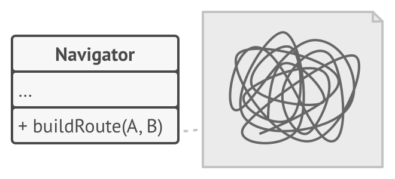

# Strategy Pattern

**Reference**  
[https://refactoring.guru/design-patterns/strategy](https://refactoring.guru/design-patterns/strategy)

## Intent

### Classification
- Behavioral design pattern
  - A pattern that encapsulates the behavior of an object and delegates requests to the object.

### Definition
- A pattern that defines a family of algorithms, encapsulates each one as a separate class, and makes them interchangeable.

## Problem

### Situation
- Let's think about a navigation app.
- In the early stages of development, a feature was created to suggest routes with scenic views.
- Over time, more requirements were added:
  1. Added a feature to provide walking routes...
  2. Added a feature to provide routes using public transportation...
  3. Even added a feature to provide routes passing through specific cities.

### Problem
- The logic for providing routes was written in the main class, so every time a new feature was added, the code in the main class doubled in length.
- Also, because the logic was not separated, bugs occurred whenever the algorithms were modified or improved.
- How can we create a better structure?

## Solution

### Key Point
- Separate each algorithm into its own class and use an interface to utilize the algorithms.

### Method
#### Terminology
- The Navigator is called the **context**, and the algorithms for selecting a specific route are called **strategies**.
> The reason it's called context is to emphasize the meaning of the context in which the strategy is used.

#### 1. Navigator (context)
- Create a class called Navigator and specify a field that can reference strategies.
- The Navigator delegates the route-finding logic to the strategy.
- This strategy is declared as an interface type, so it is not dependent on a specific route-finding algorithm.

#### 2. RouteStrategy
- Declare the methods needed for the route-finding algorithms.

#### 3. Concrete Strategy (e.g., road, walking, publicTransport...)
- Every time a new algorithm is added, create a concrete strategy that implements RouteStrategy.
- The algorithm is executed here.

- By doing this, the main class does not need to become messy, and the route-finding algorithms can be separated.

## Structure

### 1. Context
- Communicates with one of the concrete strategies through a reference declared as the strategy interface.
- Exposes a setter method so the client can change the current strategy object.

### 2. Strategy
- The common interface for all concrete strategies.
- Defines the method that the context will use to execute the strategy.

### 3. ConcreteStrategies
- Implements the algorithms that the context will use.

### 4. Client
- Creates a specific strategy object and passes it to the context. In other words, the context is not responsible for creating or changing the strategy.
- The client can also change the current strategy object of the context at runtime. 