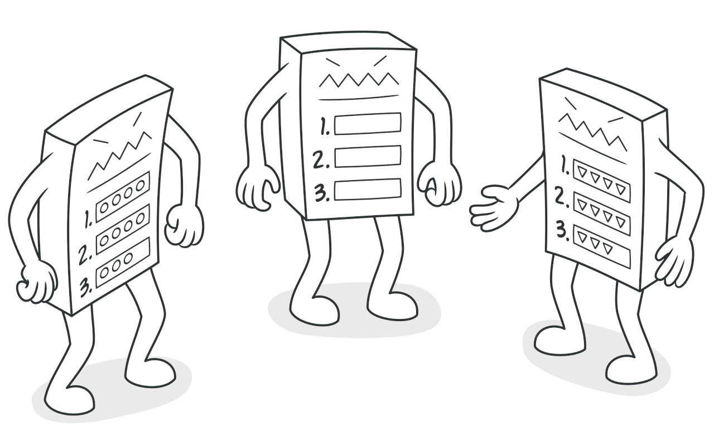
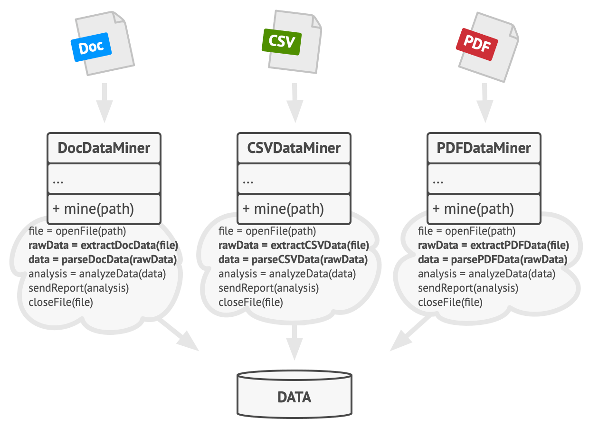
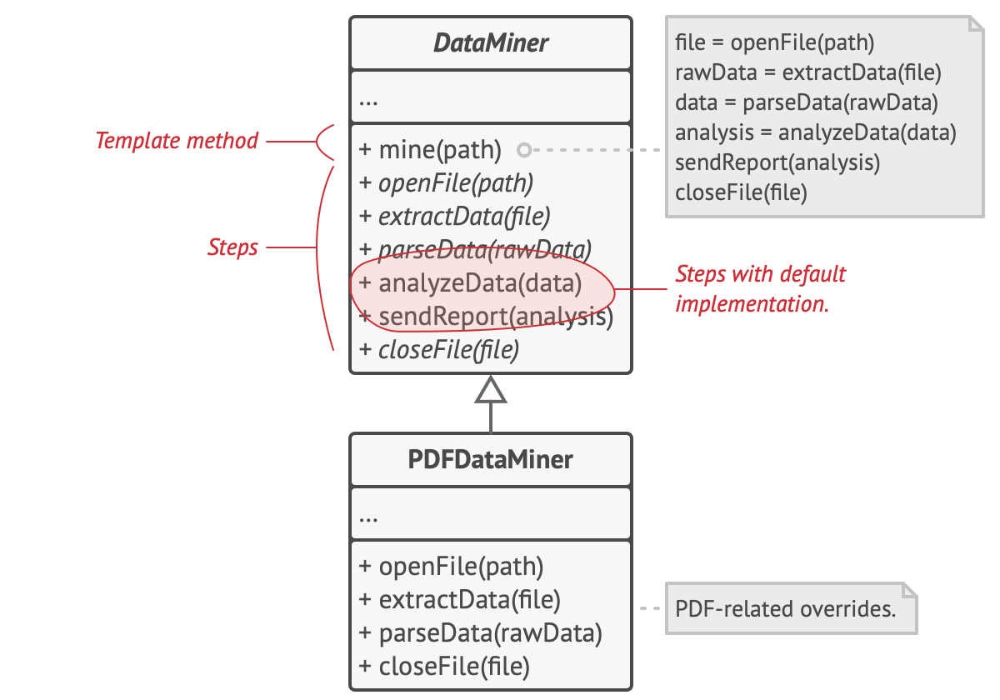

# References

- <https://refactoring.guru/design-patterns/template-method>

# Intent

### Category

- behavioral design pattern  
   - A behavioral class pattern that uses inheritance to distribute behavior among classes.

### Definition

- A pattern where the skeleton of an algorithm is defined in a superclass, and subclasses override specific methods without changing the algorithm's structure.

# Problem

### Situation

- Imagine a data mining app.
- This app analyzes corporate documents.
- Users provide data.
- The app parses the data in a unified format, analyzes it, and extracts meaningful information.

### Problem

#### Adding Support for More Input Types

- Initially, only Doc files were supported for data mining, but over time, csv and pdf files were also supported.

#### Problem Recognition

1. The three classes have similar code.  
   - They all follow the same procedure: read file -> extract data -> parse data -> analyze data -> report results -> close file.  
   - The doc, csv, and pdf classes have duplicated code.  
   ex:) openFile, analyzeData, sendReport, closeFile
2. There is a lot of branching logic.  
   - The client code calls each class's methods with branching logic.

How can we avoid duplication in classes with the same structure?

# Solution

### Core Idea

- Handle common logic in the superclass!
- Handle differing logic in subclasses!
- Group the sequence of steps together!

### Method

1. Create a superclass called DataMiner.  
   - Implement the common steps in this class.  
   - Leave the steps that differ for each document type as abstract methods.  
   - Provide a template method called mine to execute the sequence of steps.
2. Each document format class inherits from DataMiner.  
   - Each document format class overrides and implements its own methods.  
   ex:) For PDF files, the abstract parseData method is implemented with PDF parsing logic.

With this approach, common logic is placed in DataMiner, and document-specific logic is implemented via overriding. The sequence of execution is simplified through the template method.

# Structure

### 1. Abstract Class

- Declares each step of the algorithm as methods.
- Declares a template method that executes these methods in a specific order.
- Optionally, declares hook methods.  
   - Hook methods have empty bodies.  
   - If additional logic is needed, subclasses can implement these hook methods.  
   - They are usually placed between important steps.

### 2. Concrete Class

- Overrides the steps that need to be implemented with its own logic.

# Example

- <https://jdm.kr/blog/116>
