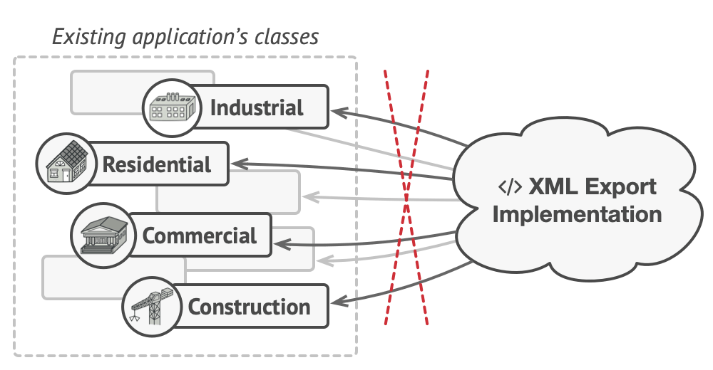
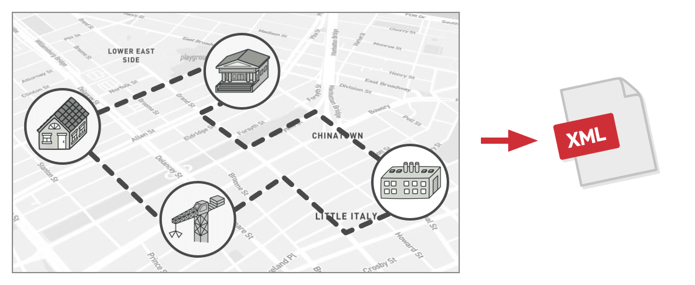

# References

- <https://refactoring.guru/design-patterns/visitor>

# Intent

### Category

- behavioral design pattern  
   - A pattern that encapsulates the behavior of objects and delegates requests to objects.

### Definition

- A pattern that separates algorithms from objects.

# Problem

### Situation

- You are developing a terrain information app composed of a large graph.
- Nodes can be things like cities or libraries.
- If there is a road between nodes, they can be connected.
- The node class represents the type of node, and each specific node is an object.

 


### Requirement

- You are asked to export the graph in XML format.

### Bad Approach

#### Method - Add logic to the node

- Add an XML exporting method to the node.
- Find connected nodes and recursively convert them to XML.

#### Problems

- Violates SRP.  
The main responsibility of the node is to work with geographic data, but now it is also asked to export XML files.
- Violates OCP.  
You have to change existing logic to add new features, which can cause unexpected bugs.
- If more features are requested, the logic gets even messier.  
If you are asked to export to CSV as well as XML, you have to modify the existing logic again.



# Solution

### Core Idea

Minimize changes to existing logic and move new logic to another class!

### Method

#### Declare Visitor

- The visitor is a class that implements new logic.
- Pass the existing object as an argument to the visitor's method.  
   - The visitor needs to implement logic about the object, so it needs to receive the object.
- At this time, the object should declare the data needed by the visitor as public.

```java
class ExportVisitor implements Visitor {
    void doForCity(City c) { ... }
    void doForIndustry(Industry f) { ... }
    void doForSightSeeing(SightSeeing ss) { ... }
    // ...
}
```

#### Method Invocation

This is the trickiest part of the visitor pattern. Let me explain how to call the visitor's method.

##### If designed poorly...

Because it's a method, not an object, you can't apply polymorphism.

If the client runs the visitor method, you have to check what kind of object it is and run the appropriate method for that object.

```javascript
foreach (Node node in graph) {
    if (node instanceof City)
        exportVisitor.doForCity((City) node)
    if (node instanceof Industry)
        exportVisitor.doForIndustry((Industry) node)
    // ...
}
```

##### Counterargument - Can't you just overload?

=> Even if the names are the same, you can't know because the types are different.

The visitor that receives the object and performs logic wants a method for each class like City, Industry, etc. Since the methods for nodes differ by class, it's hard to declare them in an interface.

##### Solution - Double Dispatch

Instead of the client calling the method, the object that will be passed to the visitor runs the visitor method. And in that method, it passes itself. This is implemented as an accept method in the object.

```java
// Client code
foreach (Node node in graph)
    node.accept(exportVisitor)

// City
class City {
    void accept(Visitor v) {
        v.doForCity(this);
    }
    // ...
}

// Industry
class Industry {
    void accept(Visitor v) {
        v.doForIndustry(this);
    }
    // ...
}
```

Let's take the City class as an example.

The city accepts the visitor and, by passing itself to the visitor, delegates the work related to City.

The visitor performs its work using the city object, calling the necessary data from the city object.

This is where the meaning of "visitor" becomes clear.

Through the accept method in the City object, the visitor visits and performs its logic.

# Structure


### 1. Visitor (interface)

- Declares visit methods that can accept concrete elements as arguments.
- In languages that support overloading, these can have the same name but different parameter types.

### 2. Concrete Visitor

- Implements several versions for different concrete element classes.  
In the example above, these would be XML format, CSV format, etc.

### 3. Element (interface)

- Declares an accept method that can accept a visitor.

### 4. Concrete Element

- Must implement the accept method to accept a visitor.
- This is to redirect to the appropriate visitor method for the current Element class.

### 5. Client

- The client is usually a collection or a complex object (e.g., composite tree).
- The client works with objects through an abstract interface, so it does not know about the concrete elements.


# Example Problems and Diagrams

Below are diagrams illustrating the Visitor Pattern problem and solution:


