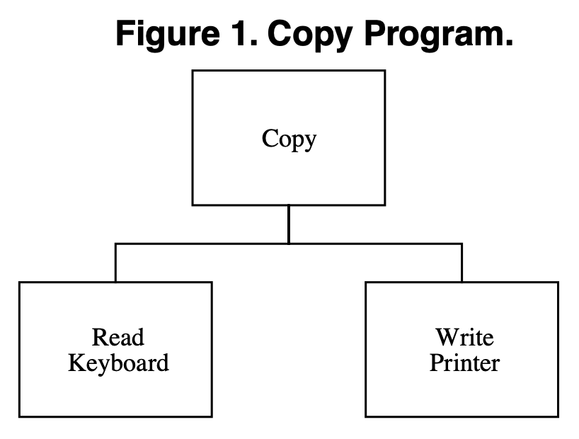
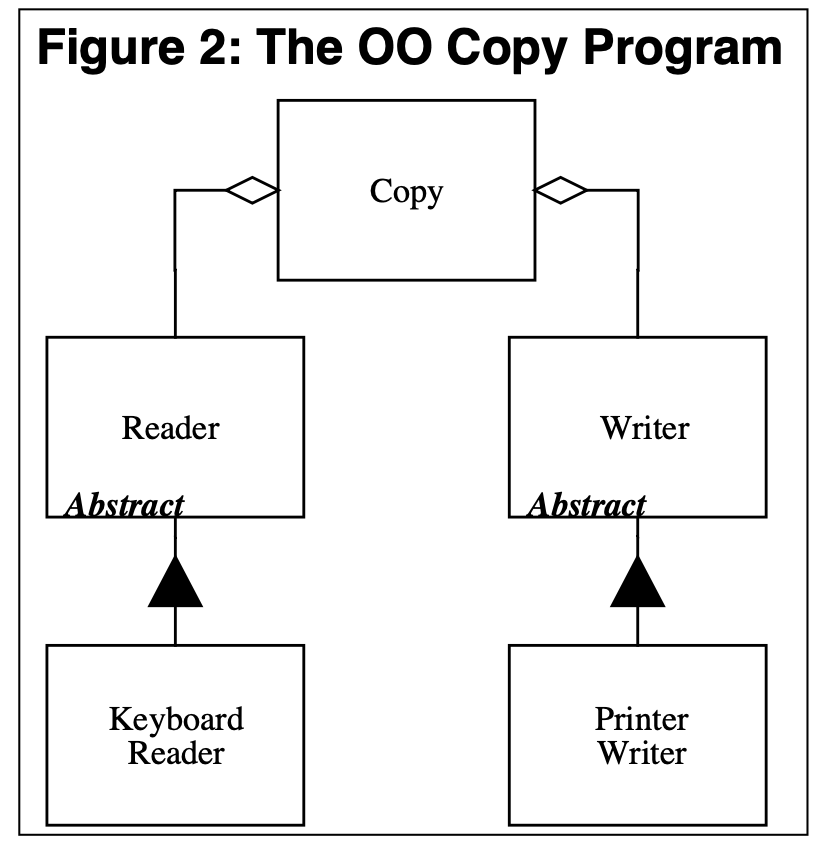
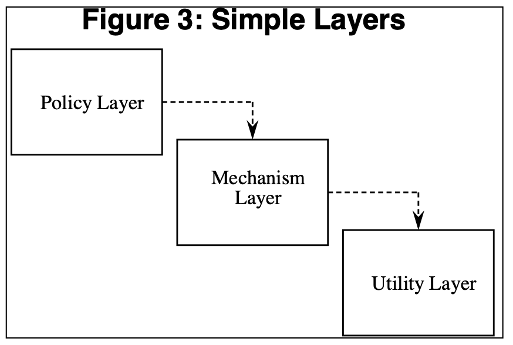
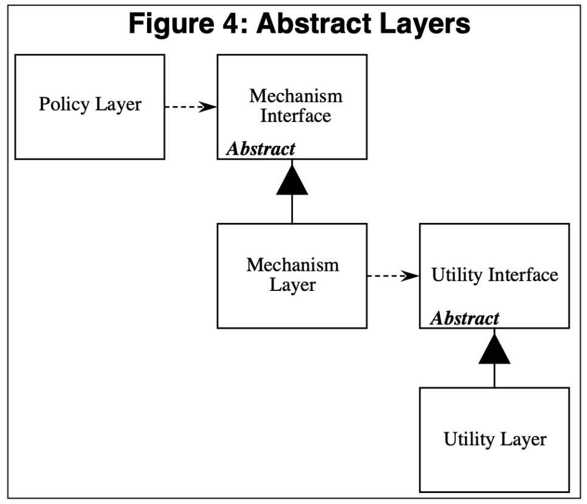

Previously, we learned about OCP (Open/Closed Principle) and LSP (Liskov Substitution Principle). OCP is the principle of allowing changes but preventing modifications, and LSP is the principle that a base class can be replaced by its subclass. Here, I will talk about the structure that arises from strictly applying these two principles.

This structure itself becomes a principle, and its name is the **Dependency Inversion Principle**.

## What's Wrong with Software?

As developers, we often drive ourselves into bad design. Why does this happen? The core of the problem is that we haven't defined what **bad design** is.

So, let me explain what bad design is.

## Bad Design

### Definition of Bad Design

Everyone may have a different idea of what bad design is. However, according to Robert Martin, if software meets any of the following criteria, most people would agree that it is bad design. (These are sufficient conditions for bad design, not necessary conditions.)

1. When you change the software, it is hard to change because it affects many other parts of the system. **[Rigidity]**
2. When you change the software, unexpected parts of the system break. **[Fragility]**
3. It is hard to separate the necessary parts from the current application, making it difficult to reuse in other applications. **[Immobility]**

I will explain these three indicators in detail to clarify what bad design is.

### Cause of Bad Design

#### **The Cause is Interdependency**

Interdependency makes software rigid, fragile, and immobile.

### How Does Interdependency Cause the 3 Bad Design Traits?

#### 1. Rigidity

A **single change in a highly interdependent module** causes a cascade of changes. The extent of these changes is unpredictable for designers and maintainers, making the cost of change unpredictable. As a result, managers are reluctant to approve changes, and the design becomes officially rigid.

#### 2. Fragility

Fragility refers to the tendency for many parts of a program to break when a change occurs. **When there is strong interdependency between conceptually unrelated parts**, new problems arise when changes are made. This reduces the reliability of the design and makes it hard for managers to predict quality.

#### 3. Immobility

Immobility means that the part you want from the design is **strongly interdependent with other unwanted parts**. In most cases, the cost of separating them is higher than redeveloping, so you end up not using it at all.

## Example: Copy Program

### Example with Strong Dependency



#### Situation

This is an example where what you type on the keyboard is **copied** and output to the printer. [Figure 1] shows the structure of this situation.

#### Problem: Cannot Reuse the Core Policy (Copy)

```cpp
void Copy() {
  int c;
  while ((c = ReadKeyboard()) != EOF)
   WritePrinter(c);
}
```

In the code above, Copy copies the character input from the keyboard using the ReadKeyboard function, and outputs it to the printer using the WritePrinter function.

While low-level modules like keyboard and printer can be reused via subroutine libraries, **Copy** calls each **specific keyboard** and **specific printer**, so Copy **cannot be reused for other input and output devices**.

Ironically, Copy encapsulates the policy we most want to reuse. Robert Martin says this is a shameful situation—because we can't reuse the system's intelligence encapsulated in Copy.

#### What if you want to output to another device?

Suppose you want to send the value input from the keyboard to a disk file.

Of course, you would want to reuse the Copy module. [Why? Because this is the **high-level policy** we need.]

But since Copy depends on WritePrinter, you can't reuse it.

```cpp
enum OutputDevice {printer, disk};

void Copy(outputDevice dev) {
  int c;
  while ((c = ReadKeyboard()) != EOF)
    if (dev == printer)
      WritePrinter(c);
    else
      WriteDisk(c);
}
```

If you branch with an if statement to write to disk, you just create another interdependency. Over time, Copy will depend on more and more low-level modules, and the system will become rigid and fragile.

### The Answer: Dependency Inversion

The problem can be summarized as follows:

**The module with the high-level policy depends on the low-level concrete modules, which causes the problem.**

If we make the Copy module independent from the concrete modules, Copy can be reused.

So, the solution is as follows:

1. Copy depends on abstract Reader and Writer.
2. Keyboard inherits from Reader, and Printer inherits from Writer.



```cpp
class Reader {
  public:
   virtual int Read() = 0;
};

class Writer {
  public:
   virtual void Write(char) = 0;
};

void Copy(Reader& r, Writer& w) {
  int c;
  while((c=r.Read()) != EOF)
    w.Write(c); 
}
```

#### Benefits

With this design, Copy depends on abstract classes, and the specific readers and writers also depend on the same abstract classes.

1. Copy is free from dependencies on specific (detail) classes and only depends on abstract classes, so it is reusable.
2. Even if you create new readers and writers, Copy is independent from them because it only depends on the abstract class.  
   - As we learned in OCP, it depends on a fixed Abstract, so it doesn't change.

By removing interdependency, the system becomes less fragile and rigid, and Copy can be used in various contexts, making it mobile.

## The Dependency Inversion Principle

### Summary

**A. HIGH LEVEL MODULES SHOULD NOT DEPEND UPON LOW LEVEL MODULES. BOTH SHOULD DEPEND UPON ABSTRACTIONS**

High-level modules should not depend on low-level modules; both should depend on abstractions.

**B. ABSTRACTIONS SHOULD NOT DEPEND UPON DETAILS. DETAILS SHOULD DEPEND UPON ABSTRACTIONS**

Abstractions should not depend on details. Details should depend on abstractions.

### Meaning of Inversion

In traditional procedural or structured programming, high-level modules often depend on low-level modules (as in Figure 1).

Thus, the term "Inversion" is used because it inverts the traditional design.

This is also a core principle of framework design.

## Is Layering Good?

### Common Belief

Booch said:

**"A well-designed object-oriented structure has clearly defined layers, and each layer provides consistent services to the next layer through well-defined interfaces."**

But people often take this literally and create structures like [Figure 3].



### Drawback

However, if you design like this, **dependency is transferred all the way to the Utility Layer!**

Policy depends on the Mechanism Layer, and the Mechanism Layer depends on the Utility Layer, so changes in the Utility Layer affect the Policy Layer.

So, the answer is...

### Abstract Layers



If you add interfaces for each layer, each layer depends on abstract classes, so they can be maintained independently.

But then, according to DIP, both low-level and high-level modules should depend on abstractions. How do you determine which is the high-level module?

## Finding the Underlying Abstraction

### The Key: The Abstraction That Doesn't Change When Concrete Modules Change


In this example, no matter how Reader and Writer change, the function of Copy does not change. In other words, the underlying abstraction—copying input data to output devices—remains unchanged.

Therefore, the high-level policy is Copy!

## Summary

To apply OCP, choose a structure according to DIP, and when abstracting in DIP, follow LSP. 