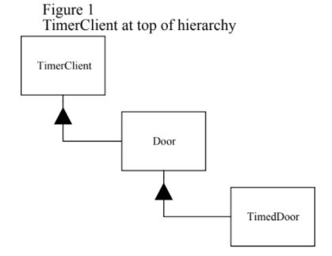
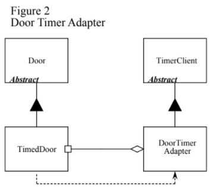
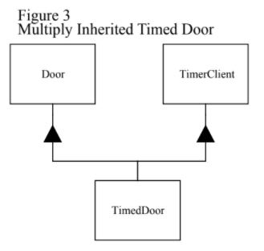

# Interface Segregation Principle

## Introduction

### Terminology

- **client, user**: An object, function, or class that uses a specific class or object.

### What is ISP?

ISP stands for Interface Segregation Principle, which means interfaces should be separated.

### Problem

If this principle is not followed, you end up with a fat (or polluted) interface. Such interfaces usually have poor cohesion. In other words, unrelated functions are grouped together in a single interface.

### Goal

According to ISP, these fat interfaces should be split. Clients using these interfaces should not see them as a single class, but rather as abstract base classes with cohesive interfaces.

### What We'll Cover

1. The drawbacks of fat or polluted interfaces
2. How such interfaces are created
3. How to design classes to prevent this

Let's explain with an example.

## Interface Pollution

### Situation

A security system with a door lock.

**Security Door**

```c++
class Door{
    public:
    virtual void Lock() = 0;
    virtual void Unlock() = 0;
    virtual bool IsDoorOpen() = 0;
};
```

**Timer**

```c++
class Timer {
    public:
    void Register(int timeout, TimerClient* client);
};

class TimerClient {
    public:
    virtual void TimeOut() = 0;
};
```

If you pass the time and a TimerClient pointer to Timer's Register function, after the timeout, TimerClient's TimeOut() is called to trigger an alarm.

### Problem: How do you make a security door with a timer feature?

#### Typical Approach

Usually, it's implemented as follows (assuming TimerClient registers itself and receives TimeOutMessage):



1. Door needs TimerClient functionality, so Door inherits from TimerClient.
2. To implement a security door with a timer, you implement Door.

#### Problems with This Approach

1. Door depends on TimerClient.
   - Not all objects implementing Door need a timer, but they must implement TimerClient.
   - If you don't want to implement the timer, you have to declare a nil virtual function (in C++), which violates LSP.
2. The original Door class has nothing to do with Timer.
   - Even when creating a Door object unrelated to Timer, you must import the TimerClient class.
3. Even reasonable changes to requirements negatively affect all subclasses that don't need the timer (**a change in one subclass negatively affects others**).
   - **Example**: Suppose the timer starts when the door opens. If you close and reopen the door before the timer ends, the previous timer will soon trigger, which is a design flaw. To fix this, you add a timeOutId:

```c++
class Timer {
    public:
        void Register(int timeout, int timeOutId, TimerClient* client);
};

class TimerClient {
    public:
    virtual void TimeOut(int timeOutId) = 0;
};
```

But just by adding timeout, you have to modify all subclasses. It's reasonable to update timer-related subclasses, but the problem is that **even subclasses unrelated to the timer are affected, making it hard to predict.**

In other words, the Door interface is **polluted** by inheriting TimerClient just to make TimedDoor!

As this pollution accumulates, you end up with a **fat interface**.

## Solution

### Key Point

**Because the clients using TimedDoor are separate, TimedDoor must be separated.**

Timer uses TimeClient, and Door is used by door clients. The reason for separation is, as in problem 3, a requirement for one client negatively affects subclasses that don't implement that client.

Both interfaces must be implemented in one object, because both interfaces access the same data (the door).

Clients using the object don't access the object's interface directly, but can access it via delegation or the object's base class.

### Separation through Delegation



```c++
class TimedDoor : public Door {
    public:
        virtual void DoorTimeOut(int timeOutId);
};

class DoorTimerAdapter : public TimerClient {
    public:
        DoorTimerAdapter(TimedDoor& theDoor)
        : itsTimedDoor(theDoor)
        {}
    virtual void TimeOut(int timeOutId)
        {itsTimedDoor.DoorTimeOut(timeOutId);}
    private:
        TimedDoor& itsTimedDoor;
};
```

#### How it works

1. Implement Door as TimedDoor
2. Implement TimerClient as DoorTimerAdapter
3. TimedDoor creates DoorTimerAdapter and passes it to Timer
4. When Timer calls TimeOut, it is delivered to DoorTimerAdapter
5. DoorTimerAdapter delegates the TimeOutMessage to TimedDoor

#### Advantages

1. Even if Timer code changes, Door subclasses are unaffected
2. TimedDoor doesn't need to implement TimerClient!
3. DoorTimerAdapter helps TimedDoor act like a TimerClient interface

=> A very general-purpose method

#### Disadvantages

1. You have to create a timer object every time you input a timeout
2. Delegation uses a bit of memory
   - This can be an issue in embedded systems

### Separation through Multiple Inheritance



#### How it works

TimedDoor implements both Door and TimerClient.

#### Advantages

1. Both Door subclasses and TimerClient can use TimedDoor, but neither depends on TimedDoor
   - Thus, both can use the same object
2. It's simple!

#### Comparison with Adapter

Robert Martin says the only reason to use an Adapter is when you need to adjust the Timer differently (e.g., create a new Timer each time). 