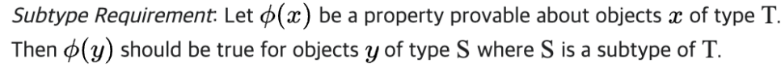
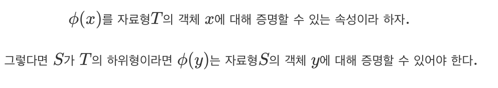
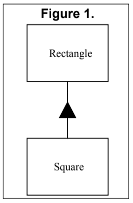

# Liskov Substitution Principle

## References

- [Liskov Substitution Principle (Wikipedia)](https://en.wikipedia.org/wiki/Liskov_substitution_principle)
- [LSP article (Uncle Bob)](http://www.butunclebob.com/ArticleS.UncleBob.PrinciplesOfOod)
- [Design by Contract (Wikipedia)](https://en.wikipedia.org/wiki/Design_by_contract)

## Introduction

Previously, the core mechanism of OCP (Open/Closed Principle) was to use abstraction and polymorphism. By using inheritance, you could create derived classes from an abstract base class.

So, what design rules govern this kind of special inheritance?

What are the characteristics of the best inheritance hierarchies?

What causes hierarchies that do not conform to OCP?

This topic will address those questions.



```cpp
class Reader {
  public:
   virtual int Read() = 0;
};

class Writer {
  public:
   virtual void Write(char) = 0;
};

void Copy(Reader& r, Writer& w) {
  int c;
  while((c=r.Read()) != EOF)
    w.Write(c); 
}
```

## Definition of Liskov Substitution Principle

Let me first share Robert Martin's interpretation of LSP, as Liskov's original words can be difficult to grasp.

### Robert Martin's LSP

**_FUNCTIONS THAT USE POINTERS OR REFERENCES TO BASE CLASSES MUST BE ABLE TO USE OBJECTS OF DERIVED CLASSES WITHOUT KNOWING IT._**

=> Functions that use references or pointers to base classes must be able to use derived class objects without knowing it.

### Liskov's Original Statement



## Why is this Principle Important?

It's easy to see why this principle is important by imagining what happens when it is violated. If you don't follow LSP, functions that use references or pointers to base classes must know about all derived classes. This violates OCP, because you have to modify the function every time a new derived class is created.

### A Simple Example of a Violation of LSP

```cpp
void DrawShape(const Shape& s) {
  if (typeid(s) == typeid(Square))
      DrawSquare(static_cast<Square&>(s));
  else if (typeid(s) == typeid(Circle))
      DrawCircle(static_cast<Circle&>(s));
}
```

Here, you have a base class `Shape` and derived classes `Square` and `Circle`. The function `DrawShape` takes a reference to the base class.

This function violates LSP because it checks whether the shape reference is a square or a circle and implements each case separately.

> [Note] This kind of function structure is called "anathema to Object Oriented Design."

## Square and Rectangle: A More Subtle Violation

### Introduction

Unlike the simple example above, this one is a much more subtle violation of LSP, making it worth examining.

### Scenario

Suppose you have an application with a Rectangle class. Later, users request the ability to draw squares as well.

### Rectangle Code

```cpp
class Rectangle {
  public:
  void SetWidth(double w) {itsWidth=w;}
  void SetHeight(double h) {itsHeight=h;}
  double GetHeight() const {return itsHeight;}
  double GetWidth() const {return itsWidth;}
  private:
  double itsWidth;
  double itsHeight;
};
```



Inheritance is an ISA relationship. Mathematically, a square is a rectangle, so it makes sense to inherit Square from Rectangle.

So, as shown in [Figure 1], you implement the Square class by inheriting from Rectangle.

But! This thinking, while subtle, can cause serious problems.

#### Why is this relationship wrong?

1. The Square class doesn't need both `itsHeight` and `itsWidth`. By definition, a square only needs one side.
   - This leads to wasted memory.
2. Since width and height are always the same in a square, `SetWidth` and `SetHeight` are inappropriate functions.
   - Having functions that don't fit the Square class is **bad design**.

But let's try to sidestep the fundamental problem and see what happens.

#### Sidestep 1 - Change Square Methods

1. Assume memory is sufficient, so we ignore the first problem.
2. If you modify Square's `SetWidth` and `SetHeight` as follows, you can avoid the second problem:

```cpp
void Square::SetWidth(double w) {
  Rectangle::SetWidth(w);
  Rectangle::SetHeight(w);
}
void Square::SetHeight(double h) {
  Rectangle::SetHeight(h);
  Rectangle::SetWidth(h);
}
```

Mathematically, this makes sense for a square.

#### Why is this approach wrong?

```cpp
void f(Rectangle& r) {
    r.SetWidth(32); // calls Rectangle::SetWidth
}
```

Suppose you have a function that takes a reference to the base class and manipulates it. If you pass a Square object to this function, the Square's width and height will both change (because of Square's overridden methods). This clearly violates the mathematical definition of a square.

You might say, "Just make SetWidth and SetHeight virtual." But Robert Martin argues that these are very basic operations, so it's not reasonable to justify this as a design mistake. If Square didn't exist, what would be the reason to make them virtual?

In complex systems, design mistakes can happen, but for such basic operations, you should be able to predict and design for them.

But let's accept the suggestion and make them virtual.

#### Sidestep 2 - Make Methods Virtual

If you simply make Rectangle's SetWidth and SetHeight virtual, you can solve the problem in method 2.

**Final Code:**

```cpp
class Rectangle {
  public:
  virtual void SetWidth(double w) {itsWidth=w;}
  virtual void SetHeight(double h) {itsHeight=h;}
  double GetHeight() const {return itsHeight;}
  double GetWidth() const {return itsWidth;}

  private:
  double itsHeight;
  double itsWidth;
};

class Square : public Rectangle {
  public:
  virtual void SetWidth(double w);
  virtual void SetHeight(double h);
};
void Square::SetWidth(double w) {
  Rectangle::SetWidth(w);
  Rectangle::SetHeight(w);
}
void Square::SetHeight(double h) {
  Rectangle::SetHeight(h);
  Rectangle::SetWidth(h);
}
```

#### Why this code seems correct

1. You can manipulate it as a mathematically correct rectangle class.
2. You can manipulate it as a mathematically correct square class.
3. You can pass a Square to a function that uses a pointer to Rectangle.

But the fundamental issue is not whether the model describes itself well, but whether it matches the **user's expectations**.

> **Note:**
> - **User (client, user)**: At the code level, a function that uses a variable, function, or object.
> - In the code below, the user of the reference `r` is the function `f`.
> - Since the programmer writes the function, the programmer is also the user.

```cpp
void f(Rectangle& r) {
    r.SetWidth(32); // calls Rectangle::SetWidth
}
```

In this code, `f` is the user, and `r` is the supplier.

#### Obligation and Reward, Precondition-Postcondition

From a contract perspective, if `f` fulfills its obligation, `r` must provide the appropriate reward. For example, if `f` sets the width to 4, `r` must guarantee the correct result.

- **Precondition**: The condition that must be satisfied for the method to execute correctly.
- **Postcondition**: The result that the method must guarantee after execution.

#### LSP from the Design by Contract Perspective

```cpp
void f(Rectangle& r) {
  r.SetHeight(5);
  r.SetWidth(4);
}
```

If `f` passes the correct precondition to `setWidth`, what should `setWidth` guarantee?

```cpp
assert((itsWidth == w) && (itsHeight == old.itsHeight));
```

Since `r` is a Rectangle, this must be guaranteed.

In other words, **the user only knows the base class's precondition and postcondition**. The user expects the base class's postcondition when using its methods.

But if a Square is passed in, `(itsHeight == old.itsHeight)` cannot be guaranteed, so LSP is violated.

Therefore, **all derived classes must satisfy the base class's postcondition**.

## Conclusion: LSP Depends on User Expectations

As seen in the example, whether you conform to LSP is not about whether the Rectangle and Square classes are mathematically correct, but about how the user expects to use the object.

From the [fundamental problem code],

**The user expects that derived classes will behave exactly like the base class.**

Therefore, designers must consider this to create designs that conform to LSP! 