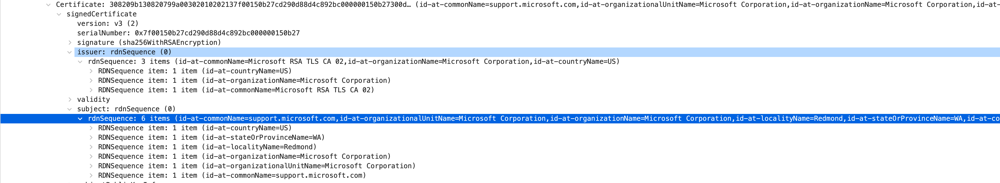

# TLS Packet Analysis

## Reference
- [Wikipedia: Transport Layer Security](https://en.wikipedia.org/wiki/Transport_Layer_Security)
- [RFC 5246](https://datatracker.ietf.org/doc/html/rfc5246)

Previously, we looked at the TCP 3-way handshake.

In this post, we will examine TLS communication. Since many blogs have already covered the basics of TLS, I will write this for personal study, comparing it with the RFC documentation.

In the next post, I will cover decrypting the encrypted application layer data.

Remember, TLS is also a stateful, connection-oriented protocol.

## Communication Details

### TCP

The client sends to the server with the Push flag set to 1.

PSH means to push to the upper layer immediately upon arrival.

Let's look at the TCP payload.

TLS values are listed in order.

### TLS Record Layer

[https://datatracker.ietf.org/doc/html/rfc5246#section-6.2](https://datatracker.ietf.org/doc/html/rfc5246#section-6.2)

This layer receives raw (uninterpreted) data from higher layers. The data is classified into three types:
- ProtocolVersion
- ContentType
- TLSPlaintext


The structure is as follows:

```c
struct {
    uint8 major;
    uint8 minor;
} ProtocolVersion;

enum {
    change_cipher_spec(20), alert(21), handshake(22),
    application_data(23), (255)
} ContentType;

struct {
    ContentType type;
    ProtocolVersion version;
    uint16 length;
    opaque fragment[TLSPlaintext.length];
} TLSPlaintext;
```

## TLSPlaintext

[https://datatracker.ietf.org/doc/html/rfc5246#section-6.2](https://datatracker.ietf.org/doc/html/rfc5246#section-6.2)

The structure is as follows:

```c
struct {
    ContentType type;
    ProtocolVersion version;
    uint16 length;
    opaque fragment[TLSPlaintext.length];
} TLSPlaintext;
```

### ContentType


Looking at the memory, the value 16 in hexadecimal is 22 in decimal, which corresponds to `handshake(22)` in the ContentType enum. This is a packet requesting a handshake.

### Version


The value at the version index is `03 01`, which the RFC says represents TLS 1.0. This is the version of the Record Layer, not the Client Hello. The ClientHello determines the version. It seems to be sent as 1.0 arbitrarily. Note that while the TLSPlaintext version is marked as 1.0, the client_version in the following fragment is 1.2. The client_version should be the latest version supported by the client, so the tls version in TLSPlaintext can be understood as the minimum supported version.

### Length

The length of the TLSPlaintext fragment. Here, it is 512 bytes.

### Fragment

This means application data. All the values below are application data!


## HandShake Protocol in Fragment

From here, you can see data like Client Hello and Server Hello.

[https://datatracker.ietf.org/doc/html/rfc5246#section-7.4](https://datatracker.ietf.org/doc/html/rfc5246#section-7.4)

### Handshake Type

If the value is 1, it is client_hello. The body type varies by HandShakeType. Let's look at the body of ClientHello first.

### Length

3 bytes are allocated to indicate the length of the body.

# TLS Full HandShake


tls session management is done with session tickets, so the flow proceeds as TLS FullHandShake described in [RFC 5077](https://datatracker.ietf.org/doc/html/rfc5077).

## Client Hello

The structure is as follows:

```c
struct {
    ProtocolVersion client_version;
    Random random;
    SessionID session_id;
    CipherSuite cipher_suites<2..2^16-2>;
    CompressionMethod compression_methods<1..2^8-1>;
    select (extensions_present) {
        case false:
            struct {};
        case true:
            Extension extensions<0..2^16-1>;
    };
} ClientHello;
```

You can check the following items:

### client_version

The TLS version the client wants to use.


### Random

The random structure generated by the client:

```c
struct {
    uint32 gmt_unix_time;
    opaque random_bytes[28];
} Random;
```


### Session ID

```c
opaque SessionID<0..32>;
```


A variable length vector, so the length and actual value follow. 0~32 can be expressed in 1 byte, so it's represented as 33 bytes in total. If this value is not empty, it means the client wants to reuse the session. Here, since the session id exists, it means the client wants to reuse it.

### Cipher Suites

The client lists the supported encryption algorithms in order of preference.

```c
uint8 CipherSuite[2];
```


The first is Reserved (GREASE), defined in [RFC 8701](https://datatracker.ietf.org/doc/html/rfc8701). It's a value to prevent the TLS echo system from malfunctioning. In the end, the client wants to use `TLS_AES_128_GCM_SHA256`.

### Compression Method

The compression algorithms supported by the client.


### Extensions

The client can request extensions from the server. The structure is:

```c
struct {
    ExtensionType extension_type;
    opaque extension_data<0..2^16-1>;
} Extension;

enum {
    signature_algorithms(13), (65535)
} ExtensionType;
```


You can see the structure of the Extension in the third line of server_name. After Client Hello, an Ack is sent, then the Server Hello packet is delivered.


## Server Hello

HandShake type (2), the structure of the Server Hello message:

```c
struct {
    ProtocolVersion server_version;
    Random random;
    SessionID session_id;
    CipherSuite cipher_suite;
    CompressionMethod compression_method;
    select (extensions_present) {
        case false:
            struct {};
        case true:
            Extension extensions<0..2^16-1>;
    };
} ServerHello;
```


The fields are similar to Client Hello, so I'll skip the Wireshark details.

### Version

The highest version supported by the server among the versions supported by the client.

### Random

The random structure generated by the server. It must be generated independently from the client.

### SessionID

The session id corresponding to this connection. If the session id sent in clientHello is not empty, the server will look it up in the session cache. If found, it will use the session state to create a new connection and send Finished messages. If empty, it means the session cannot be reused. Here, the session length is 0, so the session id sent by the client cannot be reused.

### cipherSuite

The cipher suite chosen by the server from those sent by the client. If reusing a session, it must be the same as before. Here, the server chose `TLS_ECDHE_RSA_WITH_AES_256_CBC_SHA`.

### Compression Method

The compression algorithm chosen by the server from those sent by the client.

### Extensions

The list of extensions. Only those provided by the client are listed.

> 💡 If the packet size is large, the same ack may be sent for multiple packets. This is not a problem; it just means the data was received.

## Certificate

### Multiple Packets!

The Certificate is completed over three packets due to its large size.



The Application data size of the Certificate Handshake Protocol is 3877 bytes. Considering the maximum segment size (1460 bytes with a 20-byte header), it's understandable that it is split.

### Handshake Type: Certificate Structure

```c
opaque ASN.1Cert<1..2^24-1>;

struct {
    ASN.1Cert certificate_list<0..2^24-1>;
} Certificate;
```

### Checking Certificate with Java

You can check the certificate using Java and the following three things:
1. HexEncoded Certificate value
2. bouncycastle library (cryptography library)
3. JCA (Java Cryptography Architecture)

Hex Encoding can be easily obtained from Wireshark.

```groovy
implementation 'org.bouncycastle:bcprov-jdk15on:1.70'
```

```java
Security.addProvider(new BouncyCastleProvider());
String hexCertificate = "...";
CertificateFactory cf = CertificateFactory.getInstance("X.509");
Certificate certificate = cf.generateCertificate(new ByteArrayInputStream(Hex.decode(hexCertificate)));
Files.write(Paths.get("./cert.der"), certificate.getEncoded());
```

You can then open the generated file with openssl:

```bash
openssl x509 -inform der -in cert.pem -noout -text
```

You will see the certificate details.

### Multiple Certificates

The server provides two certificates.


One is for the domain `support.microsoft.com`.


The subject is the owner of the certificate (common name is `support.microsoft.com`). The issuer is the issuing authority (Microsoft RSA TLS CA 02). The other is the intermediate CA certificate.

According to the [Chain of Trust](https://en.wikipedia.org/wiki/Chain_of_trust), the issuing authority's certificate is also provided for recursive verification.


So the subject of this certificate is Microsoft RSA TLS CA 02, which was the issuer of the server certificate. The issuer of this certificate is Baltimore CyberTrust Root, a RootCA. Where is the RootCA certificate? For security reasons, the RootCA certificate is managed by the OS. On Mac, you can check it in the System Keychain under System Roots.


During the handshake, the Certificate step provides the server's certificate and ends. The public key is also included in this certificate.

```c
Subject Public Key Info:
    Public Key Algorithm: rsaEncryption
        RSA Public-Key: (2048 bit)
        Modulus: ...
        Exponent: 65537 (0x10001)
```

The modulus and exponent, which are components of the public key, are provided in the certificate.

Now, let's look at the Server Key Exchange.

## Server Key Exchange

[https://datatracker.ietf.org/doc/html/rfc5246#section-7.4.3](https://datatracker.ietf.org/doc/html/rfc5246#section-7.4.3)


According to the RFC, this message is sent right after the Server Certificate message. Wireshark shows the same. If the server did not send the premaster secret exchange method in the Certificate message, this message is sent.

### Structure

```c
struct {
    select (KeyExchangeAlgorithm) {
        case dh_anon:
            ServerDHParams params;
        case dhe_dss:
        case dhe_rsa:
            ServerDHParams params;
            digitally-signed struct {
                opaque client_random[32];
                opaque server_random[32];
                ServerDHParams params;
            } signed_params;
        case rsa:
        case dh_dss:
        case dh_rsa:
            struct {} ;
    };
} ServerKeyExchange;

params
   The server's key exchange parameters.
```

```c
enum { dhe_dss, dhe_rsa, dh_anon, rsa, dh_dss, dh_rsa } KeyExchangeAlgorithm;

struct {
    opaque dh_p<1..2^16-1>;
    opaque dh_g<1..2^16-1>;
    opaque dh_Ys<1..2^16-1>;
} ServerDHParams; /* Ephemeral DH parameters */
```

If the client provided the `signature_algorithms` extension in Client Hello, the signature algorithm and hash algorithm pair must be present in the extension.

#### EC Diffie-Hellman Server Params

Curve Type: named_curve

[https://datatracker.ietf.org/doc/html/rfc4492#section-5.4](https://datatracker.ietf.org/doc/html/rfc4492#section-5.4)

```c
enum { explicit_prime (1), explicit_char2 (2), named_curve (3), reserved(248..255) } ECCurveType;
```

If the curve_type is named_curve (0x03), the following structure appears:

```c
struct {
    ECCurveType    curve_type;
    select (curve_type) {
        case explicit_prime:
            opaque      prime_p <1..2^8-1>;
            ECCurve     curve;
            ECPoint     base;
            opaque      order <1..2^8-1>;
            opaque      cofactor <1..2^8-1>;
        case explicit_char2:
            uint16      m;
            ECBasisType basis;
            select (basis) {
                case ec_trinomial:
                    opaque  k <1..2^8-1>;
                case ec_pentanomial:
                    opaque  k1 <1..2^8-1>;
                    opaque  k2 <1..2^8-1>;
                    opaque  k3 <1..2^8-1>;
            };
            ECCurve     curve;
            ECPoint     base;
            opaque      order <1..2^8-1>;
            opaque      cofactor <1..2^8-1>;
        case named_curve:
            NamedCurve namedcurve;
    };
} ECParameters;
```

According to the RFC, namedcurve specifies a recommended set of elliptic curve domain parameters. Only values referring to a specific curve are allowed here.

```c
struct {
    ECParameters    curve_params;
    ECPoint         public;
} ServerECDHParams;

curve_params:   Specifies the elliptic curve domain parameters associated with the ECDH public key.
public:   The ephemeral ECDH public key.
```

Wireshark shows:


ECParameters: Named Curve: secp256r1
ECPoint: Publickey Length: 65, PubKey: 048....

The server chose the algorithm `rsa_pss_rsae_sha256` in Server Key Exchange.


## Client Request

Optionally, the server can request a certificate from the client (used in mTLS). Generally, this is omitted for public internet services.

## Server Hello Done


After ServerHello and related messages are finished, this message is sent. After this, the server waits for the client's response. This means:
1. The server has finished sending messages needed for key exchange.
2. The client can now process its part of the key exchange.

The client should:
1. Verify the certificate is valid.
2. Check if it can accept the server hello parameters.

## Client Certificate

If the server requested a certificate from the client, this message would be sent. In this case, it was not requested.

## Client Key Exchange Message

[https://datatracker.ietf.org/doc/html/rfc5246#section-7.4.7](https://datatracker.ietf.org/doc/html/rfc5246#section-7.4.7)


Here, the premaster secret is set. The client sends either an RSA-encrypted secret or Diffie-Hellman parameters to share the same premaster secret.

### Structure

```c
struct {
    select (KeyExchangeAlgorithm) {
        case rsa:
            EncryptedPreMasterSecret;
        case dhe_dss:
        case dhe_rsa:
        case dh_dss:
        case dh_rsa:
        case dh_anon:
            ClientDiffieHellmanPublic;
    } exchange_keys;
} ClientKeyExchange;
```


[https://datatracker.ietf.org/doc/html/rfc5246#section-7.4.7.2](https://datatracker.ietf.org/doc/html/rfc5246#section-7.4.7.2)

Wireshark shows the type as ClientDiffieHellmanPublic.

```c
struct {
    select (PublicValueEncoding) {
        case implicit: struct { };
        case explicit: opaque dh_Yc<1..2^16-1>;
    } dh_public;
} ClientDiffieHellmanPublic;
```

## Change Cipher Spec

[https://datatracker.ietf.org/doc/html/rfc5246#section-7.1](https://datatracker.ietf.org/doc/html/rfc5246#section-7.1)

The Change Cipher Spec message is used to notify a change in encryption strategy. The value is 1, indicating a change. From this point, Handshake Messages are encrypted.

[https://datatracker.ietf.org/doc/html/rfc5246#section-6.1](https://datatracker.ietf.org/doc/html/rfc5246#section-6.1)

TLS connection state refers to the operating environment of the TLS Record Protocol, such as compression, encryption, and MAC algorithms. Connection states are logically divided into:
- current read state
- current write state
- pending read state
- pending write state

While in the pending state, security parameters are set, and `ChangeCipherSpec` changes the pending states to current states. After all handshake steps (certificates, key exchange, signatures, etc.) are decided, the `ChangeCipherSpec` message is sent, meaning that from now on, messages will be encrypted.


From the next message, everything is encrypted.


Now, Wireshark no longer shows the payload values, just that the Handshake Message is encrypted. The encrypted HandShake message is the preMasterSecret.

## New Session Ticket

[https://datatracker.ietf.org/doc/html/rfc5077](https://datatracker.ietf.org/doc/html/rfc5077)

The server sent a handshake type called New Session Ticket. If the client sets the Session Ticket extension to an empty value in ClientHello, the server supports this. The purpose is to let the client remember the session state, reducing the server's session state maintenance cost. If the session id is used, the server must maintain the session state, which is burdensome.


## Change Cipher Spec Message, Encrypted Handshake Message

The server also changes to the current state with the Change Cipher Spec message and then sends encrypted messages (likely the Finished message).

## Encrypted Transmission

After all these steps, both sides use the same master secret to encrypt messages.


The Application Data received by the Transport Layer Security Record Layer is now marked as encrypted.

End!

This post became quite long as I went into detail. I wanted to cover decryption as well, but that will be in the next post. I will continue to update this post as I learn more. If you find any mistakes, please refer to the RFC links above. See you in the next post about encryption and decryption! 