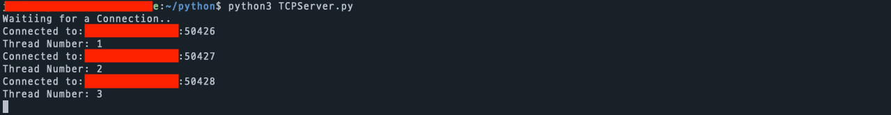
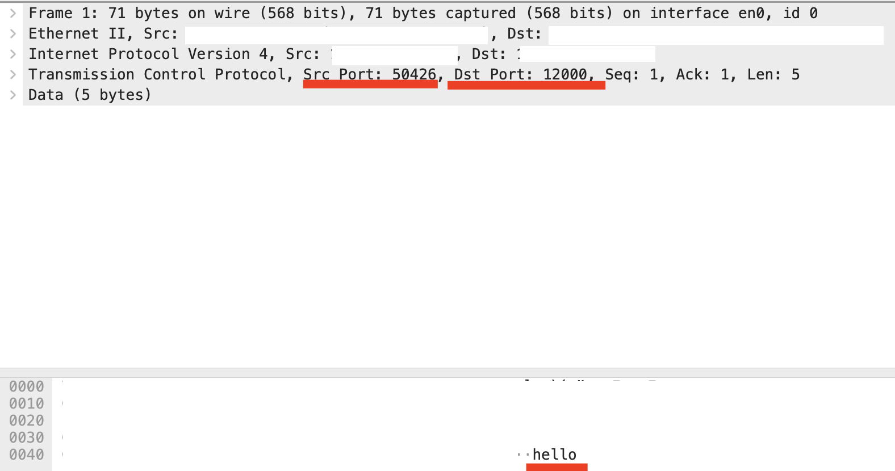
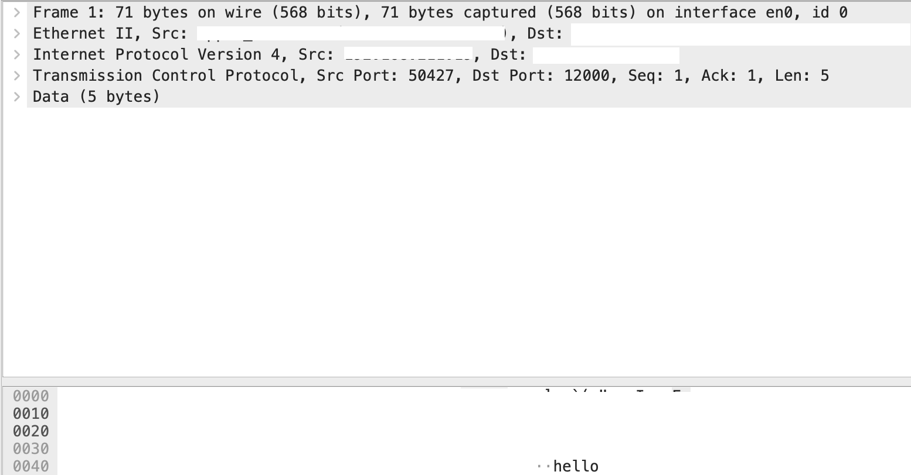
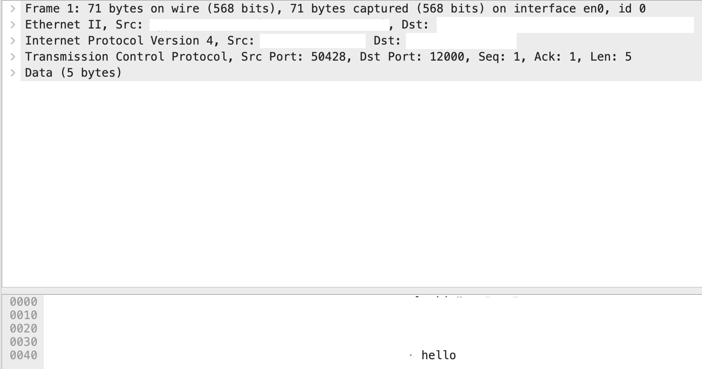
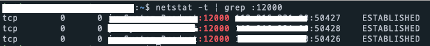
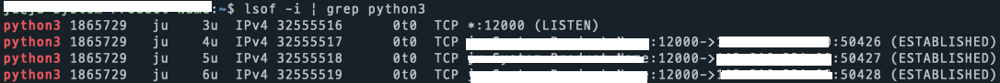

# All sockets connected to the client have the same port number as the server socket!

## Misconception

What I am going to talk about today was quite shocking to me. I used to think that sockets are determined by port numbers. For example, if you have port number 80, there is only one socket for that port.

So, when a TCP server establishes a connection with a client, a new client socket is created for each client. I thought that the port numbers of those client sockets would all be different. And theoretically, if resources are sufficient, since 4 bytes are allocated for the socket number, you can create up to 2^16 sockets.

But... after reading a textbook, I realized this was completely wrong.

## Book Content

The content I saw in the book is as follows. The topic is multiplexing/demultiplexing. - [Computer Networking - A Top Down Approach, 7th]

> It should now be clear how the transport layer could implement the demultiplexing service: Each socket in the host could be assigned a port number, and when a segment arrives at the host, **the transport layer examines the destination port number in the segment and directs the segment to the corresponding socket.** The segment's data then passes through the socket into the attached process. As we'll see, **this is basically how UDP does it.** However, we'll also see that **multiplexing/demultiplexing in TCP is yet more subtle.**

So... the transport layer checks the destination port and delivers the segment to the corresponding socket. This is what I knew. But!! This is only for UDP, and TCP is different??? I thought they were the same... So I checked the TCP part. In summary:

1. TCP sockets, unlike UDP, are identified by 4 identifiers (src IP Address, src Port, dst IP Address, dst Port)
2. If client A and B's processes connect to a web server on port 80, **all HTTP requests go to port 80.**

Huh? This was hard to accept and shocking. I thought that on the server host, sockets with different port numbers would be created for each connection. So I decided to test if this is really the case.

## Test Method

### Proposition to Verify

All client sockets on the TCP server connected to multiple TCP clients point to the same port number.

### Procedure

1. Run a TCP server on my home computer.
2. Run 3 TCP clients from outside the home subnet.
3. Each requests a connection to the server at home.
4. Check:
   - 1) Whether the client sockets on the server are all assigned to port 80
   - 2) Whether the messages sent from the client are directed to port 80

If both 1) and 2) are true, the proposition is true.

I will use three tools to check this.
- 4-1) Use Wireshark on the client.
- 4-2) Use netstat and lsof on the server.

netstat is a Linux command that shows TCP connections, and lsof (list open file) shows open files in Linux. Since sockets are treated as files in Linux, you can check with lsof as well.

## Test Execution

### Environment Setup

I will use Python for simple socket programming.

#### TCP Server

```python
import socket
import os
from _thread import *

ServerSocket = socket.socket()
port = 12000
ThreadCount = 0
try:
    ServerSocket.bind(('', port))
except socket.error as e:
    print(str(e))

print('Waiting for a Connection..')
ServerSocket.listen(5)

def threaded_client(connection):
    connection.send(str.encode('Welcome to the Server\n'))
    while True:
        data = connection.recv(2048)
        reply = 'Server Says: ' + data.decode('utf-8')
        if not data:
            break
        connection.sendall(str.encode(reply))
    connection.close()

while True:
    Client, address = ServerSocket.accept()
    print('Connected to: ' + address[0] + ':' + str(address[1]))
    start_new_thread(threaded_client, (Client, ))
    ThreadCount += 1
    print('Thread Number: ' + str(ThreadCount))
ServerSocket.close()
```

This is an iterative server. When a connection is made and a client socket is returned, a new thread is created to handle the client socket. It is bound to port 12000.

It is an echo server that sends back the message received from the client.

It also prints how many threads have been created.

#### TCP Client

```python
from socket import *

serverName = 'secret'
serverPort = 12000
clientSocket = socket(AF_INET, SOCK_STREAM)
clientSocket.connect((serverName, serverPort))

while True:
    sentence = input("input message\n")
    if sentence == 'exit':
        clientSocket.close()

    clientSocket.send(sentence.encode())
    serverMessage = clientSocket.recv(1024).decode()
    print("fromServer: ", serverMessage)
```

This code sends the input message to the server as is.

serverName should be the host IP or domain, but for security, I will keep it private.

### Server



As shown above, it shows that 3 clients are connected.

#### Client


Each of the 3 iterm windows is connected to the server. The echo service works fine.

Let's check if the hello message is actually sent to port 12000.

### 1. Wireshark

#### Process 1


#### Process 2


#### Process 3


Wow; all hello messages are sent to port 12000...!! (Host-identifying information is omitted for security.)

Confirmed with Wireshark... Now let's check on the server.

### 2. netstat

header:

| Proto | Recv-Q | Send-Q | Local Address | Foreign Address | State |



### 3. lsof

header:

| COMMAND | PID | USER | FD | TYPE | DEVICE | SIZE/OFF | NODE | NAME |



!!! It really shows sockets with 4 identifiers. The first is the server socket, and the next 3 are client sockets. The src PortNumbers are 50426, 50427, and 50428.

### Conclusion

A TCP socket can be assigned the same PortNumber!

Because it has 4 identifiers, the server's transport layer can demultiplex to different sockets using different src IP Address and src PortNumber.

### Then what is a PortNumber?

We've been communicating just fine without knowing this fact. So what is a port number really? Let's recall how we used to think about it.

If you want to use a web service, you connect to port 80. If you want to communicate with a server via ssh, you connect to port 22.

In other words, we match **services** to **port numbers**. A port is a logical entry number for using a service. Let's see how wiki defines it.

> In computer networking, a **port** is a communication endpoint. At the software level, within an operating system, a port is a logical construct that identifies a specific process or a type of network service.

In short, a port is a communication endpoint. At the software level, it is a logical construct that distinguishes a specific process or network service.

The designers are geniuses, aren't they? It's so well abstracted that we've been doing socket programming without knowing this fact...

## However, a Suspicious Thing - connection?

But when you run netstat, the first line says:

Active Internet connections (w/o servers)

I couldn't just pass by this sentence.

"Why do they say 'connection' and not 'socket'? There are 4 identifiers, so it could be called a socket..."

The more professional you get, the more you realize every word is chosen carefully.

I'll cover this question in the next topic. 