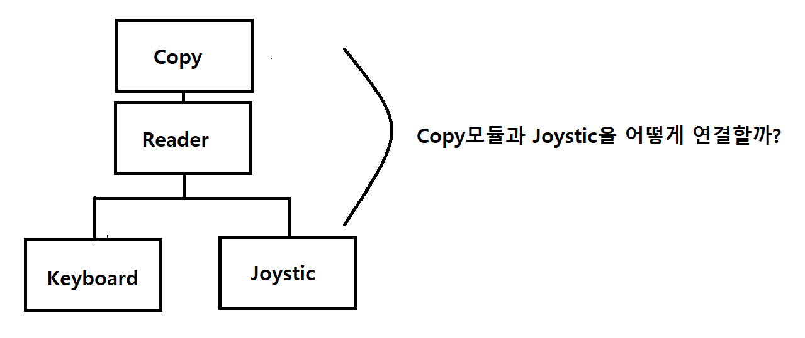

# Overview

I was pondering about architecture and realized that my understanding of abstraction was somewhat vague. I couldn't picture it clearly in my mind. Then, one day, I had to answer why service interfaces exist in Spring's controller-service-model structure.

Why should we use service interfaces in Spring? Or, why shouldn't we?

Hmm... Of course, you can write interfaces to give polymorphism so that the controller doesn't depend on a specific service, but usually, this leads to a giant service class, and abstraction becomes meaningless for services with too many responsibilities. That left me feeling uneasy.

To resolve this ambiguity, I thought it through and reached a conclusion. There are three main topics I'll cover:

Polymorphism, Dependency Injection, and Generalization of Examples.

# Polymorphism

I think there's only one main reason to write interfaces. I thought it was a big deal, but it turns out that's all there is.

It's to prevent the client class from depending on a specific class. Let me give an example from DIP (Dependency Inversion Principle). I'll briefly mention the part explained in DIP in case you forgot.

### Copy Example

The Copy module copies input from the keyboard module and outputs it to the Printer module.

Let's focus on the Keyboard.

The code for using the Keyboard module in the Copy module would look like this:

```c
void Copy() {
  int c;
  while ((c = ReadKeyboard()) != EOF)
   WritePrinter(c);
}
```

So far, so good. Now, let's say we want to extend it. How? We want to copy and return values not only from the keyboard but also from a joystick.

One way to handle this is to execute different read methods in the Copy module depending on whether it's a keyboard or joystick.

```c
enum InputDevice {keyboard, joystick};

void Copy(inputDevice dev) {
  int c;
  if (dev == keyboard)
    while ((c = ReadKeyboard()) != EOF)
        writePrint(c);
  else
    while ((c = ReadJoystick()) != EOF)
        writePrint(c);
}
```

As you can see, by writing ReadKeyboard and ReadJoystick in the Copy module, dependencies increase.

Because of this, even if you only want to use the joystick in the Copy module and reuse it in the app, you still have to bring along the keyboard module because of the ReadKeyboard part. And if you add a new input module, you have to modify the Copy module with more if-else statements.

So, what DIP suggests is this:

### Abstraction

How can we abstract keyboard and joystick? Looking again, we can call them inputDevice, and their function is to return the input value from each module.

So, you can abstract it like this:

```c++
class Reader {
  public:
   virtual int Read() = 0;
};
```

The Reader is an abstract class for keyboard and joystick. Even if you add a new inputDevice, you can use the Reader class as is. Only the implementation changes.



### Summary

So, in summary:

#### 1. If Copy uses only one module, an abstract class is unnecessary.

Using the Copy module means it only takes input from the keyboard. The dependency is appropriate.

#### 2. If you need to use multiple modules of the same 'type', depend on an abstract class.

If you need to use multiple inputDevices of the same type, depend on an abstract class. The same type means similar characteristics, properties, or behaviors.

### Conclusion

In conclusion, whether to write an abstract class depends on the number of modules of the same type you depend on.

This clears up the ambiguity I had about abstraction.

# Dependency Injection

So, how should the Copy module use the keyboard?

```c++
void Copy(Reader& r, Writer& w) {
  int c;
  while((c=r.Read()) != EOF)
  w.Write(c); 
}
```

The Copy module only depends on the abstract class. But how do you associate the keyboard with `Reader& r`?


### Problem Recognition

1. If the Copy module connects directly, it becomes dependent on the keyboard.
2. If the keyboard connects directly, it becomes dependent on the Copy module... The code would be unimaginable.

### The Need for a Third Party

A third party must connect the Copy's r and the concrete class of Reader, which is the keyboard.

What does this mean? It means you need someone to inject the dependency (Dependency Injection).

### The Third Party's Dependency

Most of the ambiguity comes from this. The third party must know both the Copy module and the Keyboard module to inject the Keyboard into Copy.

As a result, the third party's dependency inevitably increases... While we've reduced the dependency between the Copy and Keyboard modules, the third party's code will have high dependency.

Keep this in mind for dependency management.

The factory method pattern is one way to manage such dependencies, and because the dependency can become strong, there are separate DI frameworks.

### Summary

#### 1. A third party is needed to connect Copy and Keyboard.
#### 2. The third party that connects dependencies will inevitably have high dependency on both Copy and Keyboard modules.

# Another Role of Dependency Injection

Let's say Copy and Joystick are classes. If the Copy class creates a Joystick object, it directly references it because it wants to use Joystick.

If Copy only knows Joystick, that's fine, but what if Joystick interacts with other objects? If Joystick collaborates with other objects, its constructor might look like this:

```java
public Joystick(TypeA a, TypeB b, TypeC c);
```

Let's try to create Joystick in the Copy module.

The Copy module now has to initialize a, b, and c objects, which it doesn't care about, just to create Joystick!

Initializing a, b, and c means Copy now depends on them too. That's terrible.

So, a third party that injects dependencies must reference a, b, and c to create Joystick, so the Copy module doesn't depend on Joystick, a, b, or c.

In other words, dependency injection allows the client to ignore types it doesn't care about. Isn't that amazing?

# Generalization

Thinking this way, I realized I could generalize this to other examples.

These are just my personal opinions, so please take them critically.

### 1. Use of Functions

Let's say you want to calculate the VAT for a product.

The product price is 2000 won, and VAT is 10%.

```python
def getVat():
    return 2000*0.1
```

Running `getVat()` gives you the VAT for a product priced at 2000 won.

But there are probably more products with different prices. So, you want to calculate VAT for various prices. The problem with this function is that it depends on the concrete price of 2000 won.

As we saw in polymorphism, you want to calculate for prices like 2000, 3000, etc. So, you rewrite the function:

```python
def getVat(price):
    return price*0.1
```

Now, you declare an abstracted price variable!

The getVat function now depends on the abstracted price.

And you inject a specific value as a dependency:

```python
getVat(3000)
```

By applying 3000 to getVat, price becomes 3000, and you've injected the dependency!

Oh... you can even talk about dependency injection in functions! A new perspective.

### 2. CPU Scheduling

In CPU scheduling, the dispatcher does context switching. I never really understood why the dispatcher was needed.

But, as summarized above, you could say: Instead of the process-handling code directly manipulating the PCB, the dispatcher injects the PCB's context, managing dependencies.

Now I understand why the dispatcher is necessary.

### 3. Kubernetes PVC

Same here... In a pod, you don't want to use only a specific PV, so you depend on the abstraction, PVC, and someone needs to connect them.

In the controller loop in master watches, binding (dependency injection) is performed.

# In Conclusion

By organizing my thoughts this way, a lot of ambiguity has disappeared. I feel like I can answer questions about this much better now.

You might wonder why I explained something so obvious at such length, but thinking about it this way helped me connect theory to reality.

(Just like the case I wrote about in the 'Etc' board, relating to physical science) 