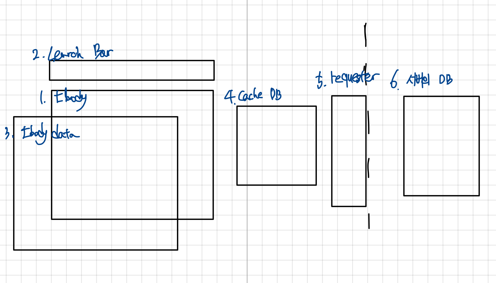

# Let's Make a Data Table

In the field, not only do I develop servers, but I also occasionally work on admin pages. Even if you don't know much about the front end, you can develop them using jQuery. However, there was a need to improve performance... Let me share the process of improving it.

Final result: [https://jsfiddle.net/who3fa7t/2/](https://jsfiddle.net/who3fa7t/2/)

## Problem

I had to display about 5000 rows * 13 columns on a single screen without paging.

The dataTable I was using was slow... It took about 10 seconds. I searched the library's documentation for three days but couldn't find a way to improve it. Every time I sorted the entire data, it took 10 seconds. I could only imagine how frustrating it must have been for those who were used to processing data in Excel.

Just for fun, I rendered the HTML directly, and it improved to 3 seconds! So I decided to implement it myself.
(Now that I think about it, there was a simpler way to do it with dataTable... but I didn't think of it at the time, haha;)

## Requirements

The requirements were as follows.

**Admin Requirements**

1. Display all data on the screen
2. Sorting
3. Search (filter)
4. Add, delete, update...

**My Ambition**

1. Reduce data output to under 3 seconds.
2. Easy maintenance

### Maintenance

There were two aspects to maintenance.

#### 1. Easy for other developers to understand

Since I was developing it myself instead of using the existing dataTable, it could be hard for others to understand. So I tried to make the structure as easy to understand as possible and shared it with my team.

#### 2. State Management

This was the most challenging part. I had previously developed a page that managed about 4-5 states. I thought it would be simple, but I fell into a state management hell.

A change in state A would:

1. Leave the rendering of A as is or render the previous state...
2. Change state A and also change state B, causing B to render...

The root causes were:

1. Storing state in the view layer.
2. Storing state internally (in variables, in memory during JavaScript execution).
3. Managing state in two forms for performance: as a list and as a hash (literal object). This required keeping both in sync.
4. Functions named for changing state A would also change state B.
5. State changes for A were attempted in various functions.
6. Rendering logic was written during state changes.

It was a nightmare. Even a simple fix took an hour, and when a bug occurred, it was hard to track down where the change happened. Most of my time was spent solving this.

## State Management

There were two ideas to solve this.

### 1. Object-Oriented Paradigm

What if only the object related to state A could change state A? For example, suppose there is a User class with a phoneNumber state.

```java
class User {
  private String phoneNumber;
}
```

If you can only modify phoneNumber through the user object, you can control situations like:

1. Where was phoneNumber modified?
2. What type should be delivered externally?
3. Internally, it's stored as '010-1234-5678', but you might want to deliver it as '01012345678' elsewhere. You can provide a public method to return it in the desired format. This ensures consistency for all clients calling the method.
4. Separation of concerns
5. If you need to modify phoneNumber, you only need to change the User class, assuming decoupling is done well.

So, I decided to apply object-oriented principles.

#### Immutable

I didn't strictly apply immutability. The reasons are:

1. Only one object exists during program execution.
2. If the state of object X changes, other objects referencing it should also see the change without needing to receive a new object.
3. For example, in a game, if player A and player B reference the map, and a part of the map changes, both should know about it without getting a new map object.
4. Since I control the package, I don't need to worry about malicious programmers trying to change the state. I'll manage state changes well.

In other words, I can trust that the state changes as I expect. However, there is one part that should be immutable. When requester gets data from the DB and passes it to tbody and cacheDB, if tbody and cacheDB share the same reference, changes in one will affect the other. To avoid unintended state changes, I deep copy the data from requester before passing it to tbody and cacheDB.

### 2. Architecture

While developing the web page, I thought of games. When you click something, something changes and the screen updates. Isn't that just like a game? Games also render changes based on actions.

Games have to manage a lot of state. How do they do it?

For example, in StarCraft, when you produce a probe:

1. Increase the population by 1.
2. Deduct 50 minerals.
3. Show that the Nexus is producing a probe.
4. Show the progress of probe production.

If you wrote this procedurally, you'd fall into state management hell. So I referred to game architecture.

#### Basic Game Process

Games generally follow this process:

1. Receive input.
2. Map input to a specific action.
3. Update the state related to the action.
4. Render the updated state.
5. Repeat 1-4.

I realized: "Rendering must always be based on state! Actions change the state!"

With this perspective, I could diagnose previous problems:

1. Always follow the order: action -> state change -> render! That way, you render the changed state.
2. Render only based on state (data)! This decouples state changes from rendering.

It's like Plato's theory of forms: data is the idea, and rendering is how it's expressed. Rendering is responsible for how the phenomenon is presented.

#### Simplifying the Structure

The process had to solve the following:

When object X's state changes, how does the renderer:

1. Know that it changed?
2. Get all the information needed to render X?

Some suggest implementing a rendering queue, but I wondered if that would really make the code easier to maintain. So I decided to simplify:

"An action calls the state change method, then calls the rendering method."

"An object has both the logic to change its state and the logic to render based on its state."

This means actions are sequentially correlated, and objects have more responsibility, but I couldn't think of a simpler structure.

So my final flow is:

1. Use event listeners to detect input.
2. Associate actions with event listener callbacks.
3. In the action, call the object's state change method, then the rendering method.

#### Layered Architecture

Listener, action, and object (element) each form a layer from top to bottom. Calls only go from top to bottom. Calls between the same layer are forbidden to avoid high dependency. Elements are assumed to be independent. The action layer determines their relationships.

The structure looks like this:


## Elements of dataTable

Let's look at the elements needed to draw the dataTable.

Here's a diagram:



### 4. cache DB

To improve speed, all data to be displayed is fetched from the server at once and stored in this cache DB. This takes up to 2 seconds initially, but after that, operations are fast since there's no communication cost.

Since it's a cache, you need to sync it with the server well.

State and state change methods:

#### State
- Data

#### Methods
- save(item)
- delete(item)
- update(item)

### 5. requester

Handles updating data on the server side.

#### State
- Doesn't really need state. Maybe the URL, but that's not necessary.

#### Methods
- save(item)
- delete(item)
- update(item)

### 6. Server DB

This exists externally, so it's not in the JavaScript code.

### 1. tbody, 3. tbody data

tbody is the part that displays the rows of the data table.

It should have its own data (tbody data). Let's answer some questions:

1. If you sort the values in tbody, should you sort the values in cache DB and display them?
2. If you filter (search) and display values, won't cache DB lose data?

So, tbody should manage its own state (tbody data) and render it.

Sorting should also be handled by tbody since it has tbody-data. So it should also manage sorting state.

#### State
- tbody data
- Sorting state

#### Methods
- Rendering-related...

### 2. searchBar

Where does tbody data come from? In other words, what determines the data in tbody? It's the searchBar. Depending on the search, the displayed data changes. The process is:

1. searchBar filters cache DB data.
2. The filtered data is set as tbody's tbody data.

Then tbody displays this data.

#### State
- Search conditions

#### Methods
- presentData (method to filter data)

## Action

What actions should be defined? Let's write two based on the requirements.

### 1. Search

The search action is as follows:

1. Filter cache DB using searchBar.
2. Pass the filtered data to tbody's tbody data.
3. Render tbody.

### 2. Sort

1. Pass the key value from tbody to sort.
2. Render tbody.

## Listeners

### 1. Search button click and enter

When the search button or enter is pressed, link it to the search action.

### 2. Column click (sort)

When a column is clicked, perform the sort action for that column.

## Rendering

Rendering should only use its own data. That way, elements don't depend on each other.

I think this is what a stand-alone object is: no dependencies on other objects.

## Implementation

Let's implement what we've discussed so far.

### Requirements

- Display user information in a table.
- Columns: ID, Name, Phone Number, Gender, Department.
- Allow searching by ID, Name, Phone Number.
- Allow filtering by Gender and Department using select boxes.
- Clicking a column header should sort by that column (ascending/descending).

We'll only implement table viewing. The explanation of elements is above. Some additional ones are in a new post.

To store the sort state, I added a thead element.

### Directory Structure


datatable has folders for actions, elements, listeners, each with the appropriate classes. The integration file is ju_table.js.

### ju_table.js

```javascript
import Thead from './elements/thead'
import Tbody from './elements/tbody'
import CacheDB from './elements/cache_db'
import Requester from './elements/requester'
import SearchBar from './elements/search_bar'
import SearchAction from './actions/search_action'
import TbodyAction from './actions/tbody_action'
import TheadAction from './actions/thead_action'
import Listener from './listeners/listener'

window.juTable = {}

window.juTable.start = function ({
    url,
    tableElem,
    columns,
    items,
    searchOptionElem,
    qElem,
    searchFormElem,
    conditionInfos
}) {
    let tbodyElem = tableElem.querySelector('tbody');
    let theadElem = tableElem.querySelector('thead');
    let thElemList = Array.from(tableElem.querySelectorAll('th'));

    let cacheDB = new CacheDB(items);
    let requester = new Requester(url);
    let searchBar = new SearchBar({
        searchOption: searchOptionElem,
        q: qElem,
        conditionInfos: conditionInfos
    })
    let tbody = new Tbody({
        tbody: tbodyElem,
        columns: columns
    })
    let thead = new Thead({
        thead: theadElem,
        thList: thElemList,
        columns: columns,
    })

    let searchAction = new SearchAction({
        searchBar: searchBar,
        tbody: tbody,
        cacheDB: cacheDB
    })

    let tbodyAction = new TbodyAction({
        tbody: tbody,
        requester: requester,
        cacheDB: cacheDB
    })

    let theadAction = new TheadAction({
        tbody: tbody,
        thead: thead
    })

    let listener = new Listener({
        searchForm: searchFormElem,
        table: tableElem,
        searchAction: searchAction,
        tbodyAction: tbodyAction,
        theadAction: theadAction
    });

    listener.init();
    // Initialize with a search
    searchAction.search();
}
```

### html

```html
<form id="search-form">
  <label for="search-option"></label>
  <select name="" id="search-option">
    <option value="id" selected>ID</option>
    <option value="name">Name</option>
    <option value="phone_number">Phone Number</option>
  </select>
  <label for="q"></label>
  <input type="text" id="q" placeholder="Enter search term">

  <select name="" id="sex-type">
    <option value="ALL" selected>All</option>
    <option value="M">Male</option>
    <option value="W">Female</option>
  </select>
  <select name="" id="department-type">
    <option value="ALL" selected>All</option>
    <option value="development">Development</option>
    <option value="marketing">Marketing</option>
    <option value="operation">Operations</option>
  </select>
</form>
<table id="user-table">
  <thead>
  <tr>
    <th>ID</th>
    <th>Name</th>
    <th>Phone Number</th>
    <th>Gender</th>
    <th>Department</th>
  </tr>
  </thead>
  <tbody>
  </tbody>
</table>

<%= javascript_pack_tag 'users' %>
```

### client code (users.js)

```javascript
function init() {
    fetch('/users', {
        headers: {Accept: 'application/json'}
    })
        .then(response => response.json())
        .then(data => {
            juTable.start({
                url: '/users',
                items: data.items,
                tableElem: document.getElementById('user-table'),
                searchOptionElem: document.getElementById('search-option'),
                qElem: document.getElementById('q'),
                searchFormElem: document.getElementById('search-form'),
                columns: ['id', 'name', 'phone_number', 'sex', 'department'],
                conditionInfos: [
                    {condition: document.getElementById('sex-type'), column: 'sex'},
                    {condition: document.getElementById('department-type'), column: 'department'}
                ]
            })
        })
}

window.onload = init
```

- The layout loads the built ju_table.js via webpack, so users.js works fine (juTable is accessible).
- conditionInfos allows flexible definition of select box filters. The column names must match those received from the server.
- columns should be listed in the order you want them displayed in the table.

The full code is available here (written in Rails, accessible at localhost:3000/users):

Code: [https://github.com/jurogrammer/data-table-exam](https://github.com/jurogrammer/data-table-exam)

For convenience, here's a jsfiddle link. Press enter to search. Click the header to sort.

[https://jsfiddle.net/who3fa7t/2/](https://jsfiddle.net/who3fa7t/2/)

## Reflection

- The input action is odd... As soon as you receive the element, the change from the input is already reflected.
- Unsure about naming actions. For example, is theadAction an action that changes the state of an element in the thead, or the state of the thead itself? The methods are mixed.
- I couldn't name the methods according to their roles well...
- In Requester, the URL is fixed and only the method changes. In practice, I hardcoded the URL.
- Not sure how to write nice JavaScript... Let me know if it's hard to read, haha;
- There are some unused states...
- Some methods are unimplemented.
- The distinction between elements and objects is unclear...

### Immutable

When cacheDB passes data to tbody, it returns a defensive copy. This is to prevent changes in tbody from affecting the data stored in cacheDB. The two states are assumed to be different.

### Is this the best? Can it be faster?

The problem with this approach is that all data is rendered. As the data grows, sorting and searching become slower. While searching for solutions, I found [this post](https://news.ycombinator.com/item?id=4225977).

It links to [http://jsfiddle.net/SukX5/1/](http://jsfiddle.net/SukX5/1/).

I was shocked to see so much data displayed instantly! But it was a trick—the page only rendered the visible data. This is exactly what infinite scroll does. I decided to implement this!

### Sorting - Separating View and Data

At first, I thought you had to load all rows to sort. For example, if you have numbers 1-10, and only sort 1,2,3, you get 32145678910, so it must be slow.

But after separating data from the view, I realized how silly that was. You can just sort the data! This operation is quick. The 10-second page load was mostly due to rendering.

So, if you sort only the data and render just the visible part, it's super fast!

(If I had understood this, I would have just used dataTable as is, haha)

So I decided to use the **Intersection Observer API**. I'll cover this in the next post. 