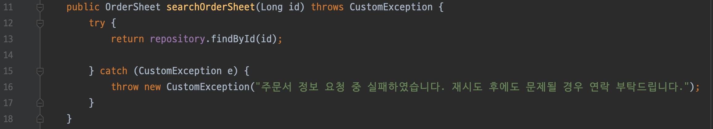

# Parent Topic

[Exception handling journey](/blog/general/exception-handling-journey/)

# Situation

Here is some smelly code I used incorrectly.

## Situation

A function receives an order number and returns the corresponding order sheet.
If the requested order number does not exist, an error should be raised and the client should be notified that the order does not exist.

# Code

## Controller

```java
package com.company.exceptiontest;

import org.slf4j.Logger;
import org.slf4j.LoggerFactory;

public class Controller {
    private final Service service;
    private final Logger logger = LoggerFactory.getLogger(this.getClass());

    public Controller(Service service) {
        this.service = service;
    }

    public String orderInfo(Long id) {
        try {
            OrderSheet orderSheet = service.searchOrderSheet(id);

            return String.valueOf(orderSheet);
        } catch (CustomException e) {
            logger.info("controller - orderInfo method: Error occurred while requesting order sheet info!");
            e.printStackTrace();

            return e.getMessage();
        }
    }
}
```

In the controller, the order sheet information is returned as a string. If an error occurs, it is caught, logged, and the error message is returned to the user.

## Service

```java
package com.company.exceptiontest;

import org.slf4j.Logger;
import org.slf4j.LoggerFactory;

public class Service {
    private final Logger logger = LoggerFactory.getLogger(this.getClass());

    public Service(Repository repository) {
        this.repository = repository;
    }

    private final Repository repository;

    public OrderSheet searchOrderSheet(Long id) throws CustomException {
        try {
            return repository.findById(id);

        } catch (CustomException e) {
            logger.info("Error occurred while requesting order sheet info!");
            throw new CustomException("Failed to request order sheet info. If the problem persists after retrying, please contact us.");
        }
    }
}
```

If an error occurs, a user-friendly error message is thrown. The message is general, not specific to a missing orderId.

In reality, there could be DB connection errors or other logic errors. Also, since this message is for the user, internal server error details should not be exposed.

## Repository

```java
package com.company.exceptiontest;

import java.util.List;

public class Repository {
    public OrderSheet findById(Long orderId) throws CustomException {
        if (orderId == 0) {
            throw new CustomException("The specified id does not exist. id: " + orderId);
        }

        return new OrderSheet(List.of(new Product("Glasses"), new Product("Water")));
    }
}
```

Since this is the repository, the exception message includes which id was not found.
For simplicity, an exception is thrown if id = 0.

## CustomException

```java
package com.company.exceptiontest;

public class CustomException extends Exception {
    public CustomException(String message) {
        super(message);
    }
}
```

This is implemented as a checked exception.

## OrderSheet

```java
import java.util.List;

public class OrderSheet {
    private final List<Product> products;

    public OrderSheet(List<Product> products) {
        this.products = products;
    }

    public List<Product> getProducts() {
        return products;
    }

    @Override
    public String toString() {
        return "OrderSheet{" +
                "products=" + products +
                '}';
    }
}
```

A simple order sheet class containing only product information.

## Product

```java
public class Product {
    private final String name;

    public Product(String name) {
        this.name = name;
    }

    @Override
    public String toString() {
        return "Product{" +
                "name='" + name + '\'' +
                '}';
    }
}
```

## ErrorHandling

```java
import org.slf4j.Logger;
import org.slf4j.LoggerFactory;

public class ErrorHandling {
    private final Logger logger = LoggerFactory.getLogger(this.getClass());

    public void run() {
        Controller controller = getController();

        String orderSheetInfo = controller.orderInfo(0L);
        logger.info(orderSheetInfo);

        logger.info("End of execution");
    }

    private Controller getController() {
        Repository repository = new Repository();
        Service service = new Service(repository);
        return new Controller(service);
    }
}
```

This class injects dependencies and manages the program execution flow.

## App (main)

```java
public class App {
    public static void main(String[] args) {
        ErrorHandling errorHandling = new ErrorHandling();
        errorHandling.run();
    }
}
```

# Execution Results

## Normal Flow

```
15:12 INFO  c.c.exceptiontest.ErrorHandling - OrderSheet{products=[Product{name='Glasses'}, Product{name='Water'}]}
15:12 INFO  c.c.exceptiontest.ErrorHandling - End of execution

Process finished with exit code 0
```

The product information is displayed correctly.

## Exception Flow

```
15:30 INFO  com.company.exceptiontest.Service - Error occurred while requesting order sheet info!
15:30 INFO  com.company.exceptiontest.Controller - controller - orderInfo method: Error occurred while requesting order sheet info!
15:30 INFO  c.c.exceptiontest.ErrorHandling - Failed to request order sheet info. If the problem persists after retrying, please contact us.
15:30 INFO  c.c.exceptiontest.ErrorHandling - End of execution
com.company.exceptiontest.CustomException: Failed to request order sheet info. If the problem persists after retrying, please contact us.
    at com.company.exceptiontest.Service.searchOrderSheet(Service.java:21)
    at com.company.exceptiontest.Controller.orderInfo(Controller.java:16)
    at com.company.exceptiontest.ErrorHandling.run(ErrorHandling.java:12)
    at com.company.App.main(App.java:8)

Process finished with exit code 0
```

The client message is delivered, but there are some issues:

1. We don't know which order number caused the error.
2. The code line where the exception occurred is unclear
    - `at com.company.exceptiontest.Service.searchOrderSheet(Service.java:16)`
Line 16 is where the exception is rethrown, so the error from repository.findById doesn't show up.


3. The repository's exception message is lost in the stack trace.
4. The exception message is duplicated.
5. Too many try-catch blocks reduce readability.

# Problem Analysis

- When the Service catches and rethrows the exception, it does not include the original error, so the stack trace is incomplete.
- Logging in both Service and Controller causes duplicate messages.
- Using checked exceptions forces unnecessary try-catch blocks and can violate OCP.
- Using a generic Exception class makes it hard for the Controller to distinguish error types and handle them appropriately.

# Improvements

## CustomException with Cause

```java
public class CustomException extends RuntimeException {
    public CustomException(String message) {
        super(message);
    }
    // Constructor to include the cause
    public CustomException(String message, Throwable e) {
        super(message, e);
    }
}
```

## Service with Cause

```java
package com.company.exceptiontest;

import org.slf4j.Logger;
import org.slf4j.LoggerFactory;

public class Service {
    private final Logger logger = LoggerFactory.getLogger(this.getClass());

    public Service(Repository repository) {
        this.repository = repository;
    }

    private final Repository repository;

    public OrderSheet searchOrderSheet(Long id) throws CustomException {
        try {
            return repository.findById(id);
        } catch (CustomException e) {
            logger.info("Error occurred while requesting order sheet info!");
            throw new CustomException("Failed to request order sheet info. If the problem persists after retrying, please contact us.", e); // Pass the exception object
        }
    }
}
```

Now, the stack trace will show exactly where the error occurred, and the original exception message is preserved.


# Conclusion

By improving exception handling, you can:

1. Clearly see where errors occur in the stack trace.
2. Know the runtime values that caused the error.
3. Deliver appropriate messages to users.

This reduces the effort needed to debug and trace errors in your code! 