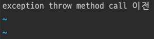
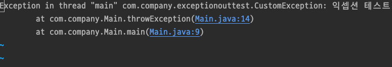
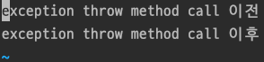
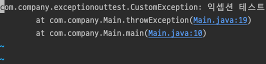

# Parent Topic

[Exception handling journey](/blog/general/exception-handling-journey/)

# References

- https://opentutorials.org/course/2598/14199
- https://en.wikipedia.org/wiki/Standard_streams
- https://en.wikipedia.org/wiki/Redirection_(computing)

# Definition

Redirection is a form of interprocess communication (IPC). It is a function that most command line interpreters have.

This is the method that came up when I wondered how data entered in the console is delivered to the app.

# Cat

Actually, the definition and explanation are so well explained by Life Coding, so I'll just link to it.

https://opentutorials.org/course/2598/14199

# Java

What I want to test is how Java handles input and output. I want to know when stdin, stdout, and stderr are used.

To find out, I designed the test as follows:

- Basically, a method that throws an exception will be called.
- The process is divided into two cases:
  1. Not handling the exception
  2. Handling the exception and calling e.printStackTrace
- Before calling the exception-throwing method, print a start and end message with System.out.println.
- After building, run the jar file in the console, redirecting stdout to stdout.log and stderr to stderr.log.
- Check what is printed in std.log and err.log.

## CustomException

```java
public class CustomException extends RuntimeException {
    public CustomException(String message) {
        super(message);
    }
}
```

This custom exception will be thrown. To avoid clutter in main, it inherits from RuntimeException. (When to inherit from Exception or RuntimeException will be explained later.)

## 1. Not handling the exception

```java
public class Main {
    public static void main(String[] args) {
        System.out.println("Before calling exception throw method");
        throwException();
        System.out.println("After calling exception throw method");
    }

    private static void throwException() {
        throw new CustomException("Exception test");
    }
}
```

Build as a jar file and run in the console with:

```sh
java -jar javatest-1.0-SNAPSHOT.jar > stdout.log 2> stderr.log
```

### Result

**stdout.log**



**stderr.log**



## Analysis

- Oh~ The output from System.out.println goes to stdout.
- The runtime system, when it can't find an exception handler, prints the stack trace to stderr before terminating!
- Since the runtime system is terminated, the stdout after the method call is not shown.

Next, let's see what happens when we handle the exception and print the stack trace.

## 2. Handling and e.printStackTrace

Let's put System.out.println outside the handler.

```java
public class Main {
    public static void main(String[] args) {
        System.out.println("Before calling exception throw method");
        try {
            throwException();
        } catch (CustomException e) {
            e.printStackTrace();
        }
        System.out.println("After calling exception throw method");
    }

    private static void throwException() {
        throw new CustomException("Exception test");
    }
}
```

### Result

**stdout.log**



**stderr.log**



## Analysis

- This time, both System.out.println outputs are shown. The handler was present and handled it, so it moved on.
- e.printStackTrace() outputs to stderr.log! StackTrace is printed to stderr!

## Oh... the method already has the answer?

Let's look at the implementation of the method...

**System class**

```java
public final class System {
    private static native void registerNatives();
    static {
        registerNatives();
    }
    /** Don't let anyone instantiate this class */
    private System() {}
    public static final InputStream in = null;
    public static final PrintStream out = null;
    public static final PrintStream err = null;
```

Haha; Seeing in, out, and err defined like this:

- in ⇒ stdin
- out ⇒ stdout
- err ⇒ stderr

So far, out in System.out meant standard output. Haha;

**printStackTrace**

```java
public class Throwable implements Serializable {
    public void printStackTrace() {
        printStackTrace(System.err);
    }
}
```

Holy... it takes System.err as input. Since System.err is of PrintStream type, it can be interpreted as a DataStream (Unix standard stream).

That's why it was printed to stderr.log!

# Finally...

I designed and tested how Java does stdout and stderr. Now I know how Java uses output.

Next, you can apply the output test design method above when using other logging libraries. Sometimes you may want to output to stderr.

For reference, the logback library, which is the default in Spring Boot, outputs to stdout even if the log level is error. I tested it with the above method, haha.

Now it's clear how output works~~ :) 