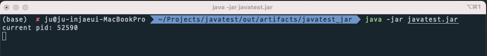
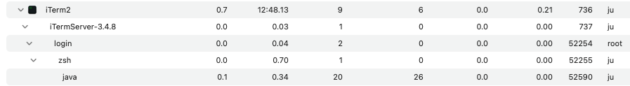
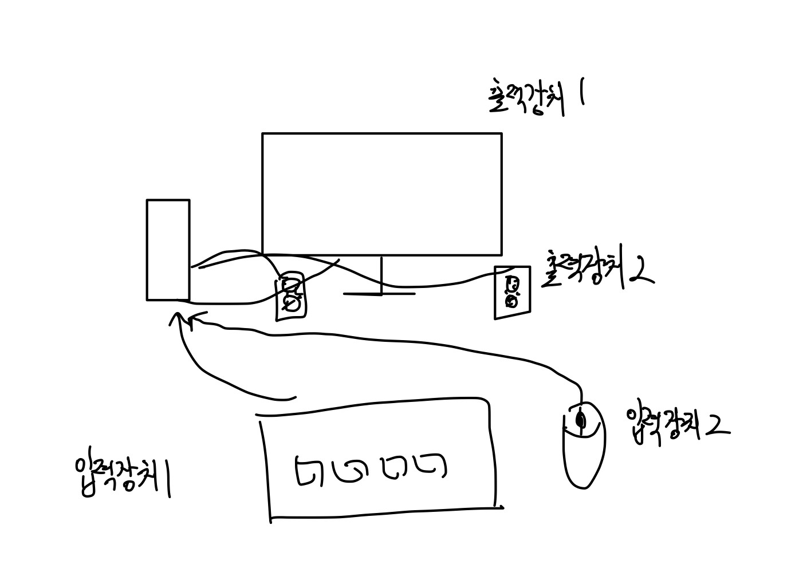

# Parent Topic

[Exception handling journey](/blog/general/exception-handling-journey/)

# Situation - Simple Input/Output Program

1. The app receives input from the keyboard.
2. The app prints the input value to the console.
3. This app is run from the console.

Additionally, to analyze the process in detail, the program also prints the pid.

## Code

```java
public class App {
    public static void main(String[] args) {
        printPid();

        Scanner scanner = new Scanner(System.in);
        while (scanner.hasNext()) {
            System.out.println(scanner.next());
        }
    }

    private static void printPid() {
        long pid = ProcessHandle.current().pid();
        System.out.println("current pid: " + pid);
    }
}
```

## Execution

After compiling the code above in the console, run it in iterm.

At this time, a child process for the Java program is created via fork(). Let's check if a child process is really created by iterm.

**P_ID**



The process id is printed as 52590.

**child process**




This screen is the Activity Monitor. If you click [View] → [Show All Processes (Hierarchical)], you can see the parent-child node hierarchy.

As expected, iterm2 creates something by default... zsh is the parent process, and java is the child process. The child process was created successfully.

Now that the program is running, let's look at input/output.

## Input/Output

For a process to print the value entered from the keyboard, the value must first be in memory.

### Input

1. Type on the keyboard.
2. The electrical signal generated by the keyboard is stored in the keyboard buffer.
3. The device driver loads the buffer data into the app's memory area.
4. The app reads the data loaded in memory.

### Output

1. The loaded data is read and printed to the console.

I wrote the process like this... but there are a lot of questions...

## Questions

1. Are there only a few input devices? There's a mouse and a keyboard... Conversely, there are also multiple output devices... Why print to the console?
2. If you say you print to the console, can't you also say you input to a file? Devices are physical equipment. Input devices are just a means to generate data. So, isn't the important thing input and output? I've been using input/output devices and input/output interchangeably. Like keyboard and console.
3. How does the OS decide which address in the app's memory to store the data?
4. I entered a value in the console, but how did the child process (app) receive my input? And when the app printed, why did the value appear in the console?



## Answers to the Questions

### 1

The keyword to answer is "standard input/output."

1) When studying sockets, I heard that file descriptor values 0, 1, 2 are set as standard input, output, and error...

2) A friend once asked, "Python's print does standard output, but what is standard output?" At the time, I hadn't thought about it at all.

Turns out... the reason for the word "standard" is because there are many types of input/output. So, we use the term **"standard"** input/output. More details are in the wiki below.

https://en.wikipedia.org/wiki/Standard_streams

### 2

Referencing the wiki above, in pre-Unix days, you had to connect each input/output **'device'** manually. In Unix, the concept of device was removed and abstracted as a **data stream**. (Here, a stream means a sequence of bytes that can be read until end of file.)

By default, input and output are set to the terminal's keyboard and terminal display.

### 3

Thinking about socket programming... when you read, you pass a buffer, right...? The OS decides where to load the value in memory because the app provides it.

As expected... you need to study C to know the low level.

### 4

This is well explained in the wiki above. Simply put, with redirection or pipeline, the child process inherits the parent's standard streams.

So, even if you enter a value in the parent process (console), the input is delivered to the child process, and the output from the child process is displayed on the parent process's terminal screen.

## Conclusion

So, to summarize:

### Console Input/Output

1. When you type on the keyboard, the value is stored in the keyboard buffer.
2. The device driver reads the buffer value and loads it into the console's memory area.
3. From the app's perspective, this is abstracted as a dataStream, and the app reads the value from this data stream.
4. The console prints this value.
5. The printed value is delivered to a specific memory area (if the output device uses memory mapped I/O).
6. The device driver delivers the data in that memory to the monitor buffer.
7. The monitor reads the buffer and displays it on the screen.

### The process from input to output in an app running in the console

Here, the app is an echo program that prints the input value as is.

1. When you type on the keyboard, the value is stored in the keyboard buffer.
2. The device driver reads the buffer value and loads it into the console's memory area.
3. From the app's perspective, this is abstracted as a dataStream, and the app reads the value from this data stream.
4. The console prints this value. At this time, through IPC methods such as redirection and pipeline, the input is delivered to the child process (app).
5. The child process reads the value from the data stream.
6. The child process prints the value to the data stream.
7. Through IPC, the output of the child process is delivered to the console's input.
8. The console prints the input value.
9. ...and so on 