# Packet Analysis

# Packet Analysis Goals

- View IP packet header
- View TCP packet header
- See 3-way handshake

# Reference Page

[https://support.microsoft.com/en-us/topic/how-to-use-tracert-to-troubleshoot-tcp-ip-problems-in-windows-e643d72b-2f4f-cdd6-09a0-fd2989c7ca8e](https://support.microsoft.com/en-us/topic/how-to-use-tracert-to-troubleshoot-tcp-ip-problems-in-windows-e643d72b-2f4f-cdd6-09a0-fd2989c7ca8e)

# Filtering for Clarity

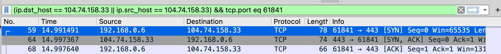

1. First, find the part where the 3-way handshake is done with TCP... (I found the [SYN] part by eye)
2. Filter by IP and port
   1. IP: Filter packets by sender and receiver to the target host.
   2. TCP: Set the sending and receiving ports to the client port.

You can see only the communication between a specific client and server on localhost.

The reason I say "specific client" is that browsers may make multiple simultaneous requests to the server to fetch data quickly, so there can be multiple client ports connecting to the server.

### Layer Order Display

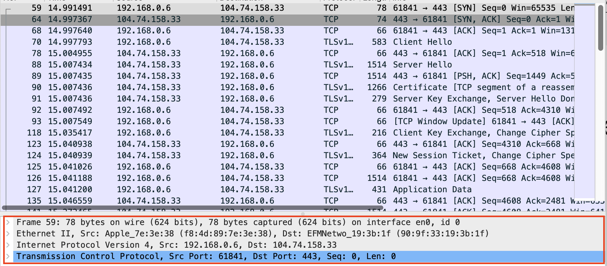

At the bottom, you can see the layers listed:

- Physical layer (Frame)
- Link layer (Ethernet)
- Network layer (IP protocol)
- Transport Layer (TCP)

# Examining the Header

## Internet Protocol

When sending a packet from localhost to the server host, here is the IP information.

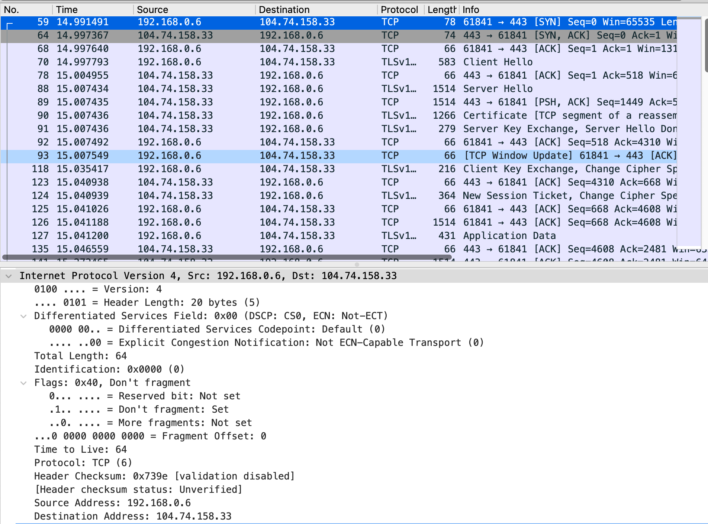

Let's compare the header info with the RFC:

[https://datatracker.ietf.org/doc/html/rfc791#section-3.1](https://datatracker.ietf.org/doc/html/rfc791#section-3.1)

### Version

It's 4. 4 bits are allocated, and it's shown as 4 in binary.

### IHL

Internet Header Length, 20 bytes. No options field, so it's 20 bytes.

### Type of Service

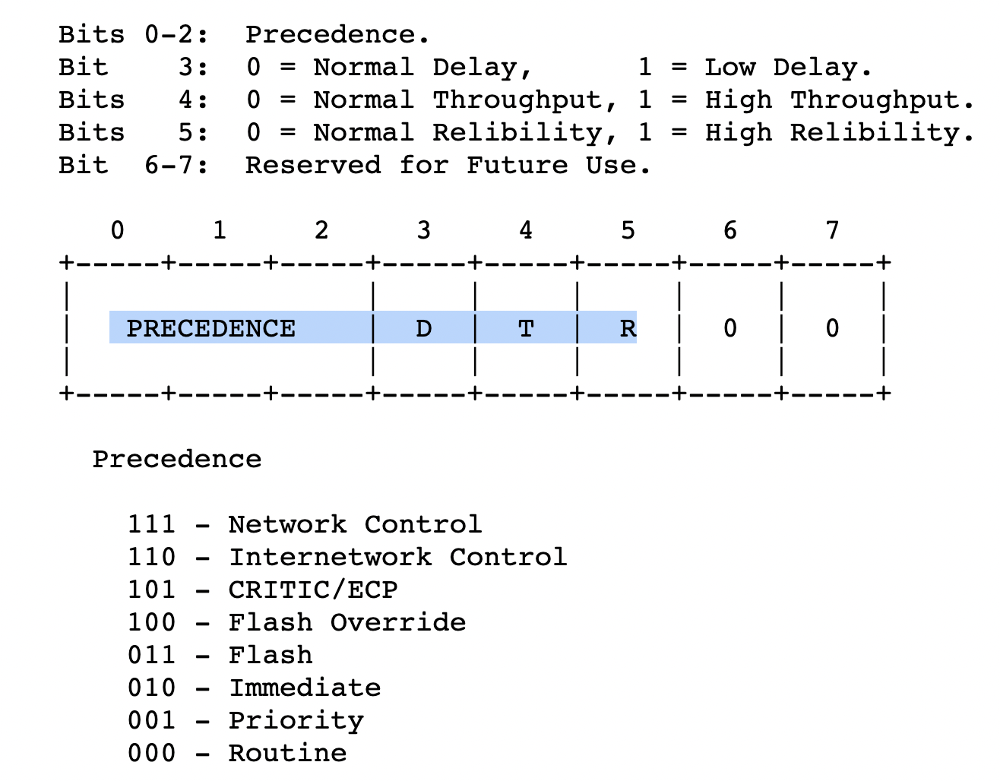

This header field is 8 bits. In the captured packet, it's 0000_0000. Wireshark shows it as Default.

### Total Length

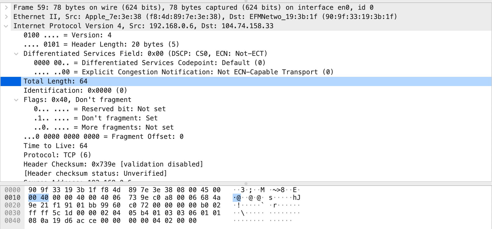

16 bits. The hex value is `00 40`, which Wireshark shows as 64, and that's correct.

This total length includes the segment (transport packet) inside the fragment (network packet).

As you can see below, the segment size is 44 bytes.

So:

ip header size + segment size = 20 bytes + 44 bytes = 64 bytes.

### Identification, Flags, Fragment Offset

The MTU for a fragment is usually 1500 bytes. If the fragment header is 20 bytes and the segment sent to the network layer exceeds 1480 bytes, the fragment size exceeds 1500 bytes, so fragmentation occurs.

These fields are used for that:

Each gets 16 bits, 3 bits, and 13 bits, respectively.

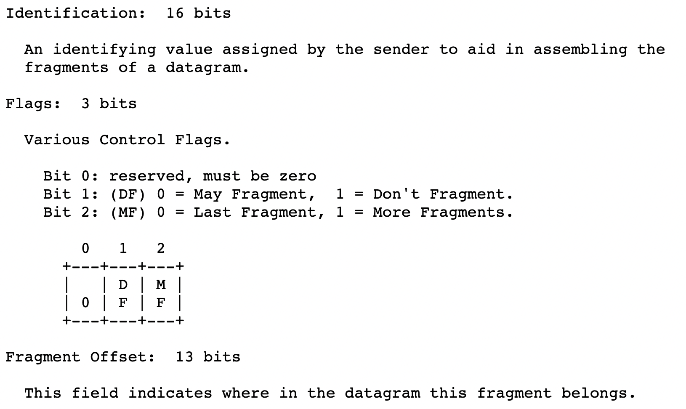
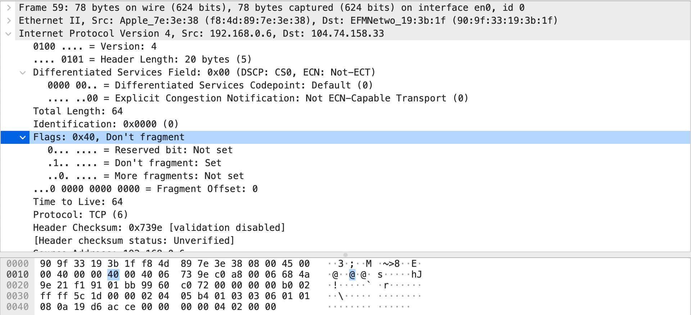

Identification: 0x0000 (16 bits)

The flag value is `010`, which means Don't Fragment (3 bits).

Fragment Offset is all 0 (13 bits).

The flag value is 0x40, probably because it's read byte by byte... 3 bits are allocated, but it's read as a byte, so it's shown as `0100 0000` (0x40).

### Time to Live

8 bits, set to 64. It decreases by 1 per second, but also decreases by 1 at each router, even if less than a second. It's the max time a datagram can survive.

This is to eliminate ghost datagrams.

### Protocol

8 bits. Indicates the upper layer protocol (i.e., which transport layer protocol). Value is 6, which means TCP.

### Header Checksum

16 bits. Value is 0x739e. Validation is off in Wireshark, so it's not shown in the header.

### Source Address

32 bits. Sent from localhost 192.168.0.6. IP addresses are always 32 bits.

When going out to the internet, the router does NAT, so the destination sees the router's IP.

### Destination Address

32 bits. Sent to 104.74.158.33.

## Transmission Control Protocol

RFC 793: [https://datatracker.ietf.org/doc/html/rfc793#section-3.1](https://datatracker.ietf.org/doc/html/rfc793#section-3.1)

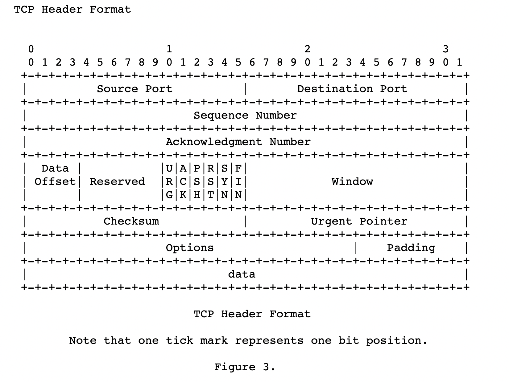

### Start of Segment

`68 4a 9e 21` is the last value of the fragment header. Right after that, the segment starts.

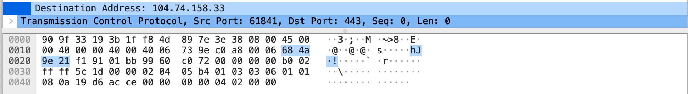
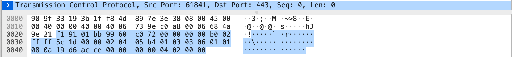

### TCP Info

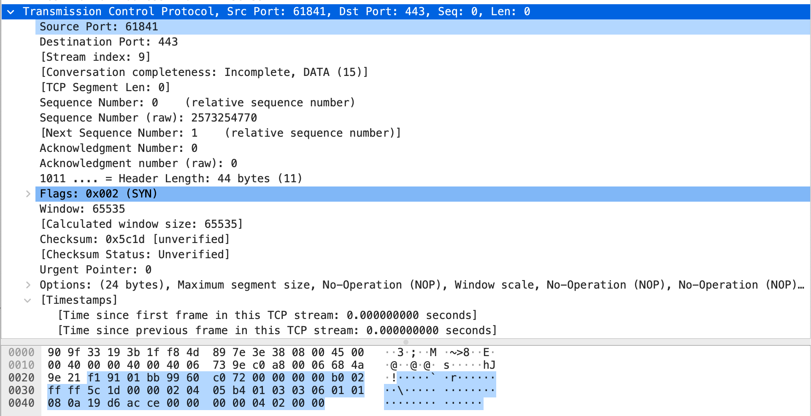

#### Source port

16 bits. Since the fragment is a host-to-host packet, the header had an IP, but the segment is a process-to-process packet, so it has a port!

Client port is 61841.

#### Destination Port

16 bits. Since it's HTTPS, the request is to port 443.

#### Sequence Number

32 bits. Sequence Number: 0 (relative sequence number). Raw value: 2573254770. Wireshark shows the first data's number as 0 for clarity.

#### Acknowledgment Number

32 bits. Set to 0. In the first step of the 3-way handshake (SYN), ack is 0. (No seq received from server yet, so default is 0.)

#### Data Offset

4 bits. Exists because the options field is variable. Tells where the data starts. Value is 1011(2), which is 11.

The number of 32-bit words in the TCP Header.

So 11 words * 4 bytes = 44 bytes.

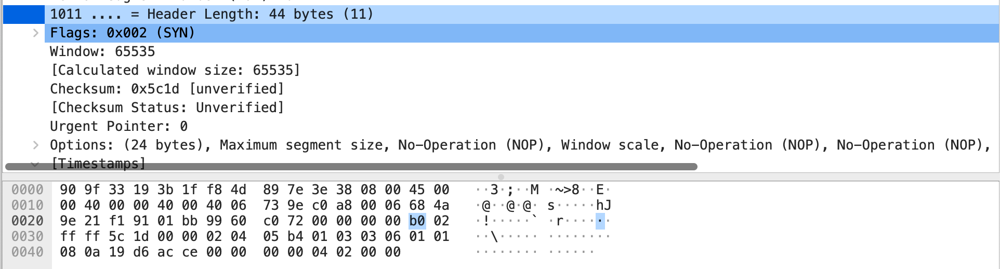

#### Flags

Bit vectors indicate usage.

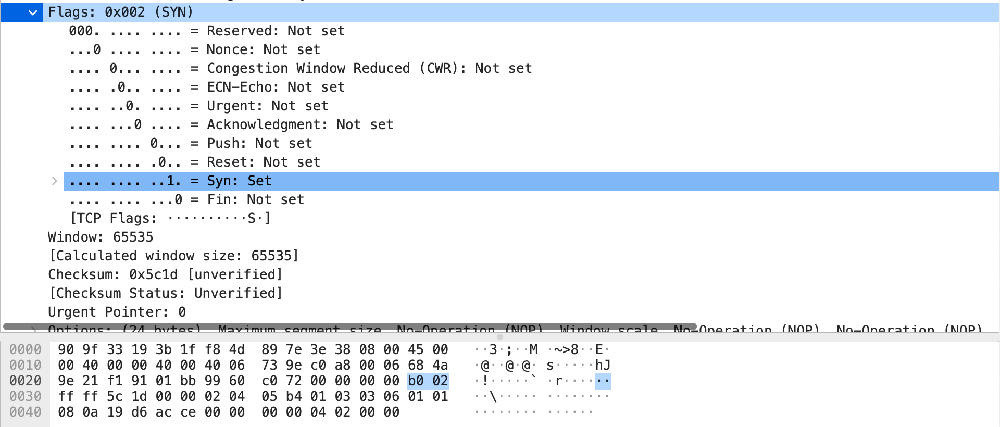

#### Reserved

6 bits. Must be 0. Reserved for future use. RFC says 6 bits, but Wireshark shows 3 bits. Currently, 3 bits are set, and Nonce, CWR, ECN-Echo each get 1 bit.

#### Control Bits

6 bits.

```
URG:  Urgent Pointer field significant
ACK:  Acknowledgment field significant
PSH:  Push Function
RST:  Reset the connection
SYN:  Synchronize sequence numbers
FIN:  No more data from sender
```

During SYN, the SYN bit is set to 1.

#### Window

16 bits. Tells the receiver (server) how much buffer space is left on the sender side. Used for flow control. Initially set to 2^16 bytes. The client allocates TCP buffers and variables at the 3rd step of the 3-way handshake.

#### Checksum

16 bits.

#### Urgent Pointer

Not sure of the details.

#### Options

Variable bits. Not often used in textbooks, but used here. There are two formats:

```
Options may occupy space at the end of the TCP header and are a multiple of 8 bits in length.  All options are included in the checksum.  An option may begin on any octet boundary.  There are two cases for the format of an option:

Case 1:  A single octet of option-kind.

Case 2:  An octet of option-kind, an octet of option-length, and the actual option-data octets.
```

**case 1**: 1 byte for option kind only.

**case 2**: option kind (1 byte) / option length (1 byte) / option data (n bytes)

So the length is 2 + n.

For example, Maximum Segment Size option:

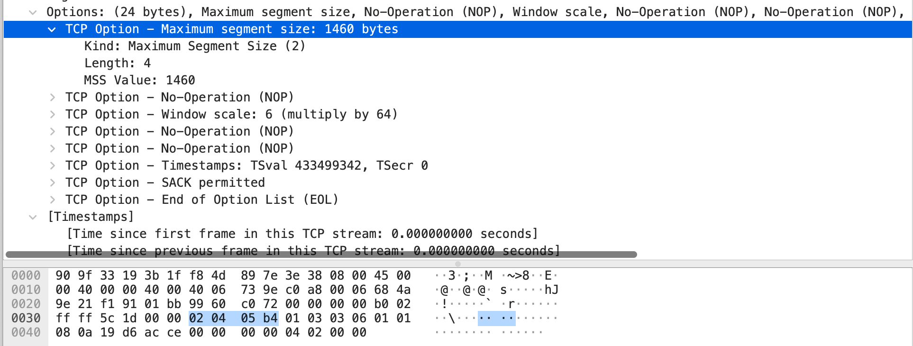

`02 04 05 b4` means:

| 1byte                | 1byte                               | 2bytes                  |
| -------------------- | ----------------------------------- | ----------------------- |
| option kind          | option length                       | option value            |
| 02                   | 04                                  | 05 b4                  |
| Maximum Segment Size | 4 bytes. (1+1+2)                    | 1460 (MSS)              |

## 3Way-Handshake

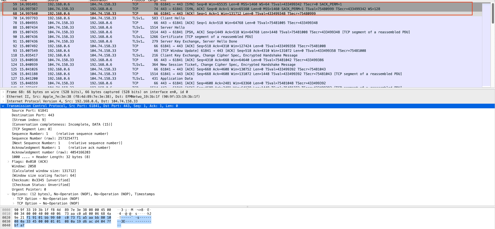

Client

ip: 192.168.0.6 port: 61841

Server

ip: 104.74.158.33, port: 443

1. Client sends SYN segment to Server
   - Means "let's synchronize/connect"
   - SEQ = 0 (relative, actual: 2573254770)
   - No application layer data
   - [window scale option](https://datatracker.ietf.org/doc/html/rfc7323#section-2.2): set to 6, so server knows to shift client window field << 6 (2^6). The exact value is known at step 3.

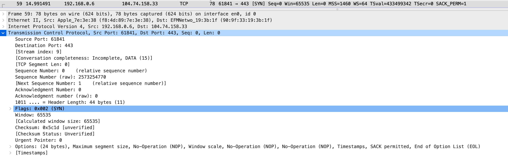
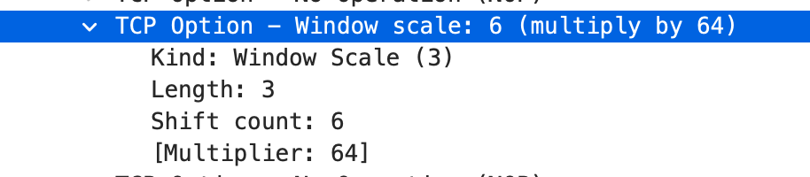

2. Server sends [SYN, ACK] segment
   - SYN = 1 (connection)
   - ACK = 1 (acknowledges client segment, actual: 2573254770 + 1)
   - No application layer data
   - Server initializes TCP buffers and variables
   - Server SEQ = 0 (actual: 4054166202)
   - Flags: ACK = 1, SYN = 1
   - Server window scale option is 7, so server window size field << 7 is the actual window size

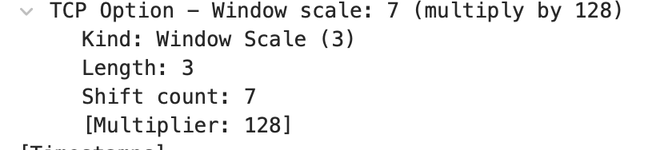
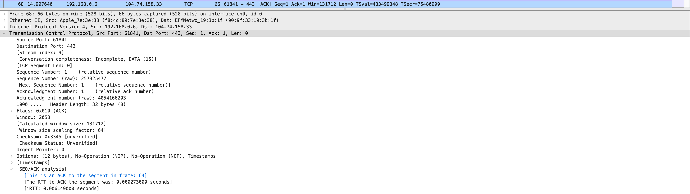

3. Client sends [ACK] segment
   1. ACK = 4054166202 + 1
   2. Client initializes TCP buffers and variables
   3. Window size is 131712 bytes. In [SYN], window scale shift count was 6, window field value is 2058, so 2058 << 6 = 131712.
   4. Application layer data may or may not be present; here, it's not. 