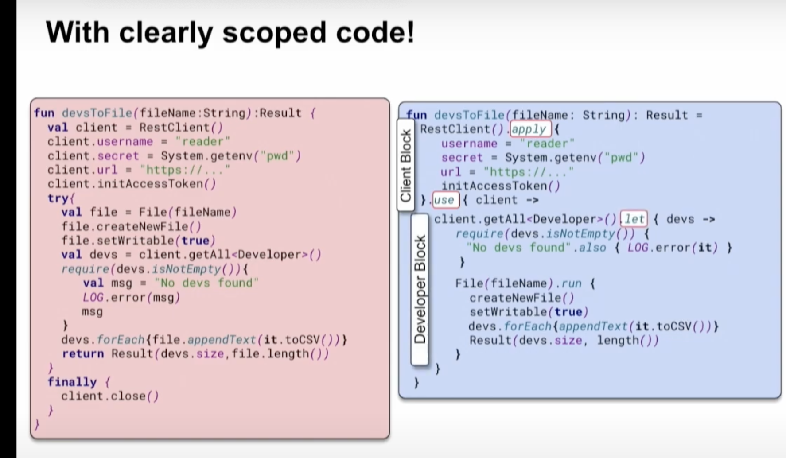
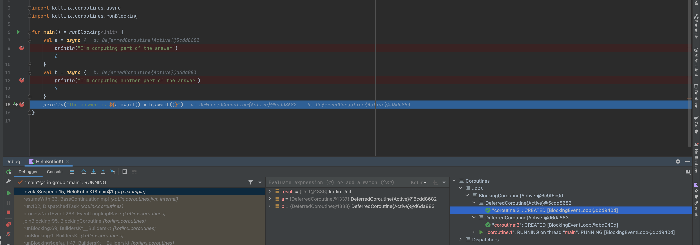

# Source

- [jep480 (Java Enhancement Proposal)](https://openjdk.org/jeps/480)
- [Original post introducing structured concurrency (2016)](https://250bpm.com/blog:71/)

Summary of the jep480 document.

# Purpose of This Post

- Introduce a concurrency programming style that can eliminate common risks from cancellation and shutdown.
- Improve the observability of concurrent code.

# Motivation

- Developers manage complexity by dividing tasks into subtasks.
- In single-threaded code, subtasks are executed sequentially, but if subtasks are independent, running them **concurrently** can **improve performance**.
- However, **managing many threads** is **very difficult**.

# Unstructured concurrency with ExecutorService

Example code using ExecutorService introduced in Java 5 for concurrency, showing what problems arise without structured concurrency.

## Example Code

```java
Response handle() throws ExecutionException, InterruptedException {
    Future<String>  user  = esvc.submit(() -> findUser());
    Future<Integer> order = esvc.submit(() -> fetchOrder());
    String theUser  = user.get();   // Join findUser
    int    theOrder = order.get();  // Join fetchOrder
    return new Response(theUser, theOrder);
}
```

---

### handle()
- Represents a server application task
- Receives a request and runs two subtasks:
    - subtask1 - calls findUser()
    - subtask2 - calls fetchOrder()

### executor service (esvc)
- ExecutorService returns a Future for each subtask
- Schedules each subtask to run concurrently

### Future.get()
- handle() blocks, waiting for the subtask results

### Independence
- Each subtask can succeed or fail independently
- Failure = throws an exception

## Problem Scenarios

When failures occur, understanding the lifetime of threads can be very complex.

### Scenario 1 - Thread leak due to exception

**Flow**
1. `findUser()` fails
2. `user.get()` causes `handle()` to fail
3. But `fetchOrder()` does not fail and its thread keeps running (=thread leak)

**Problem**
- The still-running `fetchOrder()`
    - Wastes resources
    - In the worst case, can block other tasks
        - Unnecessarily holds external connections, causing delays for new requests

### Scenario 2 - Thread leak due to failed interrupt propagation

**Flow**
1. `handle()` is interrupted
2. The interrupt is not propagated to subtasks
3. `findUser()` and `fetchOrder()` keep running in their threads

**Problem**
- Even though handle()'s thread is interrupted, both subtasks keep running, leaking threads

### Scenario 3 - Unnecessary waiting

**Flow**
1. `findUser()` takes a long time
2. While waiting for `findUser()`, `fetchOrder()` fails
3. `handle()` does not cancel `user.get()` and blocks unnecessarily
4. Only after `user.get()` returns does `handle()` fail

**Problem**
- If `user.get()` fails, `handle()` does not fail immediately, unnecessarily occupying a thread

## What is the problem? (Problem Definition)

**Problem 1 - Logical task-subtask relationships are only in code**
- The logical structure is not represented at runtime, only in the developer's mind
- Code and runtime handling are not the same, increasing the chance of human error
- Makes error diagnosis and problem solving very difficult
    - Monitoring tools like thread dumps show `handle()`, `findUser()`, and `fetchOrder()` as unrelated call stacks

**Problem 2 - Too much freedom with ExecutorService**
- ExecutorService and Future allow unstructured concurrency patterns

# Task structure should reflect code structure

Single-threaded code is predictable, easy to read, and easy to monitor.
Let's rewrite the above concurrent code as single-threaded code.

## Code

```java
Response handle() throws IOException {
    String theUser  = findUser();
    int    theOrder = fetchOrder();
    return new Response(theUser, theOrder);
}
```

---

- The body block of handle() is the task
- Methods called within the body block are subtasks
- Called methods must return a value or fail

## Code Explanation
- `fetchOrder()` cannot run until `findUser()` completes (success or failure)
- If `findUser()` fails, `fetchOrder()` is not run
- If `findUser()` fails, `handle()` also fails
- When running `findUser()`, the call stack shows both findUser() and handle(), making it clear that `findUser()` is running because of `handle()`

## Features of structured code

1. Subtasks must return a value or throw an error to the calling task, so the task can control its subtasks
    1. If a subtask fails, the parent task can cancel other subtasks or fail itself
2. Subtasks cannot outlive the task, so subtasks are children of the task (like parent-child processes)
3. Subtasks within the same task are related
    1. If the task fails, subtasks are not run
    2. If a subtask fails, other subtasks are not run
4. The task-subtask hierarchy is realized in the runtime call stack

All these constraints are enforced by the **block structure of the code**.

### Desired properties in concurrent programming
- Like single-threaded code, the parent-child relationship between tasks and subtasks should be realized not only in code structure but also at runtime.

# Structured concurrency

## Definition
Structured concurrency is an approach that keeps the natural relationship between tasks and subtasks, making concurrent code easier to read and manage.

## Principle
If a task splits into concurrent subtasks, then they all return to the same place, namely the task's code block.

## Idea
1. Code blocks provide clear entry and exit points for execution flow
2. The lifetime of work is strictly nested to match the syntactic nesting of code blocks

### Benefits
- Entry and exit points are clear, so the lifetime of subtasks is limited to the parent task's block
- Since each subtask's lifetime is limited to the parent task, you can manage and control subtasks as a single logical unit
- Subtasks' lifetimes are tied to the parent task, so you can represent the hierarchy as a tree

# Kotlin

How is the concept of structured concurrency applied in Kotlin?

[YouTube: KotlinConf 2019 - Roman Elizarov - Structured Concurrency](https://www.youtube.com/watch?v=Ed3t4WAe0Co&t=400s)



---

## Only in CoroutineScope can you run subtasks concurrently

```kotlin
fun main() = runBlocking {
    doWorld()
}

suspend fun doWorld() = coroutineScope {  // this: CoroutineScope
    launch {
        delay(1000L)
        println("World!")
    }
    println("Hello")
}
```

---
- You can only launch coroutines (coroutine builders) inside a coroutineScope
- The lifetime of coroutines created inside coroutineScope is limited to the parent task's coroutineScope lifetime

## The task waits until all subtasks are finished

```kotlin
// Sequentially executes doWorld followed by "Done"
fun main() = runBlocking {
    doWorld()
    println("Done")
}

// Concurrently executes both sections
suspend fun doWorld() = coroutineScope { // this: CoroutineScope
    launch {
        delay(2000L)
        println("World 2")
    }
    launch {
        delay(1000L)
        println("World 1")
    }
    println("Hello")
}
```

---
- Coroutines created with `launch` run concurrently
- `doWorld` only completes after all launched coroutines complete, so "Done" is printed after 2 seconds

## Cancelling the task cancels all subtasks

```kotlin
private fun main() = runBlocking {
    val task = launch {
        val subtask = launch {
            repeat(1000) { i ->
                try {
                    println("job: I'm sleeping $i ...")
                    delay(500L)
                } catch (e: CancellationException) {
                    println("subtask cancelled: $e")
                    throw e
                }
            }
        }
    }
    delay(1300L) // delay a bit
    println("main: I'm tired of waiting!")
    task.cancel() // cancels the job
    task.join() // waits for job's completion
    println("main: Now I can quit.")
}
//job: I'm sleeping 0 ...
//job: I'm sleeping 1 ...
//job: I'm sleeping 2 ...
//main: I'm tired of waiting!
//subtask cancelled: kotlinx.coroutines.JobCancellationException: StandaloneCoroutine was cancelled; job=StandaloneCoroutine{Cancelling}@2d6eabae
//main: Now I can quit.
```

## If a subtask fails in a coroutine scope, other subtasks are cancelled

Failure != cancellation
- Failure: an exception is thrown
- Cancellation: coroutine is cancelled (job.cancel())

```kotlin
private fun main() = runBlocking {
    val subtask1 = launch {
        repeat(1000) { i ->
            println("subtask1: I'm sleeping $i ...")
            delay(2000L)
            throw RuntimeException("error occurred.")
        }
    }
    val subtask2 = launch {
        try {
            repeat(1000) { i ->
                println("subtask2: I'm sleeping $i ...")
                delay(500L)
            }
        } finally {
            println("subtask2 cancelled")
        }
    }
}
//subtask1: I'm sleeping 0 ...
//subtask2: I'm sleeping 0 ...
//subtask2: I'm sleeping 1 ...
//subtask2: I'm sleeping 2 ...
//subtask2: I'm sleeping 3 ...
//subtask2 cancelled
//Exception in thread "main" java.lang.RuntimeException: error occurred.
```

## Debugging - Monitoring tools show task-subtask as a tree

BlockingCoroutine
- DeferredCoroutine
    - coroutine2
- DeferredCoroutine
    - coroutine3
- coroutine1

 