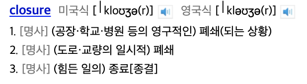

# Introduction

Let's look up the word 'closure' in English.


Dictionary:

1. an act or process of closing something, especially an institution, thoroughfare, or frontier, or of being closed.

It means 'to close'. So, when I first studied closures, it didn't make sense to me. What is being closed? Today, let's lift the veil!

# The Concept of Closure

Lambda calculus is a concept from the 1930s, and closure is from the 1960s.

A person named Peter J. Ladin first defined it in 1964 when he devised a machine to evaluate lambda calculus expressions. Later, in the 1970s, Joel Moses established and implemented the modern concept of closure.

To explain the concept, let's look at the following problem.

`x ⇒ y ⇒ x^2 + y^2`

If you put 5 into x, mathematically, you can think of it as returning a function:

`y ⇒ 25 + y^2`

But what about computers? Usually, with call by value, evaluation happens when y is applied.

In other words, even if you put `x = 5`, the function `y = x^2 + y^2` is returned.

How should the value `x = 5` be handled? It should be applied when y is applied later.

To understand this more precisely, let's learn one more piece of background knowledge: scope. Yes, I mean block scope.

# Scope

## Dictionary Definition

the extent of the area or subject matter that something deals with or to which it is relevant.

In other words, the **range** of **concern** is called scope.

telescope: to see things far away. (telescope)
microscope: to see things up close. (microscope)

## Two Keywords: name binding, part of a program

When you look up scope, you see 'scope of name binding'.

**the scope of name binding** is the **part of a program** where the **name binding is valid**.

It's a specific part (area) of a program where a name binding is valid.

### Name Binding

```java
int a = 10;
```

Expression: The name 'a' is bound to the entity 10.

### Part of a Program

Usually, the valid range of a name in a program is the range of the source code.

If you write a * 10, where is 'a' valid? ⇒ within the block...

# Free Variable, Bound Variable, and Closure

Let's look at the lambda calculus expression:

`x ⇒ y ⇒ x^2 + y^2`

Here, `x` is a free variable in the inner function. But if you apply `x = 5`, it becomes:

`y ⇒ 25 + y^2`

Now, `x` is no longer a free variable but a bound variable by the outer function, so this is called a closed lambda expression.

This closed lambda expression is what we call a closure.

Now, does the meaning of 'closed' make sense?

## When is a closure created in JavaScript?

Technically, when is a closure created? When a function is called.

From MDN JavaScript:

https://developer.mozilla.org/en-US/docs/Web/JavaScript/Closures

```javascript
function makeAdder(x) {
  return function(y) {
    return x + y;
  };
}

var add5 = makeAdder(5);
var add10 = makeAdder(10);

console.log(add5(2));  // 7
console.log(add10(2)); // 12

// add5 and add10 are both closures.
```

You might think this is just an anonymous function.

But it's not just an anonymous function; it also returns the lexical scope of the outer function where x is bound to 5 or 10.

So, it's different from just an anonymous function.

Now, let's look at practical uses. How can we use closures?

## Use Cases

#### 1. Function Factory

Just like creating instances through classes in object-oriented languages, you can use closures to return functions.

Here's Java code using a static factory method called bornWith to create objects:

```java
public class Main {
  public static void main(String[] args) {
      Person jurogrammer = Person.bornWith("jurogrammer");
      Person honggildong = Person.bornWith("gildong");

      jurogrammer.sayHello();
      honggildong.sayHello();
  }

  static private class Person {
      private String name;

      public Person(String name) {
          this.name = name;
      }

      public static Person bornWith(String name) {
          return new Person(name);
      }

      public void sayHello() {
          System.out.println("hello~ my name is " + name);
      }
  }
}
```

Here's a similar implementation in JavaScript using closures. Here, instead of creating an instance, we create a function that says hello.

```javascript
function bornWith(name) {
  return () => console.log("hello, my name is " + name)
}

let jurogrammerHelloFunc = bornWith("jurogrammer");
let honggildongHelloFunc = bornWith("gildong");

jurogrammerHelloFunc();
honggildongHelloFunc();
```

#### Private Variable

In the above example, you can use `jurogrammerHelloFunc`, but you can't access `name` directly. `name` becomes a private variable. This is how you can create private variables.

#### Delay Evaluation

```javascript
function f(x) {
    return x + 2;
}

function g(x) {
    return x + 5;
}

// Returns a closure x => ... x is not evaluated until a value is provided.
function compose(functions) {
    return x => functions.reduce((accReturnVal, curFunc) => curFunc(accReturnVal), x);
}

// Same form as above
function compose(f, g) {
    return x => f(g(x));
}
```

I mentioned function composition before. I said it's hard to write f(g(x)) due to type issues and because x is evaluated eagerly.

With closures, you can evaluate x lazily, so you can write f(g(x)).

## Lastly... The Ambiguity - Function? Record?

There's something ambiguous. Wiki defines a closure as a record storing a function and its environment. MDN also defines it that way. But sometimes, a function is also called a closure. Record and function seem different, right? In Kotlin, a closure is also called a function. Since a closed lambda expression is a function... I didn't cover this debate in this post. I just explained it as a function~ 

