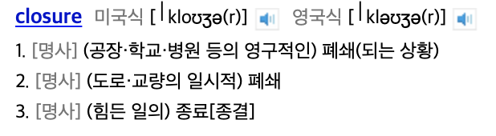
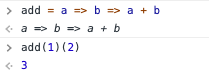

# Motivation

This time, the introduction is a bit long... Feel free to skip it.

It all started with trying to understand the concept of flux. So, I was implementing a brick breaker game using redux + canvas.

(Somehow, after some trial and error, I found that I could use redux without react.)

### Problem - I want to notify only the relevant renderer when the state changes.

In redux, when the state changes, the rendering logic subscribed to a specific state change is executed.

For example, if there is an action where the ball collides with a brick, the brick should be destroyed, right? So, if the brick's state is changed to inactive, only the render function responsible for drawing the brick should be executed.

However, in redux, everything is managed with rootState, and if you subscribe to rootState, all callback functions with rendering logic passed during subscription are executed (meaning all subscribers are notified).

As a result, not only the render function for the brick but also the render function for the ball is executed. How inefficient! So, I consulted an expert.

### Memoization

The method I heard was to store the previous state and selectively render only when the state changes. I thought, "Wouldn't it be good to implement this with the decorator pattern or proxy pattern?" So, for learning purposes, I decided to implement it with the decorator pattern.

I was going to write it in JavaScript, but I wondered if I really needed to code it in an object-oriented way, so I wrote it functionally.

# Decorator Pattern, Isn't It an Object-Oriented Design Pattern?

The well-established design patterns we know are from object-oriented languages. So, you might say, "Aren't 'functional' and 'decorator pattern' incompatible concepts?"

I think differently. In fact, the essence of the decorator pattern is that a domain concept has **basic behavior, and additional behavior can be added to it**. The GOF decorator pattern is just an object-oriented implementation of this idea.

Therefore, if you implement the form of basic behavior with additional behavior functionally, that can also be called a decorator. So, let's implement jurogrammer's decorator pattern.

For comparison, I'll attach the decorator pattern structure from object-oriented programming (from the wiki).


# Example - Coffee Making

It's easier to see with an example, so let's use the common domain of coffee making.

Americano corresponds to the **Concrete Component**.

Ice, syrup, whipped cream, etc., correspond to **Concrete Decorators**.

If you decorate an Americano with ice, it becomes an iced Americano.

## Premises

### Requirements
- Allow selection of coffee bean type when making an Americano!
- Allow creating a menu by selecting ingredients!

### Assumptions
- All coffee menus are made by adding ingredients to an Americano.
    - Ice + Milk + Americano => Iced Cafe Latte
    - Ice + Americano => Iced Americano
    - Ice + Vanilla Syrup + Milk + Americano => Iced Vanilla Latte
- Types of ingredients:
    - Sugar
    - Vanilla Syrup
    - Milk
    - Ice
- Menu:
    - Americano
    - Iced Americano
    - Iced Vanilla Latte
    - ...etc. (will be shown in code)

## Code Implementation

### Americano Implementation (Concrete Component)

```javascript
function makeAmericano(beanType) {
    return `${beanType} 아메리카노`;
}
```

Since you need to make coffee with a specific bean type, I declared the beanType parameter. As you can see in the object-oriented decorator pattern, this is the basic behavior, so it doesn't take a decoratee. It is the decoratee itself.

### Ingredient Implementation (Concrete Decorator)

Ingredients need to be added to the Americano. Let's start with ice.

#### Ice

```javascript
function addIce(americano) {
    return `얼음 추가한 ${americano}`;
}
```

Adding ice is the decorator, and you need to add ice to the Americano, which is the concrete component. So, it takes the Americano as a parameter.

After performing the logic to add ice to the Americano, it returns the decorated Americano.

Vanilla syrup, milk, and sugar are the same. I'll show them right away.

#### Vanilla Syrup

```javascript
function addVanillaSyrup(americano) {
    return `바닐라 시럽 추가한 ${americano}`;
}
```

#### Milk

```javascript
function addMilk(americano) {
    return `우유 추가한 ${americano}`;
}
```

#### Sugar

```javascript
function addSugar(americano) {
    return `설탕 추가한 ${americano}`;
}
```

### Menu Creation Function (Client)

Although not shown in the wiki structure, you ultimately need to combine the concrete decorators and the concrete component. This is done in the client code.

In the coffee domain, the process of combining is called making coffee, and the result of the combination is called the menu.

This code is the core. You could implement the combination in various ways, but I used reduce to implement it as a factory method.

```javascript
function makeMenu(americanoFun, ingredientFuncs = []) {
    return (beanType) => {
        let americano = americanoFun(beanType);
        return ingredientFuncs.reduce((addedAmericano, addIngredient) => addIngredient(addedAmericano), americano);
    }
}
```

1. It creates a function that makes a menu by taking the Americano maker and the ingredients.
2. When actually making the menu, it takes the bean type and makes the coffee.

To explain:

#### 1. Closure

In the anonymous function returned by `makeMenu`, `americanoFun` is a parameter received by `makeMenu` and is stored in the closure created by `makeMenu`. So, after preparing the menu in advance, you can make the menu later by just passing the bean type to the anonymous function.

By the way... since it returns a function again, you might say it's currying because it applies the second argument. But currying strictly means converting multiple arguments to single arguments, so it's not exactly currying.

#### 2. Reduce

The actual coffee making is done in reduce. The initial value is the Americano, and the ingredient-adding functions are applied to the Americano in sequence. As the name suggests, you keep changing the state. That's how I came up with it.

The background for thinking about state change is as follows.

The dictionary meaning of reduce:
1. Dimensional reduction
2. State transition

You might think these are different, but how are they used in the same sense? Let me explain in more depth.

In short, if you repeatedly transition the state for each element (n+1 dimensions), the dimension is reduced. I didn't study this mathematically, so I might be wrong... Let's think about state change.

- Let's say the current state is S1.
- If a value x is input, it changes to another state S2.

This can be expressed as:

```javascript
t(S_cur, x) =  S_nxt
```

t is the function that changes the state, S_cur is the current state, x is the input, and S_nxt is the next state. Here, the second meaning of reduce appears, and the reducer in redux represents this second meaning.

The first meaning, dimensional reduction, is as follows. The structure of collection.reduce is that it takes a reducer function, like this:

```javascript
reducer(acc, cur)
```

Doesn't this look familiar? It's the same as t(S_cur, x). collection.reduce takes an element e_i as input and returns acc. Then, it applies the reducer function to acc and the next element e_(i+1).

So, as you keep operating, the list becomes a value!!

In this example, the concept of state transition is a bit more emphasized.

### Menu Implementation

#### Americano

```javascript
let americano = makeMenu(makeAmericano);
```

#### Sugar Americano

```javascript
let sugarAmericano = makeMenu(makeAmericano, [addSugar]);
```

#### Iced Vanilla Latte

```javascript
let iceVanillaLate = makeMenu(makeAmericano, [addIce, addVanillaSyrup, addMilk])
```

You can create a menu by just passing the ingredient-adding functions as the second argument.

### Let's Serve Customers

Customer: Americano with Arabica beans, please.

Barista:

```javascript
americano("Arabica"); // "Arabica 아메리카노"
```

Customer: Sugar Americano with Robusta beans, please.

Barista:

```javascript
sugarAmericano("Robusta"); // "설탕 추가한 Robusta 아메리카노"
```

Customer: Iced Vanilla Latte with Liberica beans, please.

Barista:

```javascript
iceVanillaLate("Liberica") // "우유 추가한 바닐라 시럽 추가한 얼음 추가한 Liberica 아메리카노"
```

It prints well... haha;

### Full Code

```javascript
function makeAmericano(beanType) {
    return `${beanType} 아메리카노`;
}

function addSugar(americano) {
    return `설탕 추가한 ${americano}`;
}

function addVanillaSyrup(americano) {
    return `바닐라 시럽 추가한 ${americano}`;
}

function addMilk(americano) {
    return `우유 추가한 ${americano}`;
}

function addIce(americano) {
    return `얼음 추가한 ${americano}`;
}

function makeMenu(americanoFun, ingredientFuncs = []) {
    return (beanType) => {
        let americano = americanoFun(beanType);
        return ingredientFuncs.reduce((addedAmericano, addIngredient) => addIngredient(addedAmericano), americano);
    }
}

let americano = makeMenu(makeAmericano);
let sugarAmericano = makeMenu(makeAmericano, [addSugar]);
let iceVanillaLate = makeMenu(makeAmericano, [addIce, addVanillaSyrup, addMilk])
```

# Lastly,

#### Is it really functional?

- Functions are received and returned as objects
- No external references, transparent, no side effects
- Immutable

But... since there's object-oriented code in ingredientsFun.reduce, it's hard to say it's purely functional.

Well... I wrote the code as functions, so I called it functional... I'll leave the judgment to you.

#### Implementation with only arrow functions

```javascript
(americanoFun, ingredientsFun) => (beanType) =>  ingredientsFun.reduce((addedAmericano, addIngredient) => addIngredient(addedAmericano), americanoFun(beanType))
```

Not very readable, haha;

### Composed Function

I thought, "Can't I just pre-compose the ingredient functions and then pass the Americano as an argument later?" That way, you don't need to pass the Americano as the initial value. Like this:

```javascript
let ingredientsFunc = addIce ∘ addVanillaSyrup ∘ addMilk
ingredientsFunc(americano)
```

This... is a much trickier problem than I thought. If you try to implement it like above, you run into type issues. In JavaScript, it returns weird values. I think it's related to the concept of monads... I'll write about this in a future post.




 