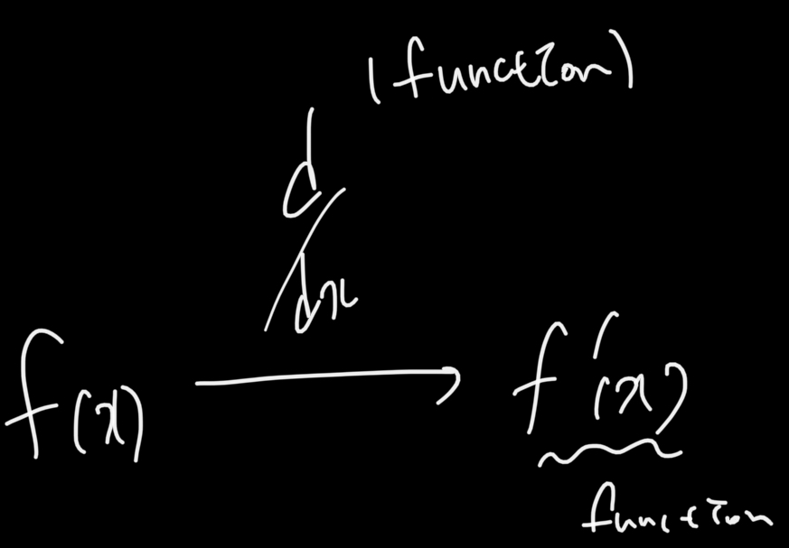
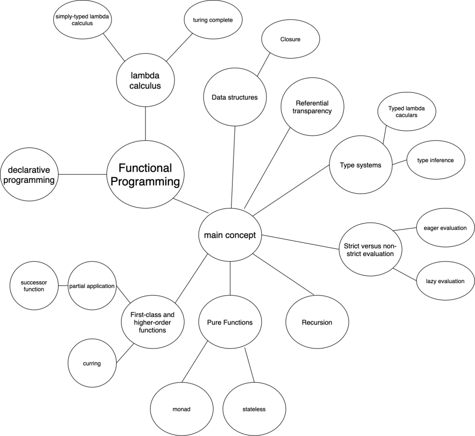

# Sources

- [https://en.wikipedia.org/wiki/Functional_programming](https://en.wikipedia.org/wiki/Functional_programming)
- [https://www.geeksforgeeks.org/introduction-of-programming-paradigms/](https://www.geeksforgeeks.org/introduction-of-programming-paradigms/)

# Prelude to Functional Programming

## Why I Want to Learn About Functional Programming

In March of this year, when I first learned JavaScript, the language felt strange. Sometimes it felt like C, sometimes like Java, and sometimes it had syntax I had never seen before.

There were three things in JavaScript's syntax that surprised me: Map, Closure, and Functions.

I used Map a lot in Python, so seeing it in JavaScript made me think, "Ah, this must be a commonly used function that people like, so it's included here too."

Then there was Closure. I understood how it worked, but I couldn't understand why it was needed. Even after reading geeksforgeeks and MDN thoroughly, I couldn't grasp why it was used in those situations. I thought other languages could implement similar things in different ways.

Finally, there were functions. OMG... Declaring functions as variables, passing them as arguments, and even returning functions from functions... It felt like a revelation. I spent the whole day looking up what a first-class function was.

After that, I got a job and moved away from JS, so I thought I wouldn't struggle with these concepts again. But then I encountered something similar in Ruby: the concept of blocks!

"Wait, you can pass a chunk of code? Is that even possible? I thought you could only pass variables!" I was very confused, since I had always written code without doing this.

While studying blocks, I found a term that connected all my confusion: <i><b>Functional Programming</b></i>.

Wow... All the things I couldn't accept were explained here. I spent a day researching, but the content was very difficult—so many concepts came from mathematics.

The real reason I wrote this post was after reading the Java Specification. Java 8 added the Functional Programming paradigm, including lambda expressions, method references, streams, and aggregation functions. My impression was that these were forced into object-oriented programming... But since this is an unstoppable trend, I accepted it, and personally, I find functional programming both unfamiliar and attractive, so I want to master it.

Before diving in, let's look at the big picture of programming paradigms. Functional programming belongs to the declarative programming paradigm. So, it's good to know the difference between declarative and imperative programming. Keeping this in mind will help you see the differences from C and JAVA.

## Declarative vs. Imperative Languages


(Source: [https://www.geeksforgeeks.org/introduction-of-programming-paradigms/](https://www.geeksforgeeks.org/introduction-of-programming-paradigms/))

The image above is from Bhumika_Rani on geeksforgeeks. To briefly explain the difference, let's look at the following example.


I did something. How would you describe it?

From a declarative language perspective:

> "You drew a square."

From an imperative language perspective:

> "You put a dot, drew a line down, turned 90 degrees counterclockwise and drew a line, turned 90 degrees counterclockwise again and drew a line, and finally turned 90 degrees counterclockwise and drew a line."

Do you get the idea?

That's why we use the terms declarative vs. imperative, and also WHAT vs. HOW. Declarative cares about what to draw, imperative cares about how to draw it.

From the perspective of Clean Code, you could say: "Abstracted (summarized) the action" vs. "Described it in detail."

C is an imperative, procedural language, so you assign variables, repeat, etc. In contrast, look at SQL, which is declarative:

`SELECT name FROM students`

It just says, "Get the name from the students table!" without specifying the details. That's the big difference!

Functional languages belong to this paradigm.

## So What is Functional Programming?

Functional programming is, simply put, programming with functions. You compose functions and apply them to build programs.

In 1937, Alonzo Church introduced this with lambda calculus. This paradigm is becoming popular for its simplicity and immutability!

In this post, I'll briefly look at the features of functional languages and explore this topic in more detail in the future. (I don't know all the details yet, so let's just get the concept for now!)

## Concepts in Functional Languages

### 1. First-class and Higher-order Functions

Higher-order functions (고계함수) are functions that take other functions as arguments or return functions. They are functions that handle other functions.

Let's look at the following expression. It blew my mind when I saw it:

$$ f(a) = k $$

$$ f(\textbf{f(a)}) = \textbf{f(k)} $$

We've seen expressions like this in math. In math, it's natural. Since this concept comes from math, it's easier to understand it that way. In computer languages, this is called a first-class object, not just a higher-order function. You just need to be able to declare functions as variables.

For example, Wikipedia gives differentiation as an example.



Also, when functions return and use other functions, you get key concepts like partial application and currying. These are always mentioned when you search for functional languages.

### 2. Pure Functions

A pure function is a function with no side effects. The output is not affected by external factors, only by the input. This makes them very reliable! That's why they're often used in parallel processing.

### 3. Recursion

This is the concept always illustrated with the factorial example. In functional languages, loops are usually implemented with recursion.

### 4. Strict vs. Non-strict Evaluation

Evaluation means "to compute an expression." Expressions can be evaluated strictly (eagerly) or non-strictly (lazily).

Here's an example that makes it clear:

```angelscript
print( length([2+1, 1/0]) )
```

What happens if you evaluate this expression?

If you said an exception occurs, that's strict evaluation. If you said 2 is printed, that's non-strict evaluation.

Most people think of the former, but the latter can be unfamiliar.

When returning the value of the length function, the important thing is the number of elements in the container. So, it returns the value without evaluating 1/0 at all.

Oh my! That's why strict evaluation is also called full evaluation.

### 5. Type Systems

I don't understand this part well yet... I'll add an explanation when I cover it later. I don't even know the concept yet, which is a bit sad.

### 6. Referential Transparency

Functional programs don't use assignment. That's because values would change! Once a value is defined, it doesn't change. This is part of the effort to eliminate side effects.

This is called referential transparency.

### 7. Data Structures

Data structures in functional languages are unique. In imperative languages, you change values in an array. In functional languages, you keep (or persist) the original value.

If you just copy values, memory becomes a problem, so there are various ways to implement this. Here, closure and persistent vectors are mentioned.

### 8. Other Concepts

Another concept is the monad, which comes up when thinking about how to maintain immutability. Think of a bank account: to change the balance, you add or subtract from it. I'm curious how functional programming implements this!

## In Conclusion...

This big topic will require a lot of time on lambda calculus, type theory, monads (category theory), and currying.

Lambda calculus is the foundation of functional programming.

Type theory is becoming more prominent these days, like in TypeScript, and I personally like it because it can catch mistakes at compile time. It was also a difficult topic in the Java Specification.

Finally, monads and currying are so frequently mentioned in functional programming that I'm familiar with the words, but I don't really know what they mean, so I'm very interested. Monads are notoriously difficult, so I'll have to spend a lot of time on them... haha.

I'll end this post with a mind map image of functional programming concepts.

 