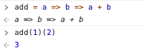

# Source

- https://www.youtube.com/watch?v=3VQ382QG-y4

# Lambda Calculus, Expressed as Boolean!

In this post, let's see how lambda calculus can be converted into boolean operations. The explanation is based on the referenced video, as the content on Wikipedia alone was not sufficient for understanding.

## Structure of the Post

This post is written in two parts. In the first part, I will introduce functions by replacing the terms used in lambda calculus with bird names. This helps reduce preconceptions and confusion.

In the next post, I will show how these bird names correspond to actual boolean operations in lambda calculus and how they are applied.

The explanation will connect lambda calculus and JavaScript, so the theory doesn't feel too abstract.

Let's get started.

## Lambda Calculus to JavaScript

In lambda calculus, we have expressions like variable, abstraction, and application. Let's see how each is represented in JavaScript in the table below.

| lambda calculus | javascript | Note |
|---|---|---|
| x | x | variable, x means x |
| a | a | variable, a means a |
| f a | f(a) | application, let f = x => x+5; f(5) |
| f a b | f(a)(b) | application, let f = x => y => x**2 + y**2; f(2)(5) |
| (f a) b | (f(a))(b) | application, parentheses clarify order |
| f(a b) | f(a(b)) | application, order |
| λa.b | a => b | abstraction |
| λa.b x | a => b(x) | abstraction |
| λa.(b x) | a => (b(x)) | abstraction |
| (λa.b) x | (a => b)(x) | abstraction |
| λa.λb.a | a => b => a | abstraction |
| λab.a = λa.λb.a | a => b => a | curried form, not (a,b) => a |

You can create an add function in JavaScript and apply it as shown below.

### β-reduction

I was confused about β-reduction, but this post explains it well, so I'll mention it again.

1. In the first reduction, since the abstraction returns a when a is given as an argument, λb.λc.b is returned as is.
2. λb.λc.b takes b as an argument and returns λc.b, then takes c as an argument and returns b. So, if you apply x as the only argument, λc.x is returned.
3. Since it returns x for any c, if you apply λe.f to λc.x, x is returned.

If this is unclear, check the introduction of the referenced YouTube video. It's well organized!

## Types of Functions (Bird Names)

### 1. Idiot
A function that returns a when a is given.

**lambda expression**

    I := λa.a

**JS**

    const I = a => a

**Example**

    I(I)

The result is I. Since I is passed as an argument to I, I is returned.

In Haskell, this is provided as the built-in function id.

### 2. Mockingbird
A function that, when given f, applies f to itself.

**lambda calculus**

    M := λf.ff

**JS**

    M = f => f(f)

**Example**

    M(I)

    M(I) => I(I) => I

As seen above, I(I) is I, so I is returned again.

    M(M)

    M(M) => M(M) => M(M) ...

It applies itself infinitely! In JavaScript, this causes a stack overflow.

In lambda calculus, this is sometimes called omega.

### 3. Kestrel
A function that, when given a and b, returns a. It always returns the first argument.

**lambda calculus**

    K := λab.a
       = λa.λb.a

**JS**

    K = a => b => a

**Example**

    K(I)(M)
    K(K)(M)
    K(3)(I)
    K(3)(M)
    K(3)(K)

All return the first argument.

In Haskell, this is called the const function.

### 4. Kite
A function that, when given a and b, returns b. It always returns the second argument.

**lambda calculus**

    KI := λab.b

**JS**

    KI = a => b => b

Kite is derived from Kestrel. For example:

    K I x y = I y = y

    K(I)(x)(y) === I(y), I(y) === y

You can see that the value passed last is returned. This works for both values and functions.

To summarize the above, see the table below.

Here, combinators are functions whose body has no free variables.

## Summary

We expressed functions with bird names and performed some strange operations. You might wonder what this is all about, but you'll be surprised in the next post!

With just these four, you can express booleans!

True, False, And, Or, Xor, Not can all be represented. And at the end, you'll get a clue about how the concept of lazy loading in functional programming came about.

Stay tuned for the next post! If you can't wait, check out the referenced video above. 