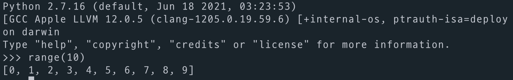
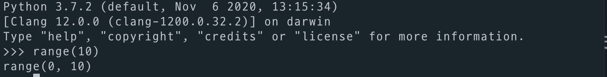

# Introduction

The concept of lazy evaluation is not difficult. So, this time, I will focus on its usefulness.

# Background Knowledge

If you are confused between expression and evaluation, please refer to the following article:
https://jurogrammer.tistory.com/129

# Definition

Lazy evaluation is a strategy where the evaluation of an expression is delayed until its value is needed. It is usually used to improve performance. Let's see how delaying evaluation can improve performance.

# Example of Performance Improvement

Here is an example where a value is only used if a certain condition is met.

```python
import time

def cpuBoundJop():
    print("hard job start")
    time.sleep(3)
    print("hard job end")
    return "hard!"

def businessLogic(n, value):
    if n > 0:
        print("The value is {}".format(value))
    else:
        print("invalid")

businessLogic(1, cpuBoundJop())
```

As you can see, cpuBoundJop is executed even when n is negative. So, running businessLogic always takes 3 seconds, regardless of n. This is unnecessary computation when n is negative. Let's improve this with lazy evaluation.

## How to Implement Lazy Evaluation? (Simulating laziness in eager languages)

Haskell is lazy by default, but most languages are eager. In eager languages, you can implement lazy evaluation by passing a function. The function is evaluated only when called, so you can choose when to evaluate.

# Improvement

```python
import time

def cpuBoundJop():
    print("hard job start")
    time.sleep(3)
    print("hard job end")
    return "hard!"

def businessLogic(n, supplier):
    if n > 0:
        print("The value is {}".format(supplier()))
    else:
        print("invalid")

businessLogic(0, (lambda : cpuBoundJop()))
```

Now, the function is only called when n is positive, so the computation is delayed as needed.

A function that returns an expression like this is called a supplier.

To discuss performance further, let's look at a filter example. We'll implement the following problem in JavaScript, Ruby, and Java, and see how many times the log is printed.

# Filter Example

- Among the natural numbers from 1 to 10
- Greater than 3
- Multiples of 5
- Find the first number

### JavaScript

```javascript
function isGreaterThan3(number) {
    console.log(`isGreaterThan3 ${number}`);
    return number > 3;
}

function isMultipleOf5(number) {
    console.log(`isMultipleOf5 ${number}`);
    return number % 5 === 0;
}

let numbers = [1, 2, 3, 4, 5, 6, 7, 8, 9, 10]
value = numbers
    .filter(isGreaterThan3)
    .filter(isMultipleOf5)
    [0]

console.log(value)
```

How many times is console.log called? (excluding the last value check)

The answer is 17 times:
1. 1~10 are checked with isGreaterThan3 (10 times)
2. The array 4~10 is returned
3. 4~10 are checked with isMultipleOf5 (7 times)

### Ruby

```ruby
def is_greater_than_3? (number)
  puts "is_greater_than_3? #{number}"
  number > 3
end

def is_multiple_of_5? (number)
  puts "is_multiple_of_5? #{number}"
  number%5 == 0
end

numbers = [1, 2, 3, 4, 5, 6, 7, 8, 9, 10]

value = numbers.filter { |number| is_greater_than_3? number }
               .filter { |number| is_multiple_of_5? number }
               .first

puts value
```

Ruby is also 17 times.

**Output:**
```text
is_greater_than_3? 1
is_greater_than_3? 2
is_greater_than_3? 3
is_greater_than_3? 4
is_greater_than_3? 5
is_greater_than_3? 6
is_greater_than_3? 7
is_greater_than_3? 8
is_greater_than_3? 9
is_greater_than_3? 10
is_multiple_of_5? 4
is_multiple_of_5? 5
is_multiple_of_5? 6
is_multiple_of_5? 7
is_multiple_of_5? 8
is_multiple_of_5? 9
is_multiple_of_5? 10
```

### Java

```java
public class App {
    static Predicate<Integer> isGreaterThan3 = number -> {
        System.out.println("isGraterThan3 " + number);
        return number > 3;
    };

    static Predicate<Integer> isMultipleOf5 = number -> {
        System.out.println("isMultipleOf5 " + number);
        return number % 5 == 0;
    };

    public static void main(String[] args) {
        List<Integer> numbers = List.of(1, 2, 3, 4, 5, 6, 7, 8, 9, 10);

        Optional<Integer> first = numbers.stream()
                .filter(isGreaterThan3)
                .filter(isMultipleOf5)
                .findFirst();

        System.out.println(first.get());
    }
}
```

In Java, it's only 7 times! Since we only need the first value, there's no need to check all values. The calculation is performed at the terminal operation (findFirst). Java implements lazy evaluation properly.

**Output:**
```text
isGraterThan3 1
isGraterThan3 2
isGraterThan3 3
isGraterThan3 4
isMultipleOf5 4
isGraterThan3 5
isMultipleOf5 5
```

# Another Use Case: Infinite Stream

In the previous example, we declared a collection of natural numbers from 1 to 10. But what if we want all natural numbers? We can't store them all in memory! Instead, we can declare something that represents natural numbers and fetch values as needed.

Let's implement this in JavaScript and Java.

## Example

### JavaScript yield

> yield?
> https://en.wikipedia.org/wiki/Value_(mathematics)
> https://en.wikipedia.org/wiki/Yield_(multithreading)

In JavaScript, you can use yield to implement this. The references above help understand the concept.

```javascript
function* naturalNumbers() {
    let number = 0;

    while(true) {
        number += 1;
        yield number;
    }
}

let stream = naturalNumbers();

stream.next().value
```

This creates an infinite stream of natural numbers using yield.

### Java

Java provides the iterate API, which can be written in set-builder notation.

```java
public class App {
    static Predicate<Integer> isGreaterThan3 = number -> {
        System.out.println("isGraterThan3 " + number);
        return number > 3;
    };

    static Predicate<Integer> isMultipleOf5 = number -> {
        System.out.println("isMultipleOf5 " + number);
        return number % 5 == 0;
    };

    public static void main(String[] args) {
        Optional<Integer> first = Stream.iterate(0, i -> i + 1)
                .filter(isGreaterThan3)
                .filter(isMultipleOf5)
                .findFirst();

        System.out.println(first.get());
    }
}
```

## Python range

In Python, range was eager in version 2.7, but became lazy in version 3.

### python 2.7



### python 3.7



You can see the difference in output.

# Avoidance of Error Conditions

```text
length(2/0, 2)
```

With lazy evaluation, the result is 2. With eager evaluation, you get a division by zero error. The difference is whether 2/0 is computed or not. It may feel odd, but think of it this way: when getting the size of a collection, you don't need to know the values, just the count. No need to evaluate the values.

I didn't know where to use this at first, but it hit me while writing Java test code.

```java
public class LazyEvaluationTest {

    @Test
    @DisplayName("Throws ArithmeticException when dividing by zero")
    void throwZeroException() {
        assertThrows(ArithmeticException.class, () -> divide(1, 0));
    }

    private static double divide(double a, double b) {
        return a / b;
    }
}
```

In assertThrows, the second argument is a supplier that throws the error. If you just pass divide(1,0), the error occurs before assertThrows is called. That's why lazy evaluation is used here.

The inside of assertThrows is similar to this:

```java
try {
  supplier.apply();
} catch (Throwable e) {
  expectedException.isInstance(e)
}
```

# Finally...

There are some issues to note:

1. **Memory Issue**
   - Delaying evaluation means you have to remember the filter function, which takes up memory. If used incorrectly, it can cause memory leaks.
2. **Repeated Evaluation (Memoization)**
   - In functional programming, there are no side effects, so the same input always gives the same output. If you've already computed f(3) once, you don't need to compute it again. Memoization is used for this optimization. 