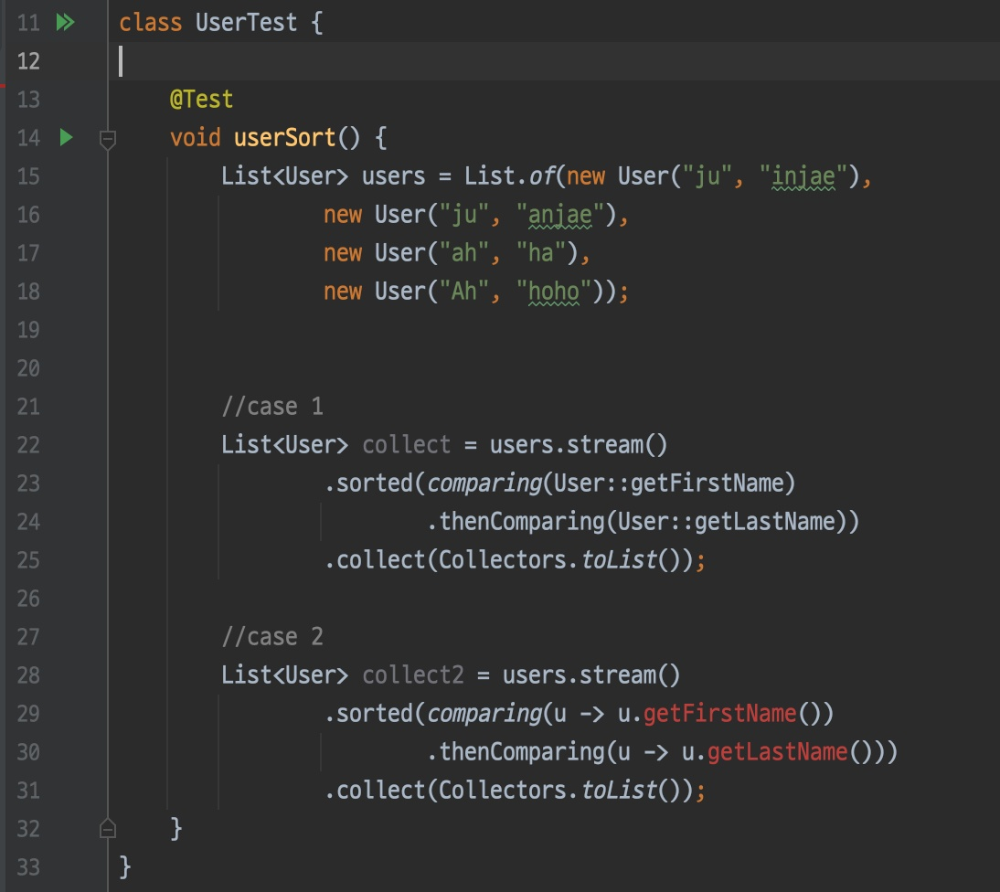

Users

1. Sort by last name
2. If the last names are the same, sort by first name
3. Then return as a List.

I created an example for cases where there are two sorting criteria.

And I tried to solve the problem using method reference and lambda expression... but what happened... The example written with a lambda expression results in a compile error.

Huh! Is it not able to infer the type well...? They look exactly the same, though.

-- To be continued 