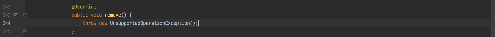
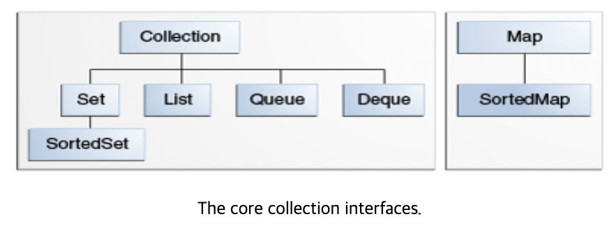

# Related Posts

https://jurogrammer.tistory.com/172

# Interfaces

https://docs.oracle.com/javase/tutorial/collections/interfaces/index.html

# Overview

Core collection interfaces encapsulate different types of collections. Therefore, you can manipulate different collections without worrying about the details.

The collection interface can be considered the foundation of the Java Collection Framework.

The Interface chapter will provide general guidelines for efficient use of collection interfaces.

# Important Notes

## Map is not a Collection

Literally, it's not.

## All Core collections are Generic

* When declaring a collection, you must specify the type that will go into the collection.
* Generics can verify at compile time whether the object being put into the collection is of the correct type.

## Java Platform does not provide interface variations

To facilitate the management of numerous core collection interfaces, the Java Platform does not provide interface variations (e.g., interfaces with characteristics like immutable, fixed-size, append-only). Instead, modification operations are optional. That is, since not all operations are implemented, calling a specific operation may throw an `UnsupportedOperationException`. Therefore, this must be documented. In summary, if you need to implement a specific collection interface, implement only what you need. Don't implement everything.

On the other hand, the general-purpose implementations of the Java platform support optional operations.

### Example of UnsupportedOperationException

Looking at the `sun.util.resources.ParallelListResourceBundle.KeySet.remove` method, it is used as follows:

# Core collection interfaces

* **Collection**
  * It corresponds to the root of the collection hierarchy.
  * A collection represents a group of objects called elements.
  * While specific collections may or may not allow duplicates, and some collections may or may not guarantee order, the Java platform provides implementations of more specific interfaces rather than implementations of collections.
    * Rather than `UniqueCollection implement Collection`,
    * It provides forms like `Set extends Collection`, `HashSet implement Set`!

* **Set**
  * A collection without duplicate elements.
  * Models mathematical sets.

* **List**
  * An ordered collection. Also called a sequence collection.
  * Can contain duplicate elements.
  * Has the ability to precisely control where to insert elements, access elements at specific indices, etc.

* **Queue**
  * Used to store data before processing.
  * Provides additional insertion, deletion, and inspection operations beyond Collection operations (insertion, extraction, inspection).
  * Queues usually maintain element order in FIFO manner, but order may vary by priority like Priority Queue. Therefore, ordering properties must be specified for each queue.

* **Deque**
  * Used to store data before processing.
  * Deque also supports the same additional operations as Queue.
  * Both FIFO and LIFO are used.
  * Can perform addition, deletion, and inspection operations on elements at both ends.

* **Map**
  * An object that maps keys to values.
  * Cannot have duplicate keys.
  * If you've used Hashtable, you'll be familiar with Map.

The following two core collections are simply sorted versions of Set and Map.

* **SortedSet**
  * Maintains elements in ascending order.
  * Provides additional operations to take advantage of ordering.
  * Used for naturally ordered sets (like word lists, membership rolls).

* **SortedMap**
  * A Map where keys are maintained in ascending order.
  * Used for naturally ordered collections of key/value pairs.
    * ex:) dictionaries, phone books

For how to maintain elements in sorted state, refer to the [Object Ordering](https://docs.oracle.com/javase/tutorial/collections/interfaces/order.html) section.

 