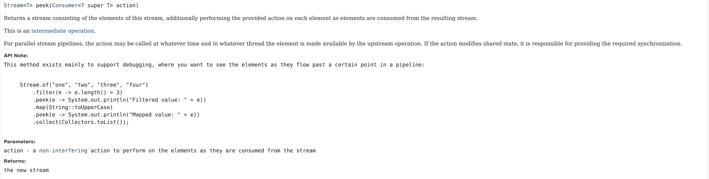
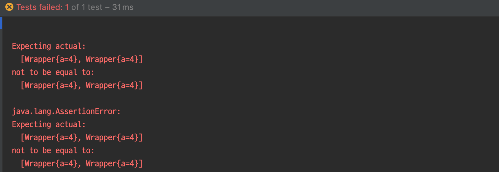
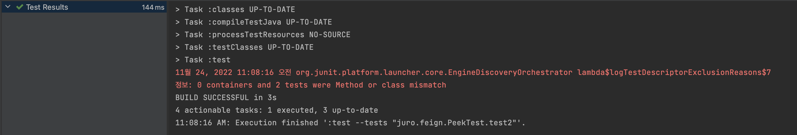
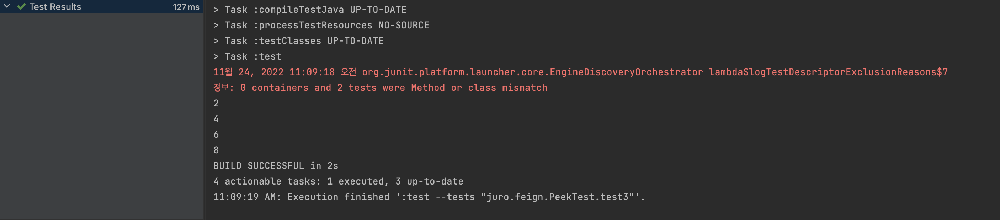

# peek?

Why does the documentation recommend using **Stream.peek mainly for debugging**? Let's find out.

- [Reference](https://docs.oracle.com/en/java/javase/11/docs/api/java.base/java/util/stream/Stream.html#:~:text=This%20method%20exists%20mainly%20to%20support%20debugging%2C)

# Stream API

Since peek is part of the Stream API, let's start by looking at the Stream API documentation.

According to the [Stream API documentation](https://docs.oracle.com/javase/8/docs/api/java/util/stream/Stream.html#:~:text=must%20be%20non%2Dinterfering%20(they%20do%20not%20modify%20the%20stream%20source)), functions passed to methods like `filter` and `map` must satisfy two constraints for correct operation:

- They must be non-interfering
- In most cases, they should be stateless

Let's focus on non-interfering.

## non-interfering

### Dictionary meaning of interfering

Interfering, meddlesome

### What non-interfering means in the documentation

It means that the data source must not be modified at all during the execution of the stream pipeline. - [Reference](https://docs.oracle.com/javase/8/docs/api/java/util/stream/package-summary.html#NonInterference:~:text=For%20most%20data%20sources%2C%20preventing%20interference%20means%20ensuring%20that%20the%20data%20source%20is%20not%20modified%20at%20all%20during%20the%20execution%20of%20the%20stream%20pipeline)

If you violate this:

- Unintended results may occur
- Exceptions may be thrown

Based on this, let's look at how peek is described in the Java docs.

## Peek

[Documentation link](https://docs.oracle.com/javase/8/docs/api/java/util/stream/Stream.html#peek-java.util.function.Consumer-:~:text=the%20new%20stream-,peek,-Stream%3CT)



Here are two things to note:

- The action parameter passed to peek must be a [non-interfering action](https://docs.oracle.com/javase/8/docs/api/java/util/stream/Stream.html#peek-java.util.function.Consumer-:~:text=Parameters%3A-,action%20%2D%20a%20non%2Dinterfering%20action,-to%20perform%20on%20the%20elements%20as)
- peek is an intermediate operation

In other words, you must not modify the source data in a peek operation.

Why is being an intermediate operation important? Let's look at some examples.

## Examples

Let's see if the source data is actually modified and what unintended results peek can cause.

### Modifying the source data

**Code**

```java
@Test
void test() {
    List<Wrapper> origin = List.of(new Wrapper(1L), new Wrapper(2L));

    List<Wrapper> modified = origin.stream()
        .peek(h -> h.setA(4L))
        .collect(Collectors.toList());

    assertThat(origin).isNotEqualTo(modified);
}

public static class Wrapper {
    private Long a;

    public void setA(Long a) {this.a = a;}

    public Wrapper(Long a) {this.a = a;}

    @Override
    public String toString() {
        return "Wrapper{" +
            "a=" + a +
            '}';
    }
}
```

**Result**



the value of the elements in the origin list (the data source) was changed.

### peek and count - 1

**Code**

What will the following code print to the console?

```java
@Test
void test2() {
    long count = IntStream.range(1, 10)
        .peek(System.out::println)
        .count();

    assertThat(count).isEqualTo(9);
}
```

**Result**



There is no output. In Java 9, due to optimization of the terminal operation count, the function passed to peek is not executed.

peek does not affect the count, so the function for standard output is not executed.

In other words, **intermediate operations** may not be executed for optimization (see lazy evaluation).

### peek and count - 2

**Code**

```java
@Test
void test3() {
    long count = IntStream.range(1, 10)
        .filter(n -> n % 2 == 0)
        .peek(System.out::println)
        .count();

    assertThat(count).isEqualTo(4);
}
```

**Result**



Since filter affects the result of count, peek is evaluated in this case.

## Caution

Here are some points to keep in mind when using peek in development:

- peek is an intermediate operation, so it may not be evaluated depending on the terminal operation (due to lazy evaluation and optimization)
- Using peek differently from the documentation may cause problems in future versions (e.g., count() optimization from Java 8 to Java 9)

Finally, let's look at methods with different paradigms and wrap up.

### Stream.forEach vs Iterable.forEach

Although they have the same method name, Stream.forEach is made for the functional paradigm, while Iterable.forEach is for the procedural paradigm. Let's see how their documentation differs.

`Stream.forEach` also specifies that you should pass a non-interfering action - [link](https://docs.oracle.com/en/java/javase/11/docs/api/java.base/java/util/stream/Stream.html#forEach(java.util.function.Consumer):~:text=Parameters%3A-,action%20%2D%20a%20non%2Dinterfering%20action%20to%20perform%20on%20the%20elements,-forEachOrdered)

`Iterable.forEach` only warns that modifying the source element may cause side effects - [link](https://docs.oracle.com/en/java/javase/11/docs/api/java.base/java/lang/Iterable.html#:~:text=The%20behavior%20of%20this%20method%20is%20unspecified%20if%20the%20action%20performs%20side%2Deffects%20that%20modify%20the%20underlying%20source%20of%20elements)

## Thoughts - Expression

peek and forEach can both cause [side-effects](https://docs.oracle.com/javase/8/docs/api/java/util/stream/package-summary.html#NonInterference:~:text=However%2C%20side%2Deffects%20such%20as%20using%20println()%20for%20debugging%20purposes%20are%20usually%20harmless.%20A%20small%20number%20of%20stream%20operations%2C%20such%20as%20forEach()%20and%20peek()%2C%20can%20operate%20only%20via%20side%2Deffects%3B%20these%20should%20be%20used%20with%20care.).

- Even standard output is defined as a side effect. Among side effects, you should implement non-interfering actions that do not modify the data source. 