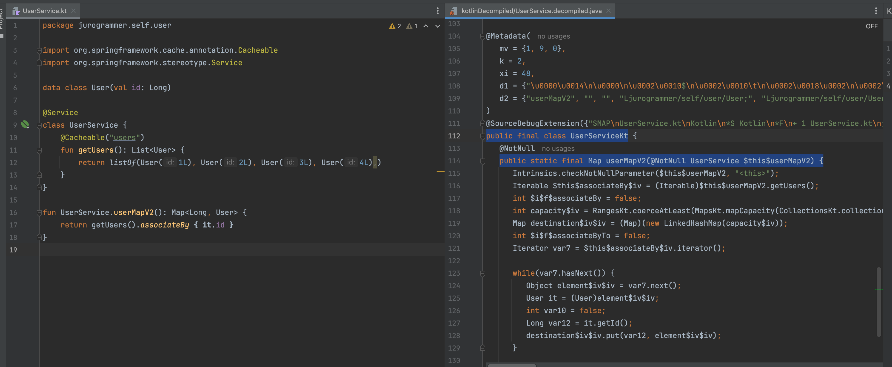

## Spring AOP Problem

In Spring, **self-invocation** refers to a method within a class calling another method of the same class. This can be problematic when using AOP (Aspect-Oriented Programming) annotations like **@Transactional**.

Spring AOP is proxy-based. So if you call another method directly within the same class, it bypasses the proxy, and AOP annotations won't be applied.

For example, suppose you have method `A` annotated with `@Transactional`, and it's called from method `B` in the same class. If method `B` calls `A` directly, Spring won’t manage the transaction properly because the call doesn’t go through the proxy.

```java
@Service
public class MyService {

    // Problematic code
    public void methodB() {
        // Direct call within the same class (self-invocation)
        methodA();
    }

    @Transactional
    public void methodA() {
        // Transaction might not work as expected
        System.out.println("Transaction starts in methodA");
        // Some DB work...
        System.out.println("Transaction ends in methodA");
    }
}
```

## A Kotlinic Workaround

You can use **extension functions**.

Since Kotlin compiles extension functions as static methods (`ClassNameKt.class`), you can invoke the Spring-managed bean instead of making a self-invocation.

### Decompiled Extension Function

  

### Example with Extension Function

#### Goal

Use caching in a method that returns a list of users, and create a convenient method that returns a `Map<Long, User>`.

```kotlin
import org.springframework.cache.annotation.Cacheable
import org.springframework.stereotype.Service

data class User(val id: Long)

@Service
class UserService {
    @Cacheable("users")
    fun getUsers(): List<User> {
        return listOf(
            User(1L),
            User(2L),
            User(3L),
            User(4L),
        )
    }

    fun userMapV1(): Map<Long, User> {
        // self-invocation
        return getUsers().associateBy { it.id }
    }
}

// Extension function
fun UserService.userMapV2(): Map<Long, User> {
    return getUsers().associateBy { it.id }
}
```

- `getUsers()`
  - Fetches a list of users and caches the result.
- `userMapV1()`
  - Calls `getUsers()` directly inside the class (self-invocation), so the cache is bypassed.
- `userMapV2()`
  - Defined as an extension function. Cache works properly because the method call goes through the Spring proxy.

### Simple Test

```kotlin
import com.github.benmanes.caffeine.cache.stats.CacheStats
import jurogrammer.self.user.UserService
import jurogrammer.self.user.userMapV2
import org.assertj.core.api.Assertions.assertThat
import org.junit.jupiter.api.Test
import org.springframework.beans.factory.annotation.Autowired
import org.springframework.boot.test.context.SpringBootTest
import org.springframework.cache.caffeine.CaffeineCache
import org.springframework.cache.caffeine.CaffeineCacheManager

@SpringBootTest
class CacheTest {
    @Autowired
    private lateinit var userService: UserService

    @Autowired
    private lateinit var cacheManager: CaffeineCacheManager

    @Test
    fun `cache should be used when getUsers is called`() {
        // given
        val rep = 5

        // when
        repeat(rep) { userService.getUsers() }

        // then
        val stats = cacheManager.getCacheStats("users")
        assertThat(stats.missCount()).isEqualTo(1)
        assertThat(stats.hitCount()).isEqualTo(4)
    }

    @Test
    fun `cache is not used when calling getUsers inside the same class`() {
        // given
        val rep = 5

        // when
        repeat(rep) { userService.userMapV1() }

        // then
        val stats = cacheManager.getCacheStats("users")
        assertThat(stats.missCount()).isEqualTo(0)
        assertThat(stats.hitCount()).isEqualTo(0)
    }

    @Test
    fun `cache should be used when calling getUsers from extension function`() {
        // given
        val rep = 5

        // when
        repeat(rep) { userService.userMapV2() }

        // then
        val stats = cacheManager.getCacheStats("users")
        assertThat(stats.missCount()).isEqualTo(1)
        assertThat(stats.hitCount()).isEqualTo(4)
    }

    private fun CaffeineCacheManager.getCacheStats(cacheName: String): CacheStats {
        val cache = this.getCache(cacheName) as? CaffeineCache
        return cache?.nativeCache?.stats() ?: throw RuntimeException("stats cannot be null")
    }
}
```

---

This Kotlinic approach solves the Spring self-invocation problem cleanly while keeping the code concise and readable.