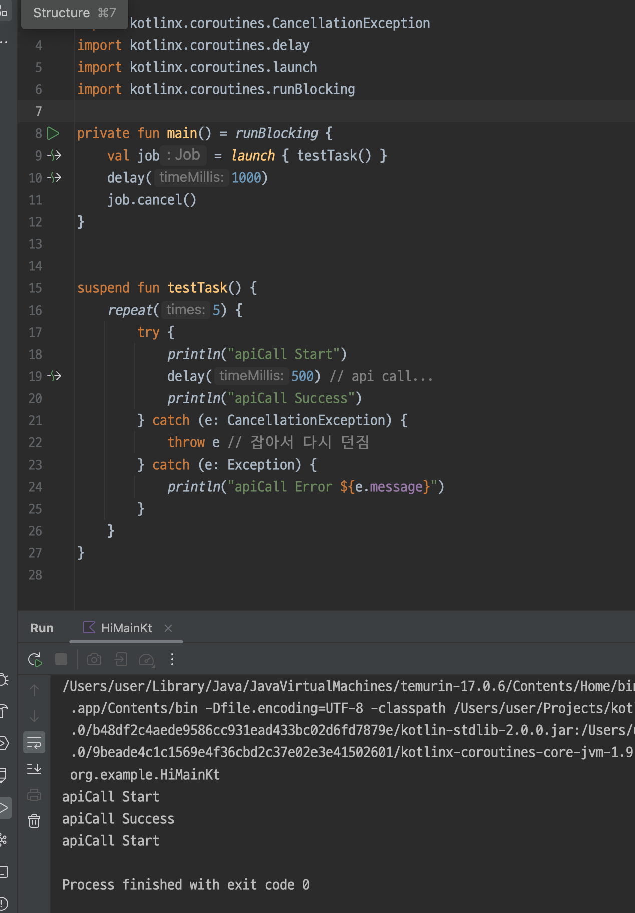

# Reference

- It's easier to understand if you think of a thread's interrupt as a job's cancel.
- When using `runCatching`, you must write code to rethrow the `CancellationException`. Kotlin does not provide a convenience method for this. - [Related Issue](https://github.com/Kotlin/kotlinx.coroutines/issues/1814)

# Reason

When a job is cancelled, it should not continue running. However, if you catch a `CancellationException`, the job may continue to run, so it is recommended to rethrow it.

## Problematic Code
If you do not rethrow, a job that is already cancelled may continue to run.

For example, `launch { testTask() }` continues to run even after its state has changed to cancelled, so both `apiCall Start` and `CancellationException` are printed in sequence.

## Correct Code
Therefore, if the job is finished, no more code should be executed, so you must throw a `CancellationException` to end code execution.

The principle is simple. If a function throws an exception, it will not execute any further.

# Reference

### Kotlin Deep Dive - It is recommended to rethrow `CancellationException`.

### Code Example - Coroutine Deep Dive
[https://github.com/MarcinMoskala/kotlin-coroutines-recipes/blob/master/src/commonMain/kotlin/retryWhen.kt#L19-L21](https://github.com/MarcinMoskala/kotlin-coroutines-recipes/blob/master/src/commonMain/kotlin/retryWhen.kt#L19-L21)

 