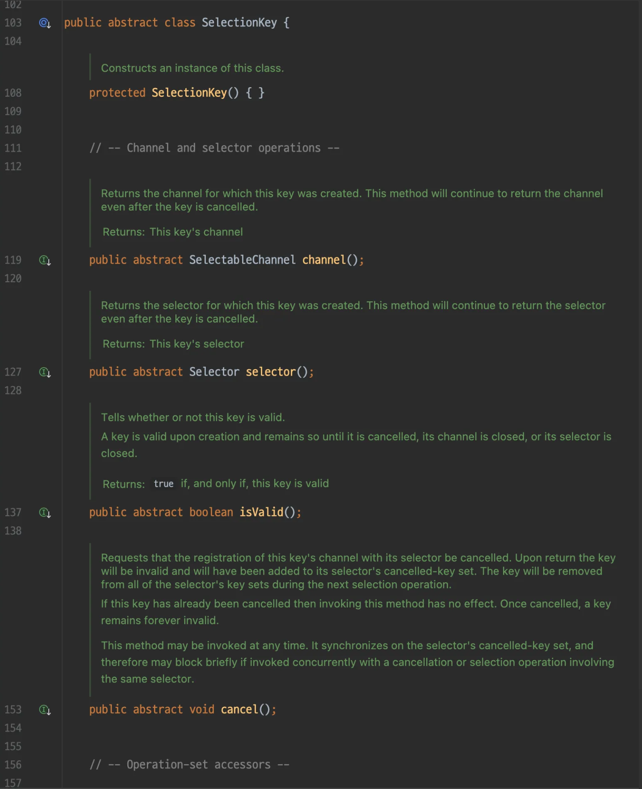

# Java NIO

## Purpose

Netty is a library that abstracts Java NIO, so Java NIO is often discussed. This post provides a brief explanation.

## Features

### NonBlocking I/O

- I/O operations can be performed asynchronously without waiting
- Multiple connections can be implemented in a non-blocking way (Selectors)

### Channels

- Bidirectional communication
    - Unlike InputStream and OutputStream, a single channel can perform both read and write
- Direct Buffer support
    - Performance improvement by reducing buffer copy overhead through memory-mapped buffers
- Read/write for socket communication is only supported with native memory - [stack overflow (Java Champion's answer)](https://stackoverflow.com/a/52791791/28307788)
    - Native memory is part of the JVM's native area
- If you use a buffer created in JVM heap memory for socket communication, there is overhead from copying to native memory
- To reduce buffer copy overhead, direct buffers are introduced, which are created and written directly in native memory
- Due to direct buffer optimization, there is a difference in the number of direct buffers between Webflux and MVC models - [https://oss.navercorp.com/nspa/nspa-server/issues/3219#issuecomment-14853076](https://oss.navercorp.com/nspa/nspa-server/issues/3219#issuecomment-14853076)
    - MVC: 200~300
    - Webflux: 75

---

## Main Components

- Selector
    - Handles events for multiple channels in a non-blocking way
- ServerSocketChannel
    - Server socket channel. Supports bidirectional communication.
    - By implementing `SelectableChannel`, Selector can register to receive events for the channel.
- SelectionKey
    - Token issued when registering a channel with a Selector. Represents the connection between selector and channel.



## Code Example

A server implementation that returns the current time when a client connects

```java
import java.io.PrintWriter;
import java.net.InetAddress;
import java.net.InetSocketAddress;
import java.net.Socket;
import java.nio.channels.SelectionKey;
import java.nio.channels.Selector;
import java.nio.channels.ServerSocketChannel;
import java.nio.channels.spi.SelectorProvider;
import java.util.Date;
import java.util.Iterator;
import java.util.Set;

/**
 * sample code: https://docs.oracle.com/en/java/javase/19/core/non-blocking-time-server-nio-example.html
 */
public class NBTimeServer { // NonBlockingTimeServer
	private static final int DEFAULT_TIME_PORT = 8900;

	public NBTimeServer() throws Exception {
		acceptConnections(this.DEFAULT_TIME_PORT);
	}

	public NBTimeServer(int port) throws Exception {
		acceptConnections(port);
	}

	private static void acceptConnections(int port) throws Exception {
		// Create selector
		Selector acceptSelector = SelectorProvider.provider().openSelector();

		// Create serverSocketChannel and bind port
		ServerSocketChannel serverSocketChannel = ServerSocketChannel.open();
		serverSocketChannel.configureBlocking(false);

		InetAddress localhost = InetAddress.getLocalHost();
		InetSocketAddress isa = new InetSocketAddress(localhost, port);
		serverSocketChannel.socket().bind(isa);

		// Register accept event of serverSocketChannel to selector.
		// Receive selectionKey as a token for registration
		SelectionKey acceptKey = serverSocketChannel.register(acceptSelector, SelectionKey.OP_ACCEPT);

		int keysAdded = 0;

		// Blocking until an event occurs
		while ((keysAdded = acceptSelector.select()) > 0) {
			// Check occurred events
			Set<SelectionKey> readyKeys = acceptSelector.selectedKeys();
			Iterator<SelectionKey> i = readyKeys.iterator();

			// Process logic for each selectionKey with an event
			while (i.hasNext()) {
				SelectionKey sk = i.next();
				// Only one is registered, so if an event is received, it is the same as the selectionKey received at registration
				assert acceptKey == sk;

				// selectionKey: channel=sun.nio.ch.ServerSocketChannelImpl[/127.0.0.1:8900], selector=sun.nio.ch.KQueueSelectorImpl@57829d67, interestOps=16, readyOps=16
				System.out.println("selectionKey: " + sk);

				i.remove();// Remove selectKey to prevent reprocessing

				ServerSocketChannel nextReady = (ServerSocketChannel)sk.channel();
				Socket socket = nextReady.accept().socket();
				PrintWriter out = new PrintWriter(socket.getOutputStream(), true);
				Date now = new Date();
				out.println(now);
				out.close();
			}
		}
	}

	public static void main(String[] args) {
		System.out.println("start");

		try {
			NBTimeServer nbt = new NBTimeServer();
		} catch (Exception e) {
			e.printStackTrace();
		}
	}
}
```

---

## Comparison with C Code

[1. select vs poll vs epoll](https://wiki.navercorp.com/spaces/NEWSHOPNAPP/pages/3045520557/1.+select+vs+poll+vs+epoll)

- fd seems to correspond to selectionKey
- The object that waits for and processes events is abstracted as Selector 