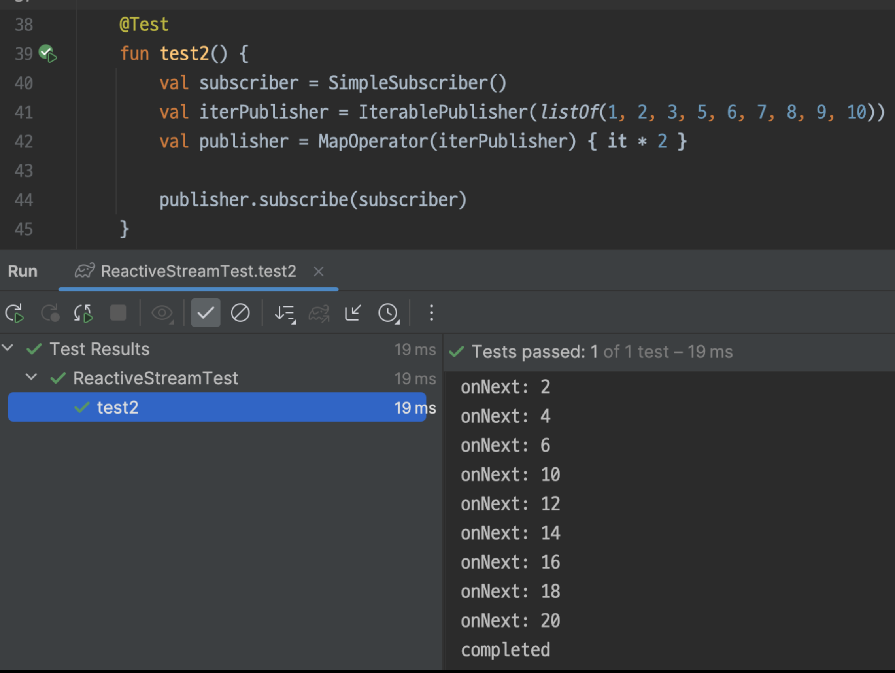

# Reactor

## Table of Contents

## Purpose

WebFlux provides developers with the Reactor interface to use Netty, so it is important to understand related concepts.

## What is Reactive Stream?

A standardized interface for processing asynchronous streams using non-blocking back pressure. Reactor implements the reactive stream specification.

[https://www.reactive-streams.org/](https://www.reactive-streams.org/)

## Structure

### Traditional Observer Pattern


**Publisher**

- Registers subscribers
- Delivers data to subscribers

**Subscriber**

- Provides an update() callback function to execute logic, which is called by the publisher

### Similarity to Reactive Stream Interface


| Function | Observer Pattern Method | Reactive Stream Method |
| --- | --- | --- |
| Subscribe | Publisher.subscribe(Subscriber) | Publisher.subscribe(Subscriber) |
| Data Transfer | Publisher.notifiySubscribers()\n  - Subscriber.update(context) | ? How is it called\n• There must be an interface that calls Subscriber.onNext(T) callback. (→ *Using Subscription*) |

### Adding Subscription


- **Subscriber.onSubscribe(Subscription)**
    - Callback function called at the time of subscription by the publisher
    - Passes the Subscription
- **Subscription**
    - Called by the subscriber for back pressure
    - **request(long)**
        - Determines the amount of data to request. The publisher calls the subscriber's onNext as many times as requested.
    - **cancel()**
        - Function to cancel further data processing

## Flow of Operation

1. Register subscription relationship
    1. Publisher.subscribe(Subscriber)
    2. A subscription is established when the subscriber subscribes to the publisher.
2. Pass Subscription
    1. Publisher calls Subscriber.onSubscribe(Subscription) and passes the subscription
3. Data Request
    1. When onSubscribe is called, the subscriber calls request() to request data
4. Data Delivery
    1. The publisher calls the subscriber's onNext() to deliver data
5. Request More After Processing
    1. After processing data, the subscriber requests more data with request()
6. Completion of Data Delivery
    1. When the publisher has delivered all data, it calls the subscriber's onComplete


## Implementation Example

Specification: [https://github.com/reactive-streams/reactive-streams-jvm/blob/v1.0.4/README.md#specification](https://github.com/reactive-streams/reactive-streams-jvm/blob/v1.0.4/README.md#specification)

### **Subscriber**

- Requests data at the time of subscription
- Calls request() after onNext to request the next data

```kotlin
class SimpleSubscriber : Subscriber<Int> {
    private lateinit var subscription: Subscription

    override fun onSubscribe(s: Subscription) {
        subscription = s
        subscription.request(1)
    }

    override fun onError(t: Throwable) {
        t.printStackTrace()
    }

    override fun onComplete() {
        println("completed")
    }

    override fun onNext(t: Int) {
        println("onNext: $t")
        subscription.request(1)
    }
}
```

---

### Publisher

- Calls onNext as many times as data is requested
- Stops sending data if canceled
- Technically, the Subscription object sends data to the subscriber, but we say the publisher sends data to the subscriber (since the logic is implemented in the publisher)

```kotlin
class IterablePublisher(private val iterable: Iterable<Int>) : Publisher<Int> {
    private val cancel = AtomicBoolean(false)

    override fun subscribe(suubscriber: Subscriber<in Int>) {
        val iter = iterable.iterator()

        suubscriber.onSubscribe(object : Subscription {
            override fun request(n: Long) {
                for (i in 1..n) {
                    if (cancel.get()) {
                        break
                    }
                    if (iter.hasNext()) {
                        val next = iter.next()
                        suubscriber.onNext(next)
                    } else {
                        suubscriber.onComplete()
                        break
                    }
                }
            }

            override fun cancel() {
                cancel.set(true)
            }
        })
    }
}
```

---

#### Result


## Operator

- All operators such as map, filter, etc. are operators. This is the most important part.
- Operator is also a Publisher

```kotlin
class MapOperator(private val actual: Publisher<Int>, private val mapper: (Int) -> Int) : Publisher<Int> {

    override fun subscribe(subscriber: Subscriber<in Int>) {
        actual.subscribe(object : Subscriber<Int> { // Creates its own subscriber to 'intercept' and process data emitted by upstream
            override fun onSubscribe(s: Subscription) {
                subscriber.onSubscribe(s)
            }

            override fun onError(t: Throwable) {
                subscriber.onError(t)
            }

            override fun onComplete() {
                subscriber.onComplete()
            }

            override fun onNext(t: Int) {
                val mappedValue = mapper(t)
                subscriber.onNext(mappedValue)
            }
        })
    }
}
```

---

#### Result



# LifeCycle

[https://spring.io/blog/2019/03/06/flight-of-the-flux-1-assembly-vs-subscription](https://spring.io/blog/2019/03/06/flight-of-the-flux-1-assembly-vs-subscription)

## Assembly Time

- The time when the pipeline is built
- Data does not actually flow yet. In other words, the pipeline is not executed yet

## Subscription Time

- The time when subscription occurs
- The publisher calls subscribe from downstream to upstream
    - In the example above, MapOperator.subscribe is called from the main thread, then IterablePublisher.subscribe is called
    - Therefore, subscriberContext should be placed at the bottom

## Execution time

- The time when the publisher emits data via onNext
    - Data flows in the order built at AssemblyTime (opposite direction of Subscription)

### Debugging Difficulty

- Assembly Time and Execution time are different
    - The data flow is understood as the pipeline defined at Assembly Time
    - But the actual stack trace is left by Execution time calls
- Difficult to understand because it is implemented as a functional interface

# Simple Implementation of Flux Interface

Implementing JFlux, which mimics the Flux interface


## JFlux

- API part
- Returns the previously implemented object every time a function is called
- Since the previously created Flux calls the function, only the parameters needed for each function are received, implementing a fluent API

```kotlin
abstract class JFlux<T> : Publisher<T> {
    abstract override fun subscribe(s: Subscriber<in T>)

    fun <R> map(mapper: (T) -> R): JFlux<R> {
        return JFluxMap(this, mapper) // Passes 'this' so JFlux.map only receives the mapper for fluent~
    }

    fun subscribe(block: (T) -> Unit) {
        subscribe(LambdaSubscriber(block)) // Calls subscribe function of objects implementing JFlux
    }

    companion object {
        fun <T> fromIterable(iterable: Iterable<T>): JFlux<T> {
            return JFluxIterable(iterable)
        }
    }
}
```

---

## Subscriber Receiving Lambda

- Receives a function to execute on onNext

```kotlin
class LambdaSubscriber<T>(private val block: (T) -> Unit) : Subscriber<T> {
    private lateinit var subscription: Subscription
    override fun onSubscribe(s: Subscription) {
        subscription = s
        subscription.request(1)
    }

    override fun onError(t: Throwable) {
        t.printStackTrace()
    }

    override fun onComplete() {
        println("completed")
    }

    override fun onNext(t: T) {
        block(t) // Call
        subscription.request(1)
    }
}
```

---

## Publisher

- Only changed to generic from the previous example

```kotlin
class JFluxIterable<T>(private val iterable: Iterable<T>) : JFlux<T>() {

    override fun subscribe(s: Subscriber<in T>) {
        s.onSubscribe(object : Subscription {
            private val iter = iterable.iterator()
            override fun request(n: Long) {
                for (i in 1..n) {
                    if (iter.hasNext()) {
                        val next = iter.next()
                        s.onNext(next)
                    } else {
                        s.onComplete()
                        break
                    }
                }
            }

            override fun cancel() {
                TODO("Not yet implemented")
            }

        })
    }
}
```

---

## MapOperator

- Only changed to generic interface
- JFlux<T> emits data of type JFlux<R> by the mapper

```kotlin
class JFluxMap<T, R>(private val publisher: JFlux<T>, private val mapper: (T) -> R) : JFlux<R>() {
    override fun subscribe(actual: Subscriber<in R>) {
        publisher.subscribe(object : Subscriber<T> {
            override fun onSubscribe(s: Subscription) {
                actual.onSubscribe(s)
            }

            override fun onError(t: Throwable) {
                actual.onError(t)
            }

            override fun onComplete() {
                actual.onComplete()
            }

            override fun onNext(t: T) {
                val mappedValue = mapper(t)
                actual.onNext(mappedValue)
            }
        })
    }
}
``` 