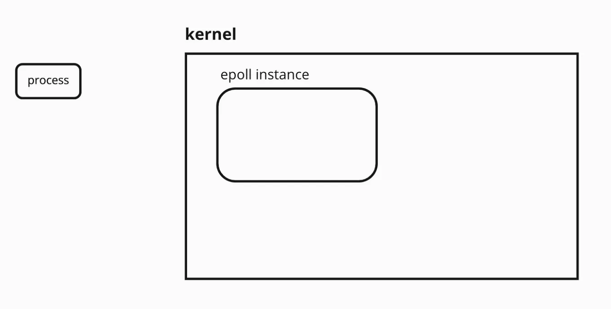
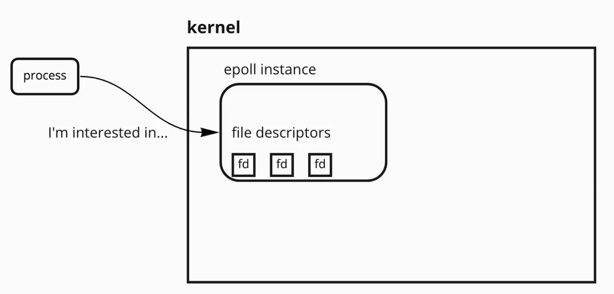
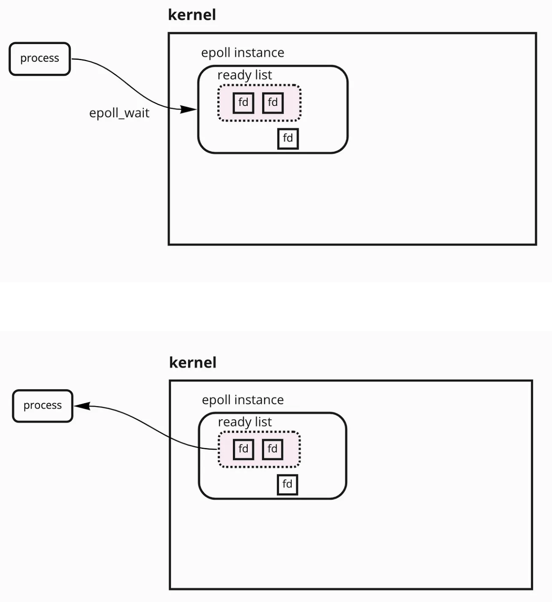
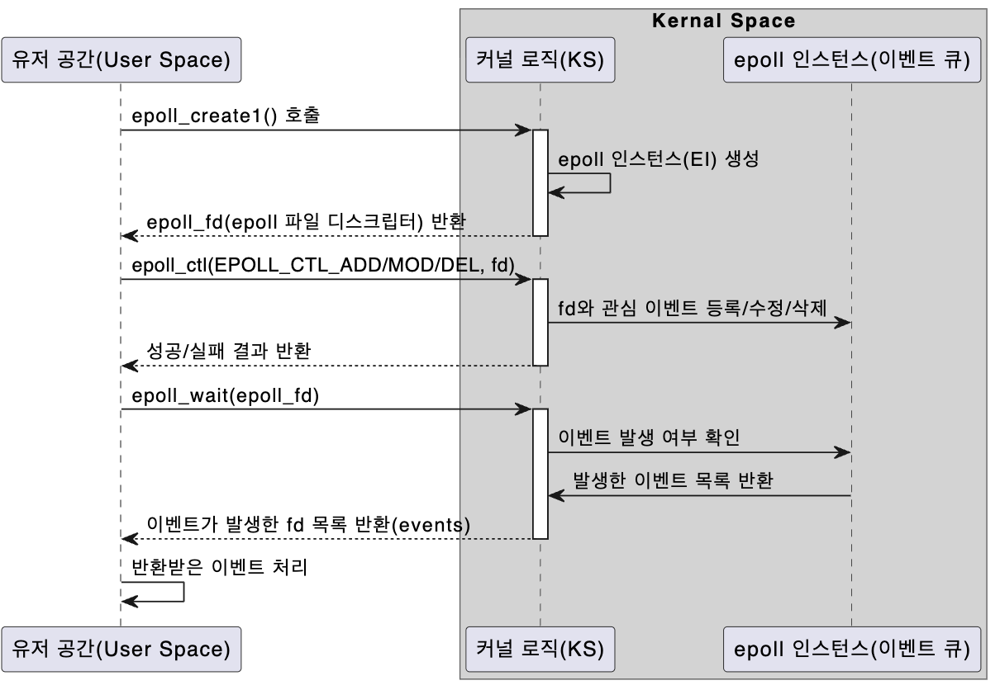
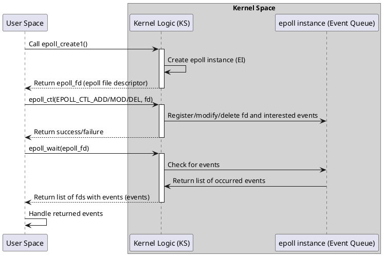

# select vs poll vs epoll

## Purpose

- Netty uses epoll. Understanding how epoll works helps in understanding Netty.
- By comparing various I/O handling methods, we can better understand epoll.

## Select

- The user program registers interested events for each file descriptor in a set
- The **user program** keeps **checking** for **events on fds in the set**
- Handles the occurred events
- Time complexity O(N) [N = number of registered events]

```c
#include <stdio.h>
#include <stdlib.h>
#include <unistd.h>
#include <sys/select.h>
#include <fcntl.h>

int main() {
    int fd1 = STDIN_FILENO; // Standard input
    int fd2 = open("file2.txt", O_RDONLY); // Another file
    int fd3 = open("file3.txt", O_RDONLY); // Another file

    if (fd2 == -1 || fd3 == -1) {
        perror("Failed to open files");
        return 1;
    }

    // Initialize fd_set for select
    fd_set readfds;
    FD_ZERO(&readfds); // Initialize fd_set
    FD_SET(fd1, &readfds); // Add fd1 to readfds
    FD_SET(fd2, &readfds); // Add fd2 to readfds
    FD_SET(fd3, &readfds); // Add fd3 to readfds

    // Set timeout for select (e.g., 5 seconds)
    struct timeval timeout;
    timeout.tv_sec = 5;
    timeout.tv_usec = 0;

    // Call select. Wait for events
    int ret = select(FD_SETSIZE, &readfds, NULL, NULL, &timeout);

    if (ret == -1) {
        perror("select failed");
        return 1;
    } else if (ret == 0) {
        printf("Timeout occurred! No data available within 5 seconds.\n");
    } else {
        // Check which file descriptor has a read event
        if (FD_ISSET(fd1, &readfds)) {
            printf("Data is available for reading on fd1 (STDIN)\n");
        }
        if (FD_ISSET(fd2, &readfds)) {
            printf("Data is available for reading on fd2 (file2.txt)\n");
        }
        if (FD_ISSET(fd3, &readfds)) {
            printf("Data is available for reading on fd3 (file3.txt)\n");
        }
    }

    // Close file descriptors
    close(fd2);
    close(fd3);

    return 0;
}
```

## Poll

- Compared to select, declared as a **`(fd, event, received)` struct**
- Lower performance than epoll, where the OS directly puts events in a queue. However, poll()'s struct is similarly used in epoll()
- Time complexity O(N) [N = number of registered events]

```c
#include <stdio.h>
#include <stdlib.h>
#include <poll.h>
#include <unistd.h>
#include <fcntl.h>

int main() {
    // Prepare file descriptors
    struct pollfd fds[2];
    int timeout = 5000; // Wait 5 seconds

    // fd1: standard input
    fds[0].fd = STDIN_FILENO;
    fds[0].events = POLLIN; // Monitor for readable event

    // fd2: file (e.g., open file descriptor)
    int fd2 = open("example.txt", O_RDONLY);
    if (fd2 == -1) {
        perror("Failed to open file");
        return 1;
    }
    fds[1].fd = fd2;
    fds[1].events = POLLIN; // Monitor for readable event

    // Call poll
    int ret = poll(fds, 2, timeout);

    if (ret == -1) {
        perror("poll failed");
        return 1;
    } else if (ret == 0) {
        printf("Timeout! No events occurred within 5 seconds.\n");
    } else {
        // Check events
        if (fds[0].revents & POLLIN) { // revents = returned events
            printf("Data is available on stdin.\n");
        }
        if (fds[1].revents & POLLIN) {
            printf("Data is available in example.txt.\n");
        }
    }

    // Close file descriptor
    close(fd2);

    return 0;
}
```

## Epoll

- The OS directly registers events in the event queue, and the user program only monitors the event queue (blocking), maximizing efficiency
- Time complexity:
    - Event queue: R/B tree. O(logn) for fd registration and deletion
    - Event collection: O(1) or O(M) [M = number of occurred events]
- Note:
    - When running Netty:
        - Mac OS uses kqueue
        - Linux uses epoll








---

```c
#include <stdio.h>
#include <stdlib.h>
#include <sys/epoll.h>
#include <unistd.h>
#include <fcntl.h>

#define MAX_EVENTS 10

int main() {
    int epoll_fd, file_fd, stdin_fd;
    struct epoll_event event, events[MAX_EVENTS];

    // 1. Create epoll instance
    epoll_fd = epoll_create1(0);
    if (epoll_fd == -1) {
        perror("epoll_create1 failed");
        exit(EXIT_FAILURE);
    }

    // 2. Register STDIN file descriptor
    stdin_fd = STDIN_FILENO;
    event.events = EPOLLIN; // Read event
    event.data.fd = stdin_fd;
    if (epoll_ctl(epoll_fd, EPOLL_CTL_ADD, stdin_fd, &event) == -1) {
        perror("epoll_ctl failed for stdin");
        exit(EXIT_FAILURE);
    }

    // 3. Register file descriptor
    file_fd = open("example.txt", O_RDONLY);
    if (file_fd == -1) {
        perror("Failed to open file");
        exit(EXIT_FAILURE);
    }
    event.events = EPOLLIN; // Read event
    event.data.fd = file_fd;
    if (epoll_ctl(epoll_fd, EPOLL_CTL_ADD, file_fd, &event) == -1) {
        perror("epoll_ctl failed for file");
        exit(EXIT_FAILURE);
    }

    // 4. Wait for events
    printf("Waiting for events...\n");
    while (1) {
        int n = epoll_wait(epoll_fd, events, MAX_EVENTS, -1);
        if (n == -1) {
            perror("epoll_wait failed");
            exit(EXIT_FAILURE);
        }

        // 5. Handle events
        for (int i = 0; i < n; i++) {
            if (events[i].data.fd == stdin_fd) {
                printf("Readable event on stdin\n");
                char buffer[256];
                ssize_t count = read(stdin_fd, buffer, sizeof(buffer));
                if (count > 0) {
                    buffer[count] = '\0';
                    printf("Input: %s", buffer);
                }
            } else if (events[i].data.fd == file_fd) {
                printf("Readable event on file\n");
                char buffer[256];
                ssize_t count = read(file_fd, buffer, sizeof(buffer));
                if (count > 0) {
                    buffer[count] = '\0';
                    printf("File content: %s", buffer);
                }
            }
        }
    }

    // 6. Clean up resources
    close(file_fd);
    close(epoll_fd);

    return 0;
}
```



---

## PlantUML: Epoll Flow



--- 