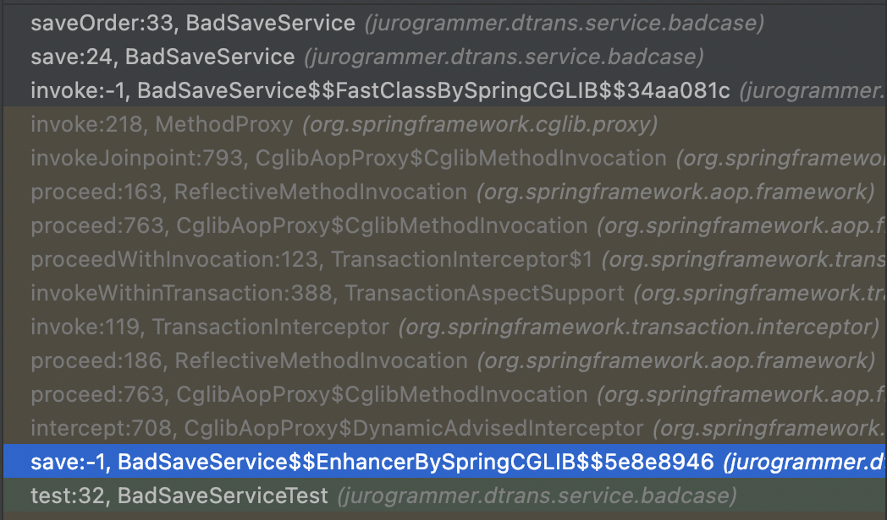

### Example Code

[https://github.com/jurogrammer/dtrans](https://github.com/jurogrammer/dtrans)

### Situation

When you want to separate transactions for different operations, but creating a new service class for this feels cumbersome.

### Code

```java
@Service
@RequiredArgsConstructor
public class SaveServiceVer1 {

    private final UserRepository userRepository;
    private final OrderRepository orderRepository;

    @Transactional
    public void save() {

        userRepository.save(new User("홍길동"));

        // If an error occurs while saving the order, you still want the user to be saved as is.
        saveOrder();
    }

    public void saveOrder() {
        orderRepository.save(new Order());
        throw new RuntimeException("Error occurred while saving order");
    }
}
```

### Idea

Even if an error occurs in saveOrder and the order is rolled back, the User save should still be performed.

So, you need to create a **separate transaction** for saving the order.

### Wrong Approach

You might try to declare the RequiredNew option on a method in the same class and call that method.

```java
@Service
@RequiredArgsConstructor
public class BadSaveService {

    private final UserRepository userRepository;
    private final OrderRepository orderRepository;

    @Transactional
    public void save() {
        userRepository.save(new User("홍길동"));

        try {
            saveOrder();
        } catch (Exception e) {
            System.out.println(e.getMessage());
        }
    }

    @Transactional(propagation = Propagation.REQUIRES_NEW)
    public void saveOrder() {
        orderRepository.save(new Order());
        throw new RuntimeException("Error occurred while saving order");
    }
}
```

However, as you can see in the following test code, both the User and the Order (even the one that caused the error) are saved without rollback.

```java
@SpringBootTest
class BadSaveServiceTest {
    @Autowired
    BadSaveService badSaveService;

    @Autowired
    UserRepository userRepository;
    @Autowired
    OrderRepository orderRepository;

    // The default strategy of the repository interface is to open a transaction and commit on save
    @Test
    @DisplayName("When saving 1 user and 1 order, both are retrieved.")
    void test() {
        try {
            badSaveService.save();
        } catch (Exception e) {
            e.printStackTrace();
        }

        List<User> users = userRepository.findAll();
        List<Order> orders = orderRepository.findAll();
        int userSize = users.size();
        int orderSize = orders.size();

        assertThat(userSize).isEqualTo(1);
        assertThat(orderSize).isEqualTo(1);

        removeAll();
    }

    private void removeAll() {
        userRepository.deleteAll();
        orderRepository.deleteAll();
    }
}
```

### Cause

When you declare the @Transactional annotation, Spring creates a subclass using CGLIB AOP that contains the transaction handling logic. Spring injects an instance of this subclass into fields annotated with @Autowired.

However, when you call a method of the superclass (your own class), the transaction handling logic is not applied, so the repository's default transaction handling is used (i.e., a new transaction is created before save and committed after save).

Therefore, even if an exception occurs after saving the order, the transaction for saving the order is committed, so no rollback occurs.



As you can see in the call stack, the save method of the CGLIB-generated subclass is executed, then the transaction interceptor logic is performed, and only then is the superclass's (BadSaveService) method executed. The saveOrder method is executed directly on the superclass without the interceptor.

### Solution 1: Declare a New Service

You can solve this by declaring a new service and injecting it, like this:

```java
@Service
@RequiredArgsConstructor
public class SaveServiceVer2 {

    private final UserRepository userRepository;
    private final OrderService orderService;

    @Transactional
    public void save() {
        userRepository.save(new User("홍길동"));

        try {
            orderService.save(new Order());
        } catch (Exception e) {
            e.printStackTrace();
        }
    }
}
```

```java
@Service
@RequiredArgsConstructor
public class OrderService {
    private final OrderRepository orderRepository;

    @Transactional(propagation = Propagation.REQUIRES_NEW)
    public void save(Order order) {
        orderRepository.save(order);
        throw new RuntimeException("Error occurred while saving order");
    }
}
```

But do we really need to declare and inject a new service? It feels cumbersome.

Compare this to Ruby on Rails code:

```ruby
Account.transaction do
  balance.save!
  account.save!
end
```

How concise is that?

1. Create a transaction for the Account table.
2. Perform operations to save balance and account.

You can do this without creating a new class. In Ruby, this is called a block statement, but it's essentially the same as declaring a callback function.

You pass a callback function to the method that creates a new transaction, and the method lazily evaluates the callback.

So you can write code like this:

### Solution 2

```java
import jurogrammer.dtrans.entity.Order;
import jurogrammer.dtrans.entity.User;
import jurogrammer.dtrans.repository.OrderRepository;
import jurogrammer.dtrans.repository.UserRepository;
lombok.RequiredArgsConstructor;
import org.springframework.stereotype.Service;
import org.springframework.transaction.annotation.Transactional;

@Service
@RequiredArgsConstructor
public class SaveServiceVer3 {

    private final OrderRepository orderRepository;
    private final UserRepository userRepository;
    private final TransactionHelper transactionHelper;

    @Transactional
    public void save() {
        userRepository.save(new User("홍길동"));
        try {
            transactionHelper.requiredNew(() -> {
                orderRepository.save(new Order());
                throw new RuntimeException("Error occurred while saving order");
            });
        } catch (Exception e) {
            e.printStackTrace();
        }
    }
}
```

```java
import org.springframework.stereotype.Component;
import org.springframework.transaction.annotation.Propagation;
import org.springframework.transaction.annotation.Transactional;

@Component
public class TransactionHelper {

    @Transactional(propagation = Propagation.REQUIRES_NEW)
    public void requiredNew(TransactionTask transactionTask) {
        transactionTask.apply();
    }
}
```

```java
@FunctionalInterface
public interface TransactionTask {

    void apply();
}
```

1. Declare a functional interface to accept a function.
2. Declare a TransactionHelper class to call the function in a new transaction context.
3. In the save logic, inject the function using a lambda expression.

You might say, "But you still created a TransactionHelper class!" However,

In Solution 1, OrderService is concrete and only reusable for order-related logic, but in Solution 2, you can perform any arbitrary logic in a new transaction context. That is, you don't have to define a new class just to create a new transaction in the future.

### But wait... it already exists?

Oh... after some searching, I found that Spring already has something similar.

[https://docs.spring.io/spring-framework/docs/current/javadoc-api/org/springframework/transaction/support/TransactionTemplate.html](https://docs.spring.io/spring-framework/docs/current/javadoc-api/org/springframework/transaction/support/TransactionTemplate.html)

There's a class called TransactionTemplate.

Haha! 