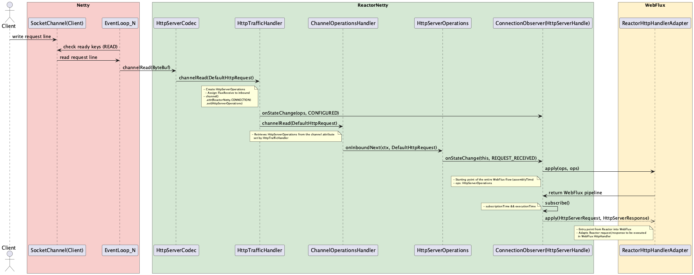
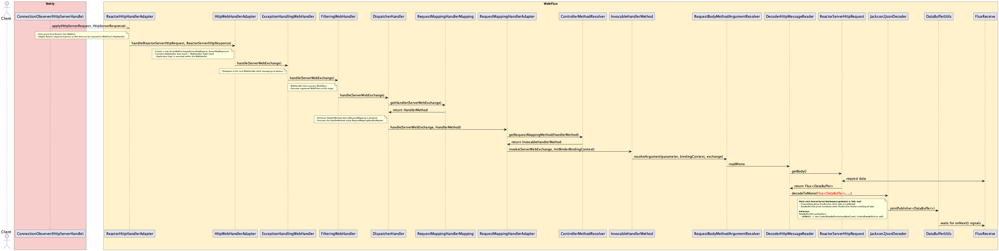
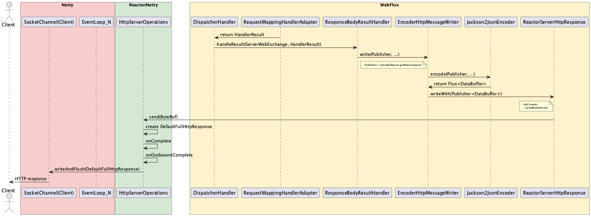

    &times;
    

This post explains the flow of WebFlux request processing through detailed sequence diagrams.

## 1. Request (Before Receive Request Body)

## 2. Request (After Receive Request Body)

## 3. Process Request Body

## 4. Process Response Body

## Summary

The WebFlux flow can be divided into four main phases:

1. **Request Reception**: Netty handles the initial HTTP request and passes it to ReactorNetty
2. **Request Processing**: The request flows through WebFlux's handler chain
3. **Request Body Processing**: The request body is read and deserialized
4. **Response Processing**: The response is serialized and sent back to the client

Each phase involves multiple components working together to provide reactive, non-blocking HTTP processing capabilities.
