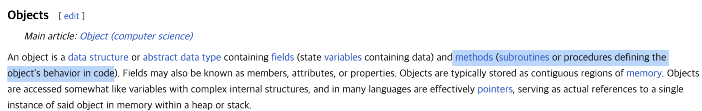
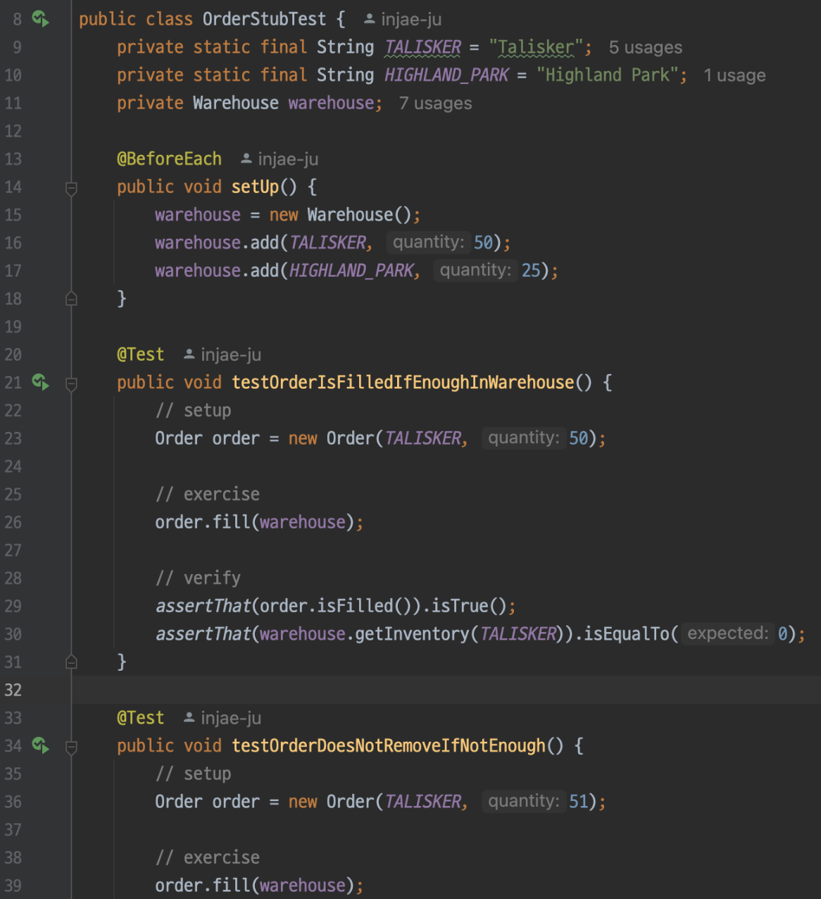
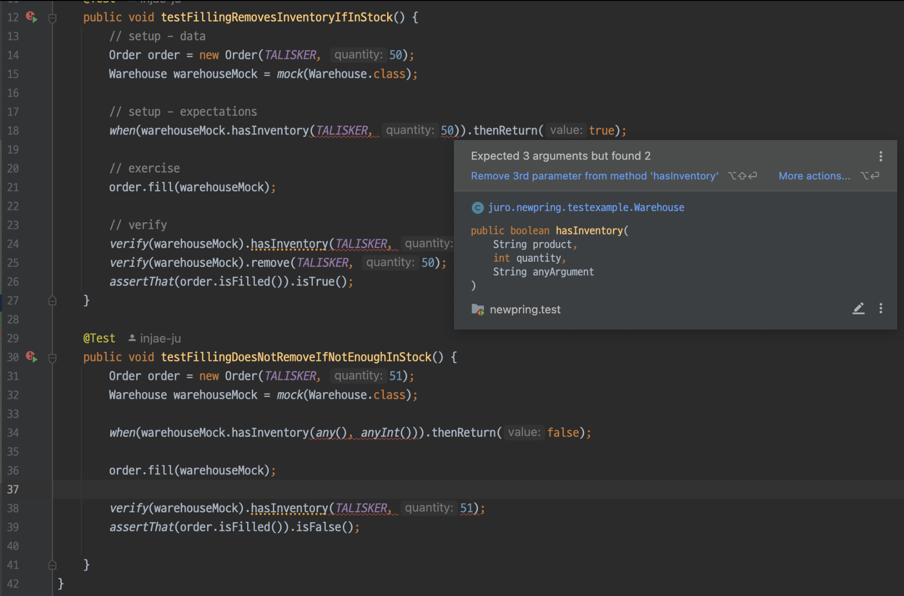
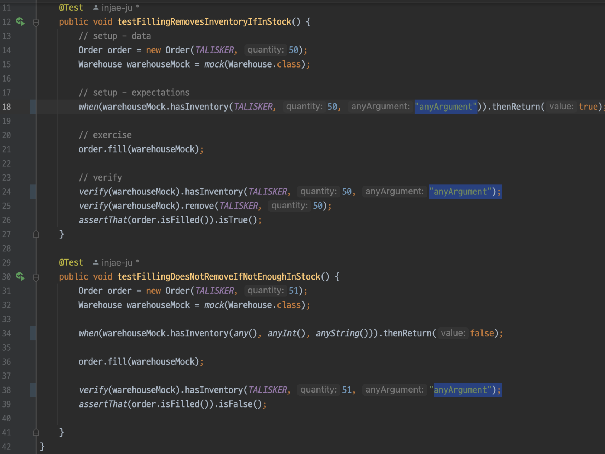

# Purpose

When developing, you may encounter the following concerns:

- Why are my tests breaking like this? Is this correct?
- Mocking this is so hard...!
- Why are there so many predefined states? How do I manage them?

A good example to explain this is understanding the difference between stubs and mocks. This post explains that difference.

Why? It helps explain integration and unit testing more clearly.

Source: [https://martinfowler.com/articles/mocksArentStubs.html](https://martinfowler.com/articles/mocksArentStubs.html)

# Key Terms

### Test Double

A general term for objects that pretend to be real objects for testing purposes.
Types of test doubles include Dummy, Fake, Spies, Stubs, and Mocks.
The term comes from "stunt double" in movies—think of someone performing dangerous actions in place of the actor.

# Unit Test Example

## Target Class

### Order
- Order form
- Fills the order from the Warehouse

```java
public class Order {
    private String product;
    private int quantity;
    private boolean isFilled;

    public Order(String product, int quantity) {
        this.product = product;
        this.quantity = quantity;
        this.isFilled = false;
    }

    public void fill(Warehouse warehouse) {
        if (warehouse.hasInventory(product, quantity)) {
            warehouse.remove(product, quantity);
            isFilled = true;
        } else {
            isFilled = false;
        }
    }

    public boolean isFilled() {
        return isFilled;
    }
}
```

### Warehouse
- Warehouse
- Manages products and quantities

```java
public class Warehouse {
    private final Map<String, Integer> inventory = new HashMap<>();

    public void add(String product, int quantity) {
        inventory.put(product, inventory.getOrDefault(product, 0) + quantity);
    }

    public int getInventory(String product) {
        return inventory.getOrDefault(product, 0);
    }

    public boolean hasInventory(String product, int quantity) {
        int currentQuantity = inventory.getOrDefault(product, 0);
        return currentQuantity >= quantity;
    }

    public void remove(String product, int quantity) {
        int currentQuantity = inventory.getOrDefault(product, 0);
        if (currentQuantity >= quantity) {
            inventory.put(product, currentQuantity - quantity);
        }
    }
}
```

## Target Logic

### Logic for Filling Orders from Warehouse
- If there is enough stock in the warehouse → fill the order and deduct stock from the warehouse.
- If not enough stock → do not fill the order, nothing happens.

### Target Method
- order.fill(Warehouse)

## Collaborators

For unit testing, you want to test only the **order object**. However, `order.fill` requires a **collaborator**: Warehouse. That is, `order.fill` calls methods on Warehouse.

So:
1. What kind of **test double** should you use for warehouse?
2. How do you **verify** that warehouse's methods were called by order?

## Test Code

### STUB Style

```java
import static org.assertj.core.api.Assertions.*;

import org.junit.jupiter.api.BeforeEach;
import org.junit.jupiter.api.Test;

public class OrderStubTest {
    private static final String TALISKER = "Talisker";
    private static final String HIGHLAND_PARK = "Highland Park";
    private Warehouse warehouse;

    @BeforeEach
    public void setUp() {
        warehouse = new Warehouse();
        warehouse.add(TALISKER, 50);
        warehouse.add(HIGHLAND_PARK, 25);
    }

    @Test
    public void testOrderIsFilledIfEnoughInWarehouse() {
        // setup
        Order order = new Order(TALISKER, 50);

        // exercise
        order.fill(warehouse);

        // verify
        assertThat(order.isFilled()).isTrue();
        assertThat(warehouse.getInventory(TALISKER)).isEqualTo(0);
    }

    @Test
    public void testOrderDoesNotRemoveIfNotEnough() {
        // setup
        Order order = new Order(TALISKER, 51);

        // exercise
        order.fill(warehouse);

        // verify
        assertThat(order.isFilled()).isFalse();
        assertThat(warehouse.getInventory(TALISKER)).isEqualTo(50);
    }
}
```

### Explanation
- Use a real warehouse object and initialize its state.
- After the exercise, check if the order is in the expected state to verify the method worked.
- After the exercise, check if the **warehouse** is in the **expected state** to verify the method worked.

In other words, you verify by checking the final state after initializing the warehouse, so this is called **state verification**.

### MOCK Style

```java
import static org.assertj.core.api.Assertions.*;
import static org.mockito.Mockito.*;

import org.junit.Test;

public class OrderMockTest {
    private static final String TALISKER = "Talisker";

    @Test
    public void testFillingRemovesInventoryIfInStock() {
        // setup - data
        Order order = new Order(TALISKER, 50);
        Warehouse warehouseMock = mock(Warehouse.class);

        // setup - expectations
        when(warehouseMock.hasInventory(TALISKER, 50)).thenReturn(true);

        // exercise
        order.fill(warehouseMock);

        // verify
        verify(warehouseMock).hasInventory(TALISKER, 50);
        verify(warehouseMock).remove(TALISKER, 50);
        assertThat(order.isFilled()).isTrue();
    }

    @Test
    public void testFillingDoesNotRemoveIfNotEnoughInStock() { // relax constraint
        Order order = new Order(TALISKER, 51);
        Warehouse warehouseMock = mock(Warehouse.class);

        when(warehouseMock.hasInvenwtory(any(), anyInt())).thenReturn(false);

        order.fill(warehouseMock);

        verify(warehouseMock).hasInventory(TALISKER, 51);
        assertThat(order.isFilled()).isFalse();
    }
}
```

### Explanation
- Use a mock object instead of a real warehouse.
- During setup, add expectation settings for the warehouse mock.
- Add verification that the **method was called** on the warehouse.

By verifying whether the method was called, you check if the method worked, so this is called **behavior verification**.

*In OOP, a method is often called a behavior - [wiki](https://en.wikipedia.org/wiki/Object-oriented_programming)*



## What if the collaborator's behavior changes?

**as-is**

```java
public boolean hasInventory(String product, int quantity)
```

**to-be**

```java
public boolean hasInventory(String product, int quantity, String anyArgument)
```

---

```java
public void fill(Warehouse warehouse) {
    if (warehouse.hasInventory(product, quantity, "anyArgument")) { // argument added
        warehouse.remove(product, quantity);
        isFilled = true;
    } else {
        isFilled = false;
    }
}
```

If the collaborator's method signature changes, what happens to the test code?

### stub

The fill method still works correctly.



### mock

Mocks directly depend on the collaborator's method, so the test breaks.



Therefore, you must update the expectation for the collaborator's method for the test to work.



This is where, even in unit tests, you need to know the implementation details of the collaborator.

## Test - Summary

- stub (state verification)
    - Uses real objects
    - Verifies by checking the final state of the collaborator
    - Initializes the collaborator's **state**
    - Less likely to break if the collaborator's method changes
- mock (behavior verification)
    - Uses mock objects
    - Verifies by checking if the collaborator's method was called
    - Initializes the expected behavior of the collaborator
    - More likely to break if the method changes

# Pros and Cons of State vs Behavior Verification

Generalizing stub vs mock as state vs behavior verification:

|  | State Verification (classicist or Detroit school) | Behavior Verification (mockist or London school) |
| --- | --- | --- |
| Fixture setup | • More fixtures to initialize<br>• More states to initialize<br>• Need management policy if reusing state | • Fewer fixtures to initialize |
| Test isolation | • Lower isolation<br>• Using real objects, if a bug occurs, many tests depending on the collaborator may break | • Higher isolation<br>• Only tests with incorrect expectations break |
| Coupling with implementation | Lower coupling<br>• The test target does not directly reference the collaborator, only verifies state | Higher coupling<br>• The test target directly references the collaborator's method |
| Execution speed | Can be slower<br>• Uses real objects | Faster |

- Regression: Bugs that occur after code changes
- Regression prevention: How well tests prevent bugs after changes
    - Integration tests using real objects have higher regression prevention
- Refactoring resilience: If tests break even when functionality is unchanged, resilience is low
    - Indicates how likely tests are to break when code structure is changed without changing results 